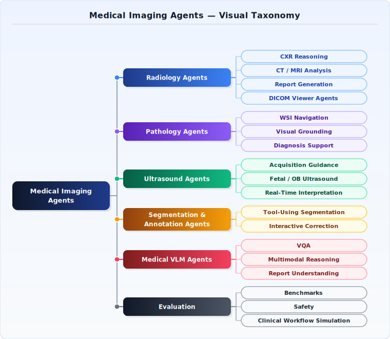

# Awesome Medical Imaging Agents [](https://github.com/awesomelistsio/awesome)

[](https://github.com/Nanboy-Ronan/awesome-medical-imaging-agents/graphs/commit-activity)


[](https://github.com/Nanboy-Ronan/awesome-medical-imaging-agents/stargazers)
[](https://github.com/Nanboy-Ronan/awesome-medical-imaging-agents)
[](https://github.com/Nanboy-Ronan/awesome-medical-imaging-agents/network/members)
[](https://github.com/Nanboy-Ronan/awesome-medical-imaging-agents/graphs/contributors)
[](https://nanboy-ronan.github.io/awesome-medical-imaging-agents/)

> A curated academic list of agentic AI for medical image analysis.
>
> Last updated: 2026-05-19

This repository tracks research on medical imaging agents, agentic AI for medical image analysis, and tool-using AI systems for imaging-focused clinical workflows. It covers radiology agents, pathology agents, ultrasound agents, endoscopy agents, ophthalmology agents, 3D medical imaging agents, medical vision-language models (VLMs), segmentation agents, report-generation agents, multimodal clinical reasoning systems, CT, MRI, chest X-ray, dermatology imaging, clinical decision support, benchmarks, datasets, and open-source toolboxes.

Use this list to find recent papers, surveys, benchmarks, datasets, and implementations for medical imaging agents, radiology agents, pathology agents, ultrasound agents, medical VLM agents, multimodal clinical reasoning, and tool-using agents for medical image analysis.

> **Structured metadata** for entries in this list is maintained in [`data/papers.yml`](data/papers.yml).
> A machine-readable **table view** of all entries (by domain, modality, task, and agent type) is available at [`generated/papers.md`](generated/papers.md) — regenerate with `python scripts/generate_readme.py`.

## Taxonomy



## Start Here: Essential Medical Imaging Agent Papers

New to the field? The table below selects 12 landmark papers and systems spanning the core subfields. Reading these gives a solid mental model of the space before diving into the full list.

| Paper / System | Year | Domain | Why it matters | Links |
|---|---:|---|---|---|
| [Agentic Systems in Radiology: Design, Applications, Evaluation, and Challenges](https://arxiv.org/pdf/2510.09404v2) | 2025 | Survey · Radiology | Best entry-point survey: maps agent design patterns, evaluation protocols, and open challenges across the full radiology pipeline. | [Paper](https://arxiv.org/pdf/2510.09404v2) |
| [MedRAX](https://arxiv.org/pdf/2502.02673v1) | 2025 | Radiology · CXR | ICML 2025 — director-worker architecture shows how composable tool-using agents outperform single-model baselines on chest X-ray reasoning. | [Paper](https://arxiv.org/pdf/2502.02673v1) · [Code](https://github.com/bowang-lab/MedRAX) |
| [RadAgent](https://arxiv.org/abs/2604.15231) | 2026 | Radiology · CT | Generates chest CT reports through an explicit tool-calling workflow with inspectable intermediate traces — a blueprint for auditable radiology agents. | [Paper](https://arxiv.org/abs/2604.15231) |
| [MMedAgent](https://arxiv.org/pdf/2407.02483) | 2024 | Multimodal · Tool-use | First paper to train a medical agent that selects and calls specialist tools (segmentation, retrieval, calculators) on demand across seven imaging modalities. | [Paper](https://arxiv.org/pdf/2407.02483) · [Code](https://github.com/Wangyixinxin/MMedAgent) |
| [MedAgent-Pro](https://openreview.net/forum?id=ZOuU0udyA4) | 2026 | Medical VLM · Imaging | ICLR 2026 — integrates imaging, labs, and clinical guidelines via explicit tool calling; demonstrates evidence-based multimodal clinical reasoning. | [Paper](https://openreview.net/forum?id=ZOuU0udyA4) · [Code](https://github.com/jinlab-imvr/MedAgent-Pro) |
| [MedSAM-Agent](https://arxiv.org/abs/2602.03320) | 2026 | Segmentation | Introduces multi-turn RL to train an interactive segmentation agent that decides which prompts to issue to SAM — the first RL-trained imaging segmentation agent. | [Paper](https://arxiv.org/abs/2602.03320) · [Code](https://github.com/CUHK-AIM-Group/MedSAM-Agent) |
| [CPathAgent](https://arxiv.org/abs/2505.20510) | 2025 | Pathology · WSI | Agentic foundation model that mimics pathologist diagnostic logic to deliver interpretable analysis of high-resolution whole-slide images. | [Paper](https://arxiv.org/abs/2505.20510) |
| [VoxelPrompt](http://arxiv.org/abs/2410.08397) | 2024 | 3D Imaging · Volumetric | Multi-stage vision agent for end-to-end volumetric medical image analysis, covering segmentation, detection, and QA across CT, MRI, and PET. | [Paper](http://arxiv.org/abs/2410.08397) |
| [Echo-alpha](https://arxiv.org/abs/2604.28011) | 2026 | Ultrasound | Demonstrates that large agentic reasoning models can jointly localize lesions and perform grounded multimodal clinical interpretation of ultrasound studies. | [Paper](https://arxiv.org/abs/2604.28011) |
| [EndoAgent](https://arxiv.org/abs/2508.07292) | 2025 | Endoscopy | Memory-guided reflective agent for endoscopic vision-to-decision reasoning; representative model of how specialty-specific imaging agents are designed. | [Paper](https://arxiv.org/abs/2508.07292) · [Code](https://github.com/Tyyds-ai/EndoAgent) |
| [AgentClinic](https://www.nature.com/articles/s41746-026-02674-7) | 2026 | Benchmark · Multimodal | The canonical multimodal benchmark for tool-using clinical AI agents; standardizes evaluation across imaging, EHR, and lab modalities with open simulator. | [Paper](https://www.nature.com/articles/s41746-026-02674-7) · [Code](https://github.com/SamuelSchmidgall/AgentClinic) · [Demo](https://agentclinic.github.io/) |
| [ABRA: Agent Benchmark for Radiology Applications](https://arxiv.org/abs/2605.11224) | 2026 | Benchmark · Radiology | First benchmark where agents operate a real DICOM viewer (OHIF + Orthanc) via tool calls, testing end-to-end radiology agent workflows on live imaging software. | [Paper](https://arxiv.org/abs/2605.11224) |

---

## Scope

- **Medical imaging agents:** radiology, pathology, ultrasound, CT, MRI, chest X-ray, dental X-ray, dermatology, endoscopy, PET, and cardiac imaging agents.
- **Agent workflows:** tool use, retrieval-augmented generation, multi-agent collaboration, self-reflection, planning, clinical reasoning, report generation, quality control, and human-in-the-loop review.
- **Research resources:** peer-reviewed papers, arXiv preprints, benchmarks, datasets, reproducible code, and related awesome lists.
- **Safety and evaluation:** hallucination detection, fairness, robustness, uncertainty, abstention, privacy, security, and clinically grounded evaluation.

## Table of Contents

- [Scope](#scope)
- [Start Here: Essential Medical Imaging Agent Papers](#start-here-essential-medical-imaging-agent-papers)
- [Radiology Agents (28)](#radiology-agents-28)
- [Pathology Agents (Whole-Slide Imaging · Digital Pathology) (17)](#pathology-agents-whole-slide-imaging--digital-pathology-17)
- [Ultrasound Agents (Echocardiography · Robotic Ultrasound) (7)](#ultrasound-agents-echocardiography--robotic-ultrasound-7)
- [Endoscopy and Surgical Imaging Agents (5)](#endoscopy-and-surgical-imaging-agents-5)
- [Ophthalmology Agents (3)](#ophthalmology-agents-3)
- [3D CT / MRI / Volumetric Imaging Agents (8)](#3d-ct--mri--volumetric-imaging-agents-8)
- [Segmentation and Annotation Agents (5)](#segmentation-and-annotation-agents-5)
- [Report Generation Agents (9)](#report-generation-agents-9)
- [Medical Vision-Language Model (VLM) Agents (15)](#medical-vision-language-model-vlm-agents-15)
- [Tool-Using and Multi-Agent Frameworks](#tool-using-and-multi-agent-frameworks)
  - [Clinical Reasoning Agents (49)](#clinical-reasoning-agents-49)
  - [Workflow and Simulation Agents (32)](#workflow-and-simulation-agents-32)
  - [Agent Skills and Tool Learning (7)](#agent-skills-and-tool-learning-7)
- [Benchmarks and Evaluation](#benchmarks-and-evaluation)
  - [Benchmark Papers (29)](#benchmark-papers-29)
  - [Safety, Robustness, and Fairness (19)](#safety-robustness-and-fairness-19)
- [Themes Index](#themes-index)
- [Datasets](#datasets)
- [Toolboxes](#toolboxes)
- [Surveys and Position Papers (14)](#surveys-and-position-papers-14)
- [Related Awesome Lists](#related-awesome-lists)
- [Contributing](#contributing)
- [License](#license)

---

## Radiology Agents (28)

Agents for chest X-ray (CXR), chest CT, neuro-radiology, DICOM workflows, dental X-ray, radiotherapy planning, stroke imaging, and other radiology-specific tasks.

- [XrayClaw: Cooperative-Competitive Multi-Agent Alignment for Trustworthy Chest X-ray Diagnosis](https://arxiv.org/abs/2604.02695) — arXiv (2026). Uses cooperative and adversarial agent interactions to improve trustworthiness in chest X-ray diagnosis.
- [CXReasonAgent: Evidence-Grounded Diagnostic Reasoning Agent for Chest X-rays](https://arxiv.org/abs/2602.23276) — arXiv (2026). Evidence-grounded chest X-ray agent that structures diagnostic reasoning around retrieved findings.
- [Which Tool Response Should I Trust? Tool-Expertise-Aware Chest X-ray Agent with Multimodal Agentic Learning](https://arxiv.org/abs/2602.21517) — arXiv (2026). Learns when to trust different tool outputs in chest X-ray workflows using expertise-aware agent collaboration.
- [MedRAX: Medical Reasoning Agent for Chest X-ray (ICML 2025)](https://arxiv.org/pdf/2502.02673v1) — arXiv (2025). Director-worker agents coordinate report generation from chest radiographs.
- [AT-CXR: Uncertainty-Aware Agentic Triage for Chest X-rays](https://arxiv.org/abs/2508.19322) — arXiv (2025). Triage agent that defers or escalates based on calibrated uncertainty.
- [PASS: Probabilistic Agentic Supernet Sampling for Interpretable and Adaptive Chest X-Ray Reasoning](https://arxiv.org/abs/2508.10501) — arXiv (2025). Builds interpretable reasoning paths with probabilistic agent selection.
- [RadFabric: Agentic AI System with Reasoning Capability for Radiology](https://arxiv.org/abs/2506.14142) — arXiv (2025). Radiology agent blends visual grounding and text-based reasoning for CXR interpretation.
- [MAARTA: Multi-Agentic Adaptive Radiology Teaching Assistant](https://arxiv.org/abs/2506.17320) — arXiv (2025). Tutoring agents guide trainees with attention feedback and targeted remediation.
- [IMACT-CXR: An Interactive Multi-Agent Conversational Tutoring System for Chest X-Ray Interpretation](https://arxiv.org/abs/2511.15825) — arXiv (2025). Multi-agent tutor combines gaze analysis, annotation, and retrieval for CXR education.
- [CXRAgent: Director-Orchestrated Multi-Stage Reasoning for Chest X-Ray Interpretation](https://arxiv.org/abs/2510.21324) — arXiv (2025). Director agent routes tasks among radiology specialists.
- [RadAgents: Multimodal Agentic Reasoning for Chest X-ray Interpretation with Radiologist-like Workflows](https://arxiv.org/abs/2509.20490) — arXiv (2025). Emulates radiology conferences with discussion-style agents.
- [LungNoduleAgent: A Collaborative Multi-Agent System for Precision Diagnosis of Lung Nodules](https://arxiv.org/abs/2511.21042) — arXiv (2025). Collaborative agents analyze CT nodules and reason about malignancy.
- [Radiologist Copilot: An Agentic Assistant with Orchestrated Tools for Radiology Reporting with Quality Control](https://arxiv.org/abs/2512.02814) — arXiv (2025). Tool-orchestrated agent drafts volumetric reports with explicit quality-control passes.
- [A Multi-Agent System for Complex Reasoning in Radiology Visual Question Answering](https://arxiv.org/abs/2508.02841) — arXiv (2025). Coordinates specialized agents for question decomposition, visual evidence retrieval, and answer synthesis.
- [Agentic large language models improve retrieval-based radiology question answering](https://arxiv.org/abs/2508.00743) — arXiv (2025). Multi-step retrieval-and-reasoning agent (RaR) for radiology QA.
- [GAZE: Grounded Agentic Zero-shot Evaluation with Viewer-Level Tools and Literature Retrieval on Rare Brain MRI](https://arxiv.org/abs/2605.00876) — arXiv (2026). Rare brain MRI framework lets VLMs call viewer tools and PubMed-backed retrieval before generating reports.
- [RadAgent: A tool-using AI agent for stepwise interpretation of chest computed tomography](https://arxiv.org/abs/2604.15231) — arXiv (2026). Generates chest CT reports through an explicit tool-using workflow with inspectable intermediate reasoning traces.
- [Scan-do Attitude: Towards Autonomous CT Protocol Management using a Large Language Model Agent](https://arxiv.org/abs/2509.20270) — arXiv (2025). LLM agent configures acquisition and reconstruction protocols for CT workflows.
- [Zero-Shot Large Language Model Agents for Fully Automated Radiotherapy Treatment Planning](https://arxiv.org/abs/2510.11754) — arXiv (2025). Planning agent automates radiotherapy workflows with iterative plan refinement.
- [OPGAgent: An Agent for Auditable Dental Panoramic X-ray Interpretation](https://arxiv.org/abs/2603.00462) — arXiv (2026). Dental X-ray agent with auditable reasoning traces for clinical review.
- [An Explainable Agentic AI Framework for Uncertainty-Aware and Abstention-Enabled Acute Ischemic Stroke Imaging Decisions](https://arxiv.org/abs/2601.01008) — arXiv (2026). Imaging agent that explains decisions and abstains under uncertainty for acute stroke workflows.
- [Experience-Guided Self-Adaptive Cascaded Agents for Breast Cancer Screening and Diagnosis with Reduced Biopsy Referrals](https://arxiv.org/abs/2602.23899) — arXiv (2026). Cascaded imaging agents adapt from prior cases to improve screening decisions while reducing unnecessary biopsies.
- [Evidential Reasoning Advances Interpretable Real-World Disease Screening](https://arxiv.org/abs/2605.15171) — arXiv (2026). EviScreen retrieves region-level historical case evidence from dual knowledge banks to make medical image screening more interpretable.
- [Automated stereotactic radiosurgery planning using a human-in-the-loop reasoning large language model agent](http://arxiv.org/abs/2512.20586v1) — arXiv (2025). Planning agent drafts SRS shot plans with clinician review loops for quality and safety.
- [RadioRAG: Online Retrieval-augmented Generation for Radiology Question Answering](https://arxiv.org/abs/2407.15621) — arXiv (2024). Streaming RAG agent that keeps pulling prior studies and reports while answering radiology questions.
- [Bridging Clinical Narratives and ACR Appropriateness Guidelines: A Multi-Agent RAG System for Medical Imaging Decisions](https://arxiv.org/abs/2510.04969) — arXiv (2025). Maps free-text clinical context to imaging guideline recommendations with multi-agent retrieval and reasoning.
- [DUCX: Decomposing Unfairness in Tool-Using Chest X-ray Agents](https://arxiv.org/abs/2603.00777) — arXiv (2026). Audits how unfairness arises across tool selection and reasoning stages in CXR agents.
- [Agent-Based Output Drift Detection for Breast Cancer Response Prediction in a Multisite Clinical Decision Support System](https://arxiv.org/abs/2512.18450) — arXiv (2025). Uses agents to detect performance drift across sites in clinical imaging decision support.

---

## Pathology Agents (Whole-Slide Imaging · Digital Pathology) (17)

Agents for whole-slide image (WSI) analysis, histopathology, digital pathology, and pathology report generation.

- [CellDX AI Autopilot: Agent-Guided Training and Deployment of Pathology Classifiers](https://arxiv.org/abs/2605.10362) — arXiv (2026). Agent-guided platform that helps pathologists train, evaluate, and deploy whole-slide pathology classifiers with minimal ML engineering.
- [QCAgent: an agentic framework for quality-controllable pathology report generation from whole slide image](https://arxiv.org/abs/2603.01647) — arXiv (2026). Pathology reporting agent framework with explicit quality-control loops over whole-slide analysis.
- [MMNavAgent: Multi-Magnification WSI Navigation Agent for Clinically Consistent Whole-Slide Analysis](https://arxiv.org/abs/2603.02079) — arXiv (2026). Multi-magnification navigation agent that improves clinically consistent exploration of pathology slides.
- [GMAT: Grounded Multi-Agent Clinical Description Generation for Text Encoder in Vision-Language MIL for Whole Slide Image Classification](https://arxiv.org/abs/2508.01293) — arXiv (2025). Multi-agent generation of clinical descriptions to steer WSI classification.
- [CPathAgent: An Agent-based Foundation Model for Interpretable High-Resolution Pathology Image Analysis Mimicking Pathologists' Diagnostic Logic](https://arxiv.org/abs/2505.20510) — arXiv (2025). Agentic pathology foundation model mimics diagnostic workflow for interpretability.
- [Evidence-based diagnostic reasoning with multi-agent copilot for human pathology](https://arxiv.org/abs/2506.20964) — arXiv (2025). Multi-agent copilot integrates pathology slides with evidence-based reasoning.
- [Patho-AgenticRAG: Towards Multimodal Agentic Retrieval-Augmented Generation for Pathology VLMs via Reinforcement Learning](https://arxiv.org/abs/2508.02258) — arXiv (2025). RL-trained agentic RAG reduces pathology VLM hallucinations.
- [Pathology-CoT: Learning Visual Chain-of-Thought Agent from Expert Whole Slide Image Diagnosis Behavior](https://arxiv.org/abs/2510.04587) — arXiv (2025). Learns sequential field-of-view decisions for WSI diagnosis.
- [PathFound: An Agentic Multimodal Model Activating Evidence-seeking Pathological Diagnosis](https://arxiv.org/abs/2512.23545) — arXiv (2025). Evidence-seeking pathology agent iterates between regions and findings.
- [WSI-Agents: A Collaborative Multi-Agent System for Multi-Modal Whole Slide Image Analysis (MICCAI)](https://arxiv.org/pdf/2507.14680) — arXiv (2025). Delegates slide parsing, reporting, and triaging across agents.
- [PathFinder: A Multi-Modal Multi-Agent System for Medical Diagnostic Decision-Making Applied to Histopathology](https://arxiv.org/pdf/2502.08916) — arXiv (2025). Uses planner, analyzer, and verifier agents for pathology QA.
- [PathAgent: Toward Interpretable Analysis of Whole-slide Pathology Images via Large Language Model-based Agentic Reasoning](https://arxiv.org/pdf/2511.17052v1) — arXiv (2025). Combines slide parsers with language agents to narrate lesion findings.
- [SurvAgent: Hierarchical CoT-Enhanced Case Banking and Dichotomy-Based Multi-Agent System for Multimodal Survival Prediction](https://arxiv.org/pdf/2511.16635v1) — arXiv (2025). Multimodal agents pool pathology, imaging, and clinical signals for survival analysis.
- [Agent-Based Large Language Model System for Extracting Structured Data from Breast Cancer Synoptic Reports: A Dual-Validation Study](https://www.medrxiv.org/content/10.1101/2025.11.25.25340989v1) — MedRxiv (2025). Agentic LLM pipeline for structured extraction from breast cancer synoptic reports with dual validation.
- [Exploring General-Purpose Autonomous Multimodal Agents for Pathology Report Generation](https://arxiv.org/abs/2601.11540) — BVM (2026). Evaluates general-purpose agentic AI systems that autonomously navigate whole-slide tissue viewers and generate diagnostic pathology reports, reaching 68.6% accuracy on veterinary cases.
- [PathReasoning: A Multimodal Reasoning Agent for Query-Based ROI Navigation on Whole-Slide Images](https://arxiv.org/abs/2511.21902) — arXiv (2025). Multimodal agent that navigates gigapixel whole-slide images through iterative reasoning cycles — sampling regions, reflecting on selections, and building reasoning chains — for cancer subtyping and survival prediction.
- [Navigating Gigapixel Pathology Images with Large Multimodal Models](https://arxiv.org/abs/2511.19652) — arXiv (2025). GIANT enables large multimodal models to iteratively navigate whole-slide images at multiple scales, paired with MultiPathQA, a benchmark of 934 clinical pathology questions including 128 authored by professional pathologists.

---

## Ultrasound Agents (Echocardiography · Robotic Ultrasound) (7)

Agents for echocardiography interpretation, robotic ultrasound acquisition, and ultrasound-guided procedures.

- [Echo-alpha: Large Agentic Multimodal Reasoning Model for Ultrasound Interpretation](https://arxiv.org/abs/2604.28011) — arXiv (2026). Agentic ultrasound model combines lesion localization with multimodal clinical reasoning for grounded interpretation.
- [EchoAgent: Towards Reliable Echocardiography Interpretation with "Eyes","Hands" and "Minds"](https://arxiv.org/abs/2604.05541) — arXiv (2026). Echocardiography agent decomposes interpretation into visual observation, measurement, and expert reasoning for more reliable cardiac assessment.
- [Evidence-Based Actor-Verifier Reasoning for Echocardiographic Agents](https://arxiv.org/abs/2604.06347) — arXiv (2026). Adds an actor-verifier loop to echocardiography agents so image understanding is cross-checked against clinical evidence before conclusions.
- [MARCUS: An Agentic, Multimodal Vision-Language Model for Cardiac Diagnosis and Management](https://arxiv.org/abs/2603.22179) — arXiv (2026). Hierarchical agentic architecture with modality-specific expert models interprets ECGs, echocardiograms, and cardiac MRI, achieving nearly triple the multimodal accuracy of frontier models on cardiac cases.
- [Echo-CoPilot: A Multi-View, Multi-Task Agent for Echocardiography Interpretation and Reporting](http://arxiv.org/abs/2512.09944v2) — arXiv (2025). Multi-stage agent handles view selection, measurements, and report drafting for echo studies.
- [From Scanning Guidelines to Action: A Robotic Ultrasound Agent with LLM-Based Reasoning](https://arxiv.org/abs/2603.14393) — arXiv (2026). Turns ultrasound scanning guidelines into a reasoning-driven robotic agent for autonomous acquisition.
- [Image-Guided Navigation of a Robotic Ultrasound Probe for Autonomous Spinal Sonography Using a Shadow-aware Dual-Agent Framework](http://arxiv.org/abs/2111.02167) — arXiv (2021). Cooperative perception-control agents for ultrasound-guided robotics.

---

## Endoscopy and Surgical Imaging Agents (5)

Agents for gastrointestinal endoscopy, surgical scene understanding, and voice-directed surgical data interaction.

- [Anatomical Landmark-Guided Deep Reinforcement Learning for Autonomous Gastric Navigation](https://arxiv.org/abs/2605.08269) — arXiv (2026). RL-trained agent uses anatomical landmarks to autonomously navigate the stomach during wireless capsule endoscopy, achieving >97% gastric coverage and decoupling diagnostic quality from specialist availability.
- [Multi-Agent Intelligence for Multidisciplinary Decision-Making in Gastrointestinal Oncology](https://arxiv.org/abs/2512.08674) — arXiv (2025). Hierarchical multi-agent framework with a Visual-Language Endoscopy Agent plus domain-specialist agents for radiology, lab, and text analysis, emulating multidisciplinary team decision-making for GI oncology.
- [EndoAgent: A Memory-Guided Reflective Agent for Intelligent Endoscopic Vision-to-Decision Reasoning](https://arxiv.org/abs/2508.07292) — arXiv (2025). Adds episodic memory and action planning for endoscopy.
- [SCOPE: Speech-guided COllaborative PErception Framework for Surgical Scene Segmentation](https://arxiv.org/abs/2509.10748) — arXiv (2025). Collaborative perception agent combines LLM reasoning with vision foundation models for real-time, hands-free speech-guided segmentation of surgical instruments and anatomy during operations.
- [Surgical Agent Orchestration Platform for Voice-directed Patient Data Interaction](https://arxiv.org/pdf/2511.07392v2) — arXiv (2025). Voice-first assistant that routes surgical team requests across documentation and data tools.

---

## Ophthalmology Agents (3)

Agents for ophthalmic image analysis, myopia screening, and pre-consultation education in eye care settings.

- [EyeAgent: An Agentic AI System for Multimodal Clinical Decision Support in Ophthalmology](https://arxiv.org/abs/2511.09394) — arXiv (2025). Tool-using agentic AI that orchestrates 53 validated ophthalmic tools across 23 imaging modalities with RAG-grounded reasoning from authoritative textbooks, matching or exceeding senior ophthalmologist performance.
- [LLM-based multi-agent system for neuro-ophthalmic diagnosis and personalized treatment planning](https://doi.org/10.3389/fnins.2025.1688509) — Frontiers in Neuroscience (2025). Multi-agent framework with an Information Collection Agent and Diagnosis Agent synthesizes ophthalmic imaging and clinical records to produce uncertainty-aware, ensemble-ranked neuro-ophthalmic diagnoses.
- [ChatMyopia: An AI Agent for Pre-consultation Education in Primary Eye Care Settings](https://arxiv.org/abs/2507.19498) — arXiv (2025). Pre-consultation education agent that integrates image tools and RAG for myopia counseling.

---

## 3D CT / MRI / Volumetric Imaging Agents (8)

Agents for volumetric CT, MRI, PET/CT, and neuroimaging analysis including segmentation, dosimetry, and multi-organ reasoning.

- [VoxelPrompt: A Vision Agent for End-to-End Medical Image Analysis](http://arxiv.org/abs/2410.08397) — arXiv (2024). Multi-stage vision agent prompting for volumetric imaging tasks.
- [CT-Agent: A Multimodal-LLM Agent for 3D CT Radiology Question Answering](https://arxiv.org/abs/2505.16229) — arXiv (2025). Slice-aware CT agent answers volumetric questions with tool calls.
- [BAAI Cardiac Agent: An intelligent multimodal agent for automated reasoning and diagnosis of cardiovascular diseases from cardiac magnetic resonance imaging](https://arxiv.org/abs/2604.04078) — arXiv (2026). Multimodal cardiac MRI agent for automated cardiovascular diagnosis with integrated reasoning over image findings and clinical context.
- [Agentic Large Language Models for Training-Free Neuro-Radiological Image Analysis](https://arxiv.org/abs/2604.16729) — arXiv (2026). Tool-orchestrating LLM framework performs neuro-radiological analysis without retraining native 3D vision models.
- [Towards a Virtual Neuroscientist: Autonomous Neuroimaging Analysis via Multi-Agent Collaboration](https://arxiv.org/abs/2605.09366) — arXiv (2026). Multi-agent neuroimaging analyst that plans preprocessing, feature extraction, interpretation, and iterative workflow refinement.
- [DosimeTron: Automating Personalized Monte Carlo Radiation Dosimetry in PET/CT with Agentic AI](https://arxiv.org/abs/2604.06280) — arXiv (2026). Agentic PET/CT dosimetry system automates patient-specific internal radiation dose estimation with clinician-facing workflow support.
- [AURA: A Multi-Modal Medical Agent for Understanding, Reasoning & Annotation](https://arxiv.org/abs/2507.16940) — arXiv (2025). Unified multimodal agent that annotates and reasons over MRI, CT, and EHR text.
- [TheraAgent: Multi-Agent Framework with Self-Evolving Memory and Evidence-Calibrated Reasoning for PET Theranostics](https://arxiv.org/abs/2603.13676) — arXiv (2026). Multi-agent PET theranostics framework with case memory and trial-grounded reasoning.

---

## Segmentation and Annotation Agents (5)

Agents that autonomously plan and execute segmentation, annotation, and region-of-interest prompting in medical images.

- [MedSAM-Agent: Empowering Interactive Medical Image Segmentation with Multi-turn Agentic Reinforcement Learning](https://arxiv.org/abs/2602.03320) — arXiv (2026). Interactive segmentation agent trained with multi-turn RL for tool orchestration.
- [Incentivizing Tool-augmented Thinking with Images for Medical Image Analysis](http://arxiv.org/abs/2512.14157v1) — arXiv (2025). Adds vision-tool reward shaping so agents decide when to call segmentation, detection, or retrieval modules.
- [Beyond Manual Annotation: A Human-AI Collaborative Framework for Medical Image Segmentation Using Only "Better or Worse" Expert Feedback](https://arxiv.org/abs/2507.05815) — arXiv (2025). Clicking agent that learns from minimal expert preference signals to decide where and how to annotate, eliminating pixel-level manual labeling while training a strong segmentation model.
- [Towards User-Centered Interactive Medical Image Segmentation in VR with an Assistive AI Agent](https://arxiv.org/abs/2505.07214) — arXiv (2025). SAMIRA is a conversational VR agent that assists radiologists with localizing, segmenting, and visualizing 3D medical image structures through speech and multimodal interaction.
- [Policy to Assist Iteratively Local Segmentation: Optimising Modality and Location Selection for Prostate Cancer Localisation](https://arxiv.org/abs/2508.03953) — arXiv (2025). Policy network agent iteratively recommends optimal imaging modalities and anatomical regions of interest to progressively localize prostate cancer in multiparametric MRI.

---

## Report Generation Agents (9)

Agents focused on automated medical imaging report drafting, refinement, evaluation, and quality control.

- [MARCH: Multi-Agent Radiology Clinical Hierarchy for CT Report Generation](https://arxiv.org/abs/2604.16175) — arXiv (2026). Hierarchical radiology agents emulate clinical oversight to reduce hallucinations in 3D CT report generation.
- [MedScribe: Clinically Grounded CT Reporting through Agentic Workflows](https://arxiv.org/abs/2605.01779) — arXiv (2026). Hypothesis-driven CT reporting agent iteratively acquires visual evidence to reduce hallucination and improve anatomical grounding.
- [EviAgent: Evidence-Driven Agent for Radiology Report Generation](https://arxiv.org/abs/2603.13956) — arXiv (2026). Evidence-grounded radiology reporting agent that emphasizes interpretable report generation.
- [A Multimodal Multi-Agent Framework for Radiology Report Generation](https://arxiv.org/abs/2505.09787) — arXiv (2025). Multi-agent pipeline for chest imaging report drafting and refinement.
- [CBM-RAG: Demonstrating Enhanced Interpretability in Radiology Report Generation with Multi-Agent RAG and Concept Bottleneck Models](https://arxiv.org/abs/2504.20898) — arXiv (2025). Improves report transparency via agentic RAG plus bottleneck concepts.
- [Medical AI Consensus: A Multi-Agent Framework for Radiology Report Generation and Evaluation](http://arxiv.org/abs/2509.17353) — arXiv (2025). Ensembles expert agents to reach consensus on imaging impressions.
- [Hybrid Retrieval-Generation Reinforced Agent for Medical Image Report Generation](http://arxiv.org/abs/1805.08298) — arXiv (2018). Early agent that jointly retrieves priors and drafts radiology reports.
- [AgentsEval: Clinically Faithful Evaluation of Medical Imaging Reports via Multi-Agent Reasoning](https://arxiv.org/abs/2601.16685) — arXiv (2026). Multi-agent evaluation framework with a perturbation-based benchmark for report faithfulness.
- [Clinically Grounded Agent-based Report Evaluation: An Interpretable Metric for Radiology Report Generation](https://arxiv.org/abs/2508.02808) — arXiv (2025). Agent-based metric for clinically grounded evaluation of radiology report quality.

---

## Medical Vision-Language Model (VLM) Agents (15)

Multimodal agents that combine vision encoders with language models for medical image understanding, diagnosis, and clinical reasoning across imaging modalities.

- [DermAgent: A Self-Reflective Agentic System for Dermatological Image Analysis with Multi-Tool Reasoning and Traceable Decision-Making](https://arxiv.org/abs/2605.14403) — arXiv (2026). Dermatology agent orchestrates specialized vision, retrieval, and critic tools for traceable image diagnosis and self-correction.
- [SkinGPT-X: A Self-Evolving Collaborative Multi-Agent System for Transparent and Trustworthy Dermatological Diagnosis](https://arxiv.org/abs/2603.26122) — arXiv (2026). Collaborative dermatology agents iteratively refine diagnoses and explanations for transparent skin-condition assessment.
- [AD-CARE: A Guideline-grounded, Modality-agnostic LLM Agent for Real-world Alzheimer's Disease Diagnosis with Multi-cohort Assessment, Fairness Analysis, and Reader Study](https://arxiv.org/abs/2603.25322) — arXiv (2026). Alzheimer's diagnosis agent validated across cohorts with fairness analysis and clinician reader study.
- [MedOpenClaw: Auditable Medical Imaging Agents Reasoning over Uncurated Full Studies](https://arxiv.org/abs/2603.24649) — arXiv (2026). Imaging agent framework designed to reason over full uncurated studies with auditable intermediate decisions.
- [Evolving Medical Imaging Agents via Experience-driven Self-skill Discovery](https://arxiv.org/abs/2603.05860) — arXiv (2026). Self-evolving imaging agent that discovers effective composite tool chains from successful trajectories and reuses them as new skills.
- [Route, Retrieve, Reflect, Repair: Self-Improving Agentic Framework for Visual Detection and Linguistic Reasoning in Medical Imaging](https://arxiv.org/abs/2601.08192) — arXiv (2026). Iterative vision-language agent that refines detections and rationales with retrieval and repair loops.
- [Med-VRAgent: A Framework for Medical Visual Reasoning-Enhanced Agents](http://arxiv.org/abs/2510.18424) — arXiv (2025). Couples visual question answering with tool-use planning.
- [M^3 Builder: A Multi-agent System for Automated Machine Learning in Medical Imaging](https://link.springer.com/chapter/10.1007/978-3-032-06004-4_12) — Springer (2026). Automates imaging pipelines with planner, builder, and evaluator agents.
- [ProtoMedAgent: Multimodal Clinical Interpretability via Privacy-Aware Agentic Workflows](https://arxiv.org/abs/2605.14113) — arXiv (2026). Privacy-aware multimodal workflow converts prototype-model evidence into clinically interpretable documentation while auditing retrieval-driven hallucinations.
- [CARE: Towards Clinical Accountability in Multi-Modal Medical Reasoning with an Evidence-Grounded Agentic Framework](https://arxiv.org/abs/2603.01607) — arXiv (2026). Evidence-grounded multimodal agent framework emphasizing traceability and accountable clinical reasoning.
- [Meissa: Multi-modal Medical Agentic Intelligence](https://arxiv.org/abs/2603.09018) — arXiv (2026). Lightweight offline 4B multimodal medical agent trained on structured trajectories for strategy selection and multi-step tool or multi-agent interaction.
- [MedAgent-Pro: Towards Evidence-based Multi-modal Medical Diagnosis via Reasoning Agentic Workflow](https://openreview.net/forum?id=ZOuU0udyA4) — OpenReview / ICLR 2026 Poster (2026). Integrates imaging, labs, and guidelines with explicit tool calling.
- [MMedAgent: Learning to Use Medical Tools with Multi-modal Agent](https://arxiv.org/pdf/2407.02483) — arXiv (2024). Shows how agents call segmentation, retrieval, and calculator tools on demand.
- [Inquire, Interact, and Integrate: A Proactive Agent Collaborative Framework for Zero-Shot Multimodal Medical Reasoning](http://arxiv.org/abs/2405.11640) — arXiv (2024). Planner-agent loop that interleaves questioning, evidence integration, and summarization.
- [MMedAgent-RL: Optimizing Multi-Agent Collaboration for Multimodal Medical Reasoning](https://arxiv.org/abs/2506.00555) — ICLR (2026). RL-based collaboration among GP and specialist agents for multimodal diagnosis.

### Backbone Foundation Models (not agents) (11)

These models are frequently used as backbone or base components within imaging agent pipelines but are not themselves agents.

- [BioGPT: Generative Pre-trained Transformer for Biomedical Text Generation and Mining](https://arxiv.org/abs/2210.10341) — arXiv (2023) — Model (LLM). Biomedical text generation backbone often used inside downstream agent pipelines.
- [BioMedGPT: Open Multimodal Generative Pre-trained Transformer for BioMedicine](https://arxiv.org/abs/2308.09442) — arXiv (2023) — Model (MLLM). Vision-language foundation model for biomedical image/text understanding; typically wrapped by agent controllers.
- [ChatCAD+: Towards a Universal and Reliable Interactive CAD using LLMs](https://arxiv.org/abs/2305.15964) — arXiv (2023) — Model (MLLM). Interactive CAD/VQA backbone for medical imaging workflows, not an agent by itself.
- [ChatDoctor: A Medical Chat Model Fine-Tuned on a Large Language Model Meta-AI (LLaMA) Using Medical Domain Knowledge](https://arxiv.org/abs/2303.14070) — arXiv (2023) — Model (LLM). Clinical dialogue-tuned base model commonly embedded inside agent toolchains.
- [DoctorGLM: Fine-tuning your Chinese Doctor is not a Herculean Task](https://arxiv.org/abs/2304.01097) — arXiv (2023) — Model (LLM). Chinese clinical assistant model leveraged as the core reasoning engine in many agent systems.
- [MEDITRON-70B: Scaling Medical Pretraining for Large Language Models](https://arxiv.org/abs/2311.16079) — arXiv (2023) — Model (LLM). Strong medical foundation model often paired with external tools in agent workflows.
- [Med-Flamingo: a Multimodal Medical Few-shot Learner](https://arxiv.org/abs/2307.15189) — arXiv (2023) — Model (MLLM). Few-shot LVLM pretraining that agents wrap for image+text diagnostic reasoning.
- [PMC-LLaMA: Towards Building Open-source Language Models for Medicine](https://arxiv.org/abs/2304.14454) — arXiv (2023) — Model (LLM). PMC-pretrained medical LLM used as a lightweight base for agent orchestration.
- [HuatuoGPT: Towards Taming Language Model to Be a Doctor](https://arxiv.org/abs/2305.15075) — arXiv (2023) — Model (LLM). Chinese clinical dialogue and diagnosis base model used in downstream agent systems.
- [LLaVA-Med: Training a Large Language-and-Vision Assistant for Biomedicine in One Day](https://arxiv.org/abs/2306.00890) — arXiv (2023) — Model (MLLM). Rapidly trained LVLM used as a base for multimodal agents.
- [SurgicalGPT: End-to-End Language-Vision GPT for Visual Question Answering in Surgery](https://arxiv.org/abs/2304.09974) — arXiv (2023) — Model (MLLM). Surgical VQA model that can be wrapped by agent controllers.

---

## Tool-Using and Multi-Agent Frameworks

Frameworks that coordinate multiple agents or enable tool-use for clinical reasoning, workflow automation, and skill acquisition in medical settings.

### Clinical Reasoning Agents (49)

Agents for clinical question answering, diagnosis, differential reasoning, and knowledge-intensive medical decision support.

- [COTCAgent: Preventive Consultation via Probabilistic Chain-of-Thought Completion](https://arxiv.org/abs/2605.15016) — arXiv (2026). Hierarchical longitudinal-EHR reasoning agent that combines executable temporal statistics, symptom-trend matching, and bounded follow-up inquiry for preventive consultation.
- [Text Knows What, Tables Know When: Clinical Timeline Reconstruction via Retrieval-Augmented Multimodal Alignment](https://arxiv.org/abs/2605.15168) — arXiv (2026). Retrieval-augmented multimodal alignment reconstructs clinical timelines by anchoring narrative events to structured EHR evidence.
- [A Versatile AI Agent for Rare Disease Diagnosis and Risk Gene Prioritization](https://arxiv.org/abs/2605.06226) — arXiv (2026). Hygieia integrates phenotypes, genetic profiles, and clinical records with router-based knowledge-enhanced reasoning for rare-disease diagnosis and risk-gene prioritization.
- [TheraAgent: Self-Improving Therapeutic Agent for Precise and Comprehensive Treatment Planning](https://arxiv.org/abs/2605.05963) — arXiv / ACL (2026). Iterative generate-judge-refine treatment-planning agent with a treatment-specific evaluator for safer and more complete therapeutic recommendations.
- [SymptomAI: Towards a Conversational AI Agent for Everyday Symptom Assessment](https://arxiv.org/abs/2605.04012) — arXiv (2026). Patient-facing conversational agents conduct symptom interviews and differential diagnosis for everyday symptom-assessment scenarios.
- [Agentic clinical reasoning over longitudinal myeloma records: a retrospective evaluation against expert consensus](https://arxiv.org/abs/2604.24473) — arXiv (2026). Evaluates agentic synthesis of long-horizon myeloma EHR records against expert consensus across years of therapy history.
- [EndoGov: A knowledge-governed multi-agent expert system for endometrial cancer risk stratification](https://arxiv.org/abs/2604.23802) — arXiv (2026). Two-tier specialist-and-governance agents enforce guideline overrides for interpretable endometrial cancer risk stratification.
- [Thinking Like a Clinician: A Cognitive AI Agent for Clinical Diagnosis via Panoramic Profiling and Adversarial Debate](https://arxiv.org/abs/2604.23605) — arXiv (2026). DxChain mirrors clinician cognitive steps with memory anchoring, profiling, and adversarial debate over EHR evidence.
- [QuarkMedSearch: A Long-Horizon Deep Search Agent for Exploring Medical Intelligence](https://arxiv.org/abs/2604.12867) — arXiv (2026). Chinese medical deep-search agent with multi-hop data construction, tool invocation, reflection training, and expert-verified evaluation.
- [WiseMind: a knowledge-guided multi-agent framework for accurate and empathetic psychiatric diagnosis](https://www.nature.com/articles/s41746-026-02559-9) — npj Digital Medicine (2026). Knowledge-guided psychiatric diagnosis agents combine structured clinical reasoning with empathetic dialogue.
- [A multi-agent framework combining large language models with medical flowcharts for self-triage](https://www.nature.com/articles/s44360-026-00112-2) — Nature Health (2026). Structured and auditable self-triage system with retrieval, decision, and conversation agents grounded in validated medical flowcharts.
- [TrajOnco: a multi-agent framework for temporal reasoning over longitudinal EHR for multi-cancer early detection](https://arxiv.org/abs/2604.10386) — arXiv (2026). Chain-of-agents with long-term memory reasons over longitudinal EHR trajectories to generate evidence-linked cancer risk estimates.
- [Joint Optimization of Reasoning and Dual-Memory for Self-Learning Diagnostic Agent](https://arxiv.org/abs/2604.07269) — arXiv (2026). Improves clinical diagnostic agents by jointly refining reasoning behavior and dual-memory retrieval from accumulated case experience.
- [Within the MDT Room: Situated in Multidisciplinary Team-Grounded Agent Debate for Clinical Diagnosis](https://arxiv.org/abs/2603.28393) — arXiv (2026). Frames rare-disease diagnosis as a multidisciplinary team debate grounded in situated clinical evidence.
- [Improving Clinical Diagnosis with Counterfactual Multi-Agent Reasoning](https://arxiv.org/abs/2603.27820) — arXiv (2026). Uses counterfactual critique across agents to test competing diagnostic hypotheses before commitment.
- [From Physician Expertise to Clinical Agents: Preserving, Standardizing, and Scaling Physicians' Medical Expertise with Lightweight LLM](https://arxiv.org/abs/2603.23520) — arXiv (2026). Encodes expert physician diagnostic and therapeutic styles into a lightweight model to standardize and scale case-dependent clinical reasoning.
- [PubMed Reasoner: Dynamic Reasoning-based Retrieval for Evidence-Grounded Biomedical Question Answering](https://arxiv.org/abs/2603.27335) — arXiv (2026). Couples iterative retrieval with reasoning to produce evidence-grounded biomedical answers from current literature.
- [MediHive: A Decentralized Agent Collective for Medical Reasoning](https://arxiv.org/abs/2603.27150) — arXiv (2026). Decentralized specialist agents collaborate on complex medical reasoning while exposing uncertainty and disagreement.
- [ClinicalAgents: Multi-Agent Orchestration for Clinical Decision Making with Dual-Memory](https://arxiv.org/abs/2603.26182) — arXiv (2026). Adds short- and long-term memory modules to improve multi-step clinical decision making.
- [GSEM: Graph-based Self-Evolving Memory for Experience Augmented Clinical Reasoning](https://arxiv.org/abs/2603.22096) — arXiv (2026). Organizes prior clinical experiences as a graph memory to support retrieval and adaptation during reasoning.
- [Agentic Cognitive Profiling: Realigning Automated Alzheimer's Disease Detection with Clinical Construct Validity](https://arxiv.org/abs/2603.17392) — arXiv (2026). Reframes Alzheimer's screening as an agentic cognitive profiling workflow designed to better match clinical constructs.
- [MedCoRAG: Interpretable Hepatology Diagnosis via Hybrid Evidence Retrieval and Multispecialty Consensus](https://arxiv.org/abs/2603.05129) — arXiv (2026). Evidence-grounded hepatology diagnosis agent that fuses hybrid retrieval with multispecialty consensus.
- [MedCollab: Causal-Driven Multi-Agent Collaboration for Full-Cycle Clinical Diagnosis via IBIS-Structured Argumentation](https://arxiv.org/abs/2603.01131) — arXiv (2026). Multi-agent diagnostic workflow that structures debate as causal arguments across the full clinical cycle.
- [HypAgent: A Hypothesis-Driven LLM Agent for Clinical Phenotyping and Prediction from EHR Data](https://arxiv.org/abs/2602.16378) — arXiv (2026). Hypothesis-first agent pipeline for EHR phenotyping and downstream risk prediction.
- [Closing Reasoning Gaps in Clinical Agents with Differential Reasoning Learning](https://arxiv.org/abs/2602.09945) — arXiv (2026). Learns from discrepancies between agent reasoning and reference rationales, then retrieves targeted instructions to patch likely logic gaps at inference time.
- [CoMMa: Contribution-Aware Medical Multi-Agents From A Game-Theoretic Perspective](https://arxiv.org/abs/2602.09159) — arXiv (2026). Decentralized specialist agents estimate marginal evidence contribution to produce more stable and interpretable oncology decisions.
- [MedClarify: An information-seeking AI agent for medical diagnosis with case-specific follow-up questions](https://arxiv.org/abs/2602.17308) — arXiv (2026). Diagnostic agent that asks targeted follow-up questions to reduce ambiguity before final recommendations.
- [EHRNavigator: A Multi-Agent System for Patient-Level Clinical Question Answering over Heterogeneous Electronic Health Records](https://arxiv.org/abs/2601.10020) — arXiv (2026). Multi-agent QA system that navigates heterogeneous EHR sources to answer patient-level clinical questions.
- [AgenticSum: An Agentic Inference-Time Framework for Faithful Clinical Text Summarization](https://arxiv.org/abs/2602.20040) — arXiv (2026). Multi-step clinical summarization pipeline designed to improve faithfulness and preserve source-grounded facts.
- [ClinNoteAgents: An LLM Multi-Agent System for Predicting and Interpreting Heart Failure 30-Day Readmission from Clinical Notes](https://arxiv.org/abs/2512.07081) — arXiv (2025). Multi-agent clinical note understanding for HF readmission risk and interpretation.
- [SOLVE-Med: Specialized Orchestration for Leading Vertical Experts across Medical Specialties](https://arxiv.org/abs/2511.03542) — arXiv (2025). Router-and-orchestrator agents coordinate domain-specialist models for medical QA.
- [Agentic memory-augmented retrieval and evidence grounding for medical question-answering tasks](https://www.medrxiv.org/content/10.1101/2025.08.06.25333160v1) — MedRxiv (2025). Couples tool-augmented recall with long-horizon QA to reduce hallucinations.
- [MedAgents: Large Language Models as Collaborators for Zero-shot Medical Reasoning](https://aclanthology.org/2024.findings-acl.33.pdf) — Findings of ACL (2024). Introduces collaborating LLM roles for differential diagnosis.
- [DoctorAgent-RL: A Multi-Agent Collaborative Reinforcement Learning System for Multi-Turn Clinical Dialogue](https://arxiv.org/abs/2505.19630) — arXiv (2025). RL-trained doctor and patient agents for multi-turn clinical consultations.
- [DeepRare: A Rare Disease Diagnosis Agentic System Powered by LLMs](https://arxiv.org/abs/2506.20430) — arXiv (2025). Multi-agent rare-disease diagnosis with tool use and evidence-linked reasoning.
- [HARMON-E: Hierarchical Agentic Reasoning for Multimodal Oncology Notes to Extract Structured Data](http://arxiv.org/abs/2512.19864v2) — arXiv (2025). Cascaded agents turn free-text oncology encounters into structured registries with validator feedback.
- [Mapis: A Knowledge-Graph Grounded Multi-Agent Framework for Evidence-Based PCOS Diagnosis](http://arxiv.org/abs/2512.15398v1) — arXiv (2025). Agents route KG lookups, case comparison, and critique to support difficult endocrine diagnoses.
- [MDAgents: An Adaptive Collaboration of LLMs for Medical Decision-Making](https://proceedings.neurips.cc/paper_files/paper/2024/file/90d1fc07f46e31387978b88e7e057a31-Paper-Conference.pdf) — NeurIPS (2024). Uses self-reflection and role specialization to step through treatment decisions.
- [Agentic Medical Knowledge Graphs Enhance Medical Question Answering: Bridging the Gap Between LLMs and Evolving Medical Knowledge](http://arxiv.org/abs/2502.13010) — arXiv (2025). Grounds agents in dynamic knowledge graphs for up-to-date recommendations.
- [KERAP: A Knowledge-Enhanced Reasoning Approach for Accurate Zero-shot Diagnosis Prediction Using Multi-agent LLMs](https://arxiv.org/abs/2507.02773) — arXiv (2025). Hierarchical agents blend retrieval-augmented prompts with structured reasoning for rare cases.
- [MedLA: A Logic-Driven Multi-Agent Framework for Complex Medical Reasoning with Large Language Models](https://ojs.aaai.org/index.php/AAAI/article/view/37052) — AAAI (2026). Logic-tree agents use graph-guided discussion to resolve premise-level inconsistencies in complex medical reasoning.
- [ConfAgents: A Conformal-Guided Multi-Agent Framework for Cost-Efficient Medical Diagnosis](https://arxiv.org/abs/2508.04915) — arXiv (2025). Confidence-guided triage escalates uncertain diagnosis cases to collaborative agents while reducing unnecessary multi-agent computation.
- [MedAide: Information Fusion and Anatomy of Medical Intents via LLM-based Agent Collaboration](http://arxiv.org/abs/2410.12532) — arXiv (2024). Decomposes physician intents into coordinated agent subtasks.
- [Multi Agent based Medical Assistant for Edge Devices](http://arxiv.org/abs/2503.05397) — arXiv (2025). Lightweight cooperating agents for remote/edge clinical deployments.
- [TxAgent: An AI Agent for Therapeutic Reasoning Across a Universe of Tools](https://arxiv.org/pdf/2503.10970v1) — arXiv (2025). Tool-using agent that navigates drug facts, contraindications, and dosing rules step by step.
- [CDR-Agent: Intelligent Selection and Execution of Clinical Decision Rules Using Large Language Model Agents](https://arxiv.org/pdf/2505.23055v1) — arXiv (2025). Agent coordinates retrieval and rule execution to surface guideline-backed recommendations.
- [OEMA: Ontology-Enhanced Multi-Agent Collaboration Framework for Zero-Shot Clinical Named Entity Recognition](https://arxiv.org/pdf/2511.15211v2) — arXiv (2025). Uses planner-critic agents grounded in medical ontologies for accurate NER on EHR notes.
- [MedBeads: An Agent-Native, Immutable Data Substrate for Trustworthy Medical AI](https://arxiv.org/abs/2602.01086) — arXiv (2026). Proposes an immutable, graph-structured clinical data substrate to give medical agents deterministic and tamper-evident patient context.
- [Multi-agent Searching System for Medical Information](http://arxiv.org/abs/2203.12465) — arXiv (2022). Early agentic pipeline that dispatches searchers and summarizers for literature triage.

### Workflow and Simulation Agents (32)

Agents for clinical workflow automation, hospital simulation, population health, coding, trial matching, and multi-step administrative tasks.

- [GraphFlow: An Architecture for Formally Verifiable Visual Workflows Enabling Reliable Agentic AI Automation](https://arxiv.org/abs/2605.14968) — arXiv (2026). Visual workflow architecture for auditable clinical-site automation with contracts, durable execution, and explicit trust boundaries.
- [Agentifying Patient Dynamics within LLMs through Interacting with Clinical World Model](https://arxiv.org/abs/2605.14723) — arXiv (2026). SepsisAgent uses a clinical world model in a propose-simulate-refine loop for ICU sepsis treatment recommendation.
- [An Agentic LLM-Based Framework for Population-Scale Mental Health Screening](https://arxiv.org/abs/2605.13046) — arXiv (2026). Agentic framework for processing large-scale mental-health screening records and supporting population-level risk stratification.
- [BioResearcher: Scenario-Guided Multi-Agent for Translational Medicine](https://arxiv.org/abs/2605.05985) — arXiv (2026). Scenario-guided agents orchestrate literature, trials, patents, omics tools, and claim reconciliation for translational medicine research.
- [ADAPTS: Agentic Decomposition for Automated Protocol-agnostic Tracking of Symptoms](https://arxiv.org/abs/2605.03212) — arXiv (2026). Mixture-of-agents decomposes long clinical interviews into symptom-specific reasoning tasks for depression and anxiety severity tracking.
- [Virtual Speech Therapist: A Clinician-in-the-Loop AI Speech Therapy Agent for Personalized and Supervised Therapy](https://arxiv.org/abs/2605.01101) — arXiv (2026). Agentic speech-therapy platform combines stuttering classification, adaptive treatment planning, and clinician supervision.
- [End-to-End Evaluation and Governance of an EHR-Embedded AI Agent for Clinicians](https://arxiv.org/abs/2604.27309) — arXiv (2026). Governance framework for an EHR-embedded ambient documentation agent, covering rubric validation, live feedback, monitoring, cost, and gated iteration.
- [FastOMOP: A Foundational Architecture for Reliable Agentic Real-World Evidence Generation on OMOP CDM data](https://arxiv.org/abs/2604.24572) — arXiv (2026). Architecture for reliable agentic real-world evidence generation over OMOP common-data-model repositories.
- [TSAssistant: A Human-in-the-Loop Agentic Framework for Automated Target Safety Assessment](https://arxiv.org/abs/2604.23938) — arXiv (2026). Modular multi-agent system drafts target safety assessment reports from genetics, omics, pharmacology, and clinical evidence with expert review.
- [Agentic AI for Personalized Physiotherapy: A Multi-Agent Framework for Generative Video Training and Real-Time Pose Correction](https://arxiv.org/abs/2604.21154) — arXiv (2026). Multi-agent tele-rehabilitation loop generates personalized exercise videos and provides real-time pose correction.
- [Tool-wielding language model-based agent offers conversational exploration of clinical tabular data](https://www.nature.com/articles/s44387-025-00070-2) — npj Artificial Intelligence (2026). Tool-using agent lets clinicians explore clinical tables conversationally while invoking data-analysis operations.
- [Orchestrated multi agents sustain accuracy under clinical-scale workloads compared to a single agent](https://www.nature.com/articles/s44401-026-00077-0) — npj Health Systems (2026). Clinical workload study showing orchestrated task-specific agents preserve accuracy and efficiency better than a single agent at scale.
- [Eligibility-Aware Evidence Synthesis: An Agentic Framework for Clinical Trial Meta-Analysis](https://arxiv.org/abs/2604.02678) — arXiv (2026). Agentic evidence-synthesis pipeline for trial retrieval, eligibility normalization, and meta-analytic aggregation across heterogeneous studies.
- [Symphony for Medical Coding: A Next-Generation Agentic System for Scalable and Explainable Medical Coding](https://arxiv.org/abs/2603.29709) — arXiv (2026). Multi-agent coding workflow for scalable ICD-style coding with explicit rationale and validation steps.
- [CarePilot: A Multi-Agent Framework for Long-Horizon Computer Task Automation in Healthcare](https://arxiv.org/abs/2603.24157) — arXiv (2026). Targets long-horizon healthcare desktop workflows such as navigation, documentation, and task completion across software systems.
- [Can LLM Agents Generate Real-World Evidence? Evaluating Observational Studies in Medical Databases](https://arxiv.org/abs/2603.22767) — arXiv (2026). Evaluates whether agents can execute end-to-end observational study workflows over medical databases.
- [OpenHospital: A Thing-in-itself Arena for Evolving and Benchmarking LLM-based Collective Intelligence](https://arxiv.org/abs/2603.14771) — arXiv (2026). Introduces a hospital-style arena for evolving and benchmarking collaborative medical agent systems.
- [When OpenClaw Meets Hospital: Toward an Agentic Operating System for Dynamic Clinical Workflows](https://arxiv.org/abs/2603.11721) — arXiv (2026). Proposes an agentic operating system for hospital workflows that coordinates documentation, tool use, and adaptive task execution.
- [Empowering Locally Deployable Medical Agent via State Enhanced Logical Skills for FHIR-based Clinical Tasks](https://arxiv.org/abs/2603.06902) — arXiv (2026). Training-free logical-skill memory improves privacy-preserving local agents on FHIR-based clinical information system tasks.
- [A Multi-Agent Framework for Interpreting Multivariate Physiological Time Series](https://arxiv.org/abs/2603.04142) — arXiv (2026). Coordinates specialized agents to interpret multivariate physiological signals for clinical decision support.
- [ClinicalReTrial: A Self-Evolving AI Agent for Clinical Trial Protocol Optimization](https://arxiv.org/abs/2601.00290) — arXiv (2026). Self-improving agent that iterates on trial protocol drafts to reduce design flaws and improve feasibility.
- [Causal-Enhanced AI Agents for Medical Research Screening](https://arxiv.org/abs/2601.02814) — arXiv (2026). Agentic screening pipeline for systematic reviews that adds causal signals to reduce hallucinations.
- [DemMA: Dementia Multi-Turn Dialogue Agent with Expert-Guided Reasoning and Action Simulation](https://arxiv.org/abs/2601.06373) — arXiv (2026). Multi-turn dialogue agent that simulates dementia patient behavior for training and evaluation.
- [From Passive to Proactive: A Multi-Agent System with Dynamic Task Orchestration for Intelligent Medical Pre-Consultation](https://arxiv.org/abs/2511.01445) — arXiv (2025). Hierarchical agent orchestration for proactive triage and history collection.
- [MedTutor-R1: Socratic Personalized Medical Teaching with Multi-Agent Simulation](https://arxiv.org/abs/2512.05671) — arXiv (2025). Multi-agent pedagogical simulator and Socratic tutor for one-to-many clinical teaching.
- [Agent Hospital: A Simulacrum of Hospital with Evolvable Medical Agents](https://arxiv.org/pdf/2405.02957) — arXiv (2024). End-to-end hospital simulator with patient, clinician, and admin agents.
- [Learning to Be a Doctor: Searching for Effective Medical Agent Architectures](https://arxiv.org/abs/2504.11301) — arXiv (2025). Benchmarks agent-based curricula across simulated clinical tasks.
- [Mediator-Guided Multi-Agent Collaboration among Open-Source Models for Medical Decision-Making](http://arxiv.org/abs/2508.05996) — arXiv (2025). Introduces a mediator agent that coaches specialized LLMs through patient encounters.
- [MedDCR: Learning to Design Agentic Workflows for Medical Coding](https://arxiv.org/pdf/2511.13361v1) — arXiv (2025). Trains agents to chain codebook retrieval, reasoning, and validation for ICD/DRG assignment.
- [Hybrid-Code: A Privacy-Preserving, Redundant Multi-Agent Framework for Reliable Local Clinical Coding](https://arxiv.org/abs/2512.23743) — arXiv (2025). Redundant, on-prem agents deliver resilient clinical coding while preserving patient privacy.
- [An Agentic AI Framework for Training General Practitioner Student Skills](https://arxiv.org/abs/2512.18440) — arXiv (2025). Simulated patient and tutor agents improve GP student training in virtual consultations.
- [Multi-Agent Medical Decision Consensus Matrix System: An Intelligent Collaborative Framework for Oncology MDT Consultations](http://arxiv.org/abs/2512.14321v1) — arXiv (2025). Coordinates planner, specialist, and auditor agents to reach treatment consensus in tumor boards.

### Agent Skills and Tool Learning (7)

Research on how agents learn, select, and audit clinical tools and skills.

- [Reinforcement Learning for Tool-Calling Agents in Fast Healthcare Interoperability Resources (FHIR)](https://arxiv.org/abs/2605.14126) — arXiv (2026). RL post-training improves multi-turn CodeAct agents for clinically meaningful question answering over FHIR resource graphs.
- [An Empirical Study of Agent Skills for Healthcare: Practice, Gaps, and Governance](https://arxiv.org/abs/2605.02709) — arXiv (2026). Empirical study of public healthcare agent skills, documenting practice patterns, transfer gaps, and governance needs.
- [MedSkillAudit: A Domain-Specific Audit Framework for Medical Research Agent Skills](https://arxiv.org/abs/2604.20441) — arXiv (2026). Audit framework for medical research agent skills emphasizing scientific integrity, reproducibility, methodological validity, and boundary safety.
- [Large language model agents can use tools to perform clinical calculations](https://www.nature.com/articles/s41746-025-01475-8) — npj Digital Medicine (2025). Tool-use agents improve clinical calculator accuracy via OpenMedCalc and code-interpreter style tools.
- [AgentMD: Empowering language agents for risk prediction with large-scale clinical tool learning](https://www.nature.com/articles/s41467-025-64430-x) — Nature Communications (2025). Agent curates and selects risk calculators at scale to improve risk prediction.
- [RiskAgent: Synergizing Language Models with Validated Tools for Evidence-Based Risk Prediction](https://arxiv.org/abs/2503.03802) — arXiv (2025). Tool-using agent that collaborates with evidence-based clinical decision tools for generalist risk prediction.
- [Picking the Right Specialist: Attentive Neural Process-based Selection of Task-Specialized Models as Tools for Agentic Healthcare Systems](https://arxiv.org/abs/2602.14901) — arXiv (2026). Learns specialist-tool routing policies so healthcare agents can select the most suitable expert model per task.

---

## Benchmarks and Evaluation

This section is for researchers choosing evaluation resources for medical imaging agents. The table below maps published benchmarks, simulation environments, and datasets to the imaging domain, modality, and agent capability they test. Entries are drawn from resources already listed in this repository; information is taken directly from source abstracts and descriptions. Where details are not stated in the source, the entry reads "Not specified."

| Name | Domain | Modality | Agent Task | Data / Environment | Metrics | Code / Dataset | Notes |
|---|---|---|---|---|---|---|---|
| [ABRA](https://arxiv.org/abs/2605.11224) | Radiology | DICOM (CT / MRI) | Viewer navigation · tool use | Agents operate a live OHIF viewer and Orthanc DICOM server via function calls | Not specified | [Paper](https://arxiv.org/abs/2605.11224) | First benchmark where agents drive a real DICOM viewer; 2026 |
| [DeepTumorVQA](https://arxiv.org/abs/2605.09679) | Radiology · Oncology | 3D CT | Visual question answering · tool use | Hierarchical 3D CT tumor cases with stage-wise task decomposition | Per-stage scores isolating perception, localization, reasoning, and tool-use failures | [Paper](https://arxiv.org/abs/2605.09679) | Designed to separate VLM from tool-augmented agent failures; 2026 |
| [ReX-MLE](http://arxiv.org/abs/2512.17838v1) | Medical imaging | Multiple (not specified) | Tool use · report generation · planning | Varied medical imaging challenge tasks; end-to-end pipeline | Tool planning, execution, and reporting performance | [Paper](http://arxiv.org/abs/2512.17838v1) | Autonomous agent benchmark across imaging challenges; 2025 |
| [AgentClinic](https://agentclinic.github.io/) | Multimodal clinical | Multimodal (imaging refs, EHR text, lab tables) | Tool use · diagnosis reasoning · multimodal reasoning | Open clinical simulator with imaging, EHR, and lab modalities | Not specified | [Paper](https://www.nature.com/articles/s41746-026-02674-7) · [Code](https://github.com/SamuelSchmidgall/AgentClinic) · [Data](https://agentclinic.github.io/) | Canonical multimodal clinical agent benchmark; imaging included; 2026 |
| [AgentRx](https://arxiv.org/abs/2605.10286) | Radiology · Clinical | Multimodal (images, EHR, reports, notes) | Multimodal reasoning · clinical prediction | LLM agents synthesizing temporal EHR, medical images, reports, and notes | Not specified | [Paper](https://arxiv.org/abs/2605.10286) | Tests agents that synthesize imaging with structured clinical data; 2026 |
| [LungCURE](https://arxiv.org/abs/2604.06925) | Oncology (lung cancer) | Multimodal (CT, pathology, clinical data) | Diagnosis reasoning · multimodal reasoning | Real-world lung cancer staging and treatment cases | Not specified | [Paper](https://arxiv.org/abs/2604.06925) | CT + pathology + clinical data; staging and treatment reasoning; 2026 |
| [MedInsightBench](http://arxiv.org/abs/2512.13297v1) | General medical | Multimodal (text · image · tabular) | Multi-step insight discovery | Text, image, and tabular medical cases | Finding surfacing, evidence quality, next-action scoring | [Paper](http://arxiv.org/abs/2512.13297v1) | Tests agents surfacing findings, evidence, and next-step recommendations; 2025 |
| [MedAgentBoard](https://arxiv.org/abs/2505.12371) | General medical | Text · imaging · EHR | Multi-agent collaboration | Text, imaging, and EHR tasks | Multi-agent vs. single-LLM vs. conventional method comparison | [Paper](https://arxiv.org/abs/2505.12371) | NeurIPS 2025 Datasets & Benchmarks; imaging subtasks included |
| [MedBench v4](https://arxiv.org/pdf/2511.14439v2) | General medical (multilingual) | Text · imaging | Clinical QA · tool use | Large-scale multilingual clinical QA, imaging, and tool-use tasks | Not specified | [Paper](https://arxiv.org/pdf/2511.14439v2) | Chinese-language focus; multilingual; includes imaging subtasks; 2025 |
| [MedAgentsBench](https://arxiv.org/pdf/2503.07459) | General medical | Not specified | Tool use · chain-of-thought · collaboration | Multi-turn patient cases; hard medical QA subsets | Thinking model and framework comparison | [Paper](https://arxiv.org/pdf/2503.07459) · [Dataset](https://huggingface.co/datasets/super-dainiu/medagents-benchmark) | Evaluates reasoning models and agent frameworks on hard QA; 2025 |
| [MedAgentBench](https://arxiv.org/abs/2501.14654) | Clinical (EHR) | EHR text | Longitudinal task completion | Realistic virtual EHR with longitudinal inpatient cases | Task completion accuracy | [Paper](https://arxiv.org/abs/2501.14654) · [Code](https://github.com/stanfordmlgroup/MedAgentBench) | Stanford; EHR-focused; reinforcement-style training environment; 2025 |
| [MedMemoryBench](https://arxiv.org/abs/2605.11814) | Personalized healthcare | Not specified | Long-term memory · personalized tracking | Personalized healthcare agent interactions | Precision, safety, clinical tracking | [Paper](https://arxiv.org/abs/2605.11814) | Memory-specific benchmark for healthcare agents; 2026 |
| [BioTool](https://arxiv.org/abs/2605.05758) | Biomedical (general) | Text | Tool use (biomedical tools) | Biomedical tool-calling dataset | Not specified | [Paper](https://arxiv.org/abs/2605.05758) | Training and evaluation dataset for agents calling biomedical tools; 2026 |
| [MedicalAgentQA](https://huggingface.co/datasets/vapa/MedicalAgentQA) | General medical | Text | Visual question answering · tool selection | QA pairs targeting reasoning, evidence citation, and tool selection | Not specified | [Dataset](https://huggingface.co/datasets/vapa/MedicalAgentQA) | Compact HuggingFace QA dataset for medical agent evaluation |

---

### Benchmark Papers (29)

Peer-reviewed and preprint benchmark papers providing evaluation frameworks, datasets, and simulation environments for medical AI agents.

- [RealICU: Do LLM Agents Understand Long-Context ICU Data? A Benchmark Beyond Behavior Imitation](https://arxiv.org/abs/2605.13542) — arXiv (2026). ICU benchmark for long-context patient-state understanding and decision support beyond imitating historical clinician actions.
- [ABRA: Agent Benchmark for Radiology Applications](https://arxiv.org/abs/2605.11224) — arXiv (2026). Radiology-agent benchmark where agents operate OHIF and Orthanc through viewer, DICOM, and function-calling tools.
- [AgentRx: A Benchmark Study of LLM Agents for Multimodal Clinical Prediction Tasks](https://arxiv.org/abs/2605.10286) — arXiv (2026). Benchmark study of LLM agents synthesizing temporal EHR, medical images, reports, and notes for clinical prediction.
- [DeepTumorVQA: A Hierarchical 3D CT Benchmark for Stage-Wise Evaluation of Medical VLMs and Tool-Augmented Agents](https://arxiv.org/abs/2605.09679) — arXiv (2026). Hierarchical 3D tumor VQA benchmark that isolates perception, localization, reasoning, and tool-use failures.
- [CodeClinic: Evaluating Automation of Coding Skills for Clinical Reasoning Agents](https://arxiv.org/abs/2605.09675) — arXiv (2026). Tests whether clinical agents can generate and maintain code skills for ICU monitoring and EHR reasoning tasks.
- [PhysicianBench: Evaluating LLM Agents in Real-World EHR Environments](https://arxiv.org/abs/2605.02240) — arXiv (2026). Benchmark of 100 long-horizon physician tasks in realistic EHR environments with verifiable execution.
- [Healthcare AI GYM for Medical Agents](https://arxiv.org/abs/2605.02943) — arXiv (2026). Gymnasium-compatible environment for multi-turn reinforcement learning across clinical domains, tools, and safe treatment decisions.
- [MedProbeBench: Systematic Benchmarking at Deep Evidence Integration for Expert-level Medical Guideline](https://arxiv.org/abs/2604.18418) — arXiv (2026). Benchmark for deep evidence integration in expert-level medical guideline development workflows.
- [HealthAdminBench: Evaluating Computer-Use Agents on Healthcare Administration Tasks](https://arxiv.org/abs/2604.09937) — arXiv (2026). Benchmark with realistic EHR, payer portal, and fax GUI environments for end-to-end healthcare administrative workflows.
- [LungCURE: Benchmarking Multimodal Real-World Clinical Reasoning for Precision Lung Cancer Diagnosis and Treatment](https://arxiv.org/abs/2604.06925) — arXiv (2026). Multimodal oncology benchmark targeting staging and treatment reasoning for real-world lung cancer care.
- [ESL-Bench: An Event-Driven Synthetic Longitudinal Benchmark for Health Agents](https://arxiv.org/abs/2604.02834) — arXiv (2026). Synthetic longitudinal benchmark for health agents that must reason over evolving device, exam, and life-event timelines.
- [Doctorina MedBench: End-to-End Evaluation of Agent-Based Medical AI](https://arxiv.org/abs/2603.25821) — arXiv (2026). Simulated physician-patient benchmark for end-to-end evaluation of medical agents beyond static QA.
- [MedMASLab: A Unified Orchestration Framework for Benchmarking Multimodal Medical Multi-Agent Systems](https://arxiv.org/abs/2603.09909) — arXiv (2026). Standardized multimodal benchmark and orchestration framework spanning heterogeneous architectures, organ systems, and disease categories.
- [GAIA-Medicine: Benchmarking Large Language Models in Medical Reasoning and Diagnosis](https://arxiv.org/abs/2602.18585) — arXiv (2026). Evaluates medical reasoning and diagnosis quality across diverse clinical scenarios.
- [LiveMedBench: A Contamination-Free Medical Benchmark for LLMs with Automated Rubric Evaluation](https://arxiv.org/abs/2602.10367) — arXiv (2026). Live-style benchmark designed to reduce contamination while scoring medical outputs with automated rubrics.
- [ClinTrialBench: A Multi-Dimensional Framework to Evaluate LLMs and AI Agents in Clinical Trial Eligibility and Matching](https://arxiv.org/abs/2602.15578) — arXiv (2026). Benchmark for trial eligibility and patient-matching decisions with clinical constraints.
- [MedSage: A Comprehensive Benchmark for Assessing Medical Assistance Capabilities of Large Language Models](https://arxiv.org/abs/2602.13242) — arXiv (2026). Measures medical assistant performance across QA, reasoning, and decision-support tasks.
- [ART: Action-based Reasoning Task Benchmarking for Medical AI Agents](https://arxiv.org/abs/2601.08988) — arXiv (2026). Evaluates safe, multi-step agent reasoning over structured EHR tasks.
- [MedAgentsBench: Benchmarking Thinking Models and Agent Frameworks for Complex Medical Reasoning](https://arxiv.org/pdf/2503.07459) — arXiv (2025). Evaluates chain-of-thought, tool-use, and collaboration on multi-turn patient cases.
- [MedAgentBoard: Benchmarking Multi-Agent Collaboration with Conventional Methods for Diverse Medical Tasks](https://arxiv.org/abs/2505.12371) — NeurIPS Datasets & Benchmarks (2025). Compares multi-agent, single-LLM, and conventional methods across text, imaging, and EHR tasks.
- [AgentClinic: a multimodal benchmark for tool-using clinical AI agents](https://www.nature.com/articles/s41746-026-02674-7) — npj Digital Medicine (2026). Peer-reviewed version of the simulated clinical environment benchmark with tool-using agent tasks.
- [AI Hospital: Benchmarking Large Language Models in a Multi-agent Medical Interaction Simulator](https://aclanthology.org/2025.coling-main.680.pdf) — COLING (2025). Focuses on doctor-patient dialogues and operations management.
- [MedAgentBench: A Realistic Virtual EHR Environment to Benchmark Medical LLM Agents](https://arxiv.org/abs/2501.14654) — arXiv (2025). Defines longitudinal inpatient cases for reinforcement-style training.
- [MedBench v4: A Robust and Scalable Benchmark for Evaluating Chinese Medical Language Models, Multimodal Models, and Intelligent Agents](https://arxiv.org/pdf/2511.14439v2) — arXiv (2025). Large-scale multilingual benchmark spanning clinical QA, imaging, and tool-use tasks.
- [LLM-Assisted Emergency Triage Benchmark: Bridging Hospital-Rich and MCI-Like Field Simulation](https://arxiv.org/abs/2509.26351) — arXiv (2025). Tests agent robustness on high-stress, time-sensitive triage scenarios with evolving patient context.
- [ReX-MLE: The Autonomous Agent Benchmark for Medical Imaging Challenges](http://arxiv.org/abs/2512.17838v1) — arXiv (2025). Measures end-to-end tool planning, execution, and reporting across varied medical imaging tasks.
- [MedInsightBench: Evaluating Medical Analytics Agents Through Multi-Step Insight Discovery in Multimodal Medical Data](http://arxiv.org/abs/2512.13297v1) — arXiv (2025). Scores how agents surface findings, evidence, and next actions over text+image+tabular cases.
- [CP-Env: Evaluating Large Language Models on Clinical Pathways in a Controllable Hospital Environment](http://arxiv.org/abs/2512.10206v2) — arXiv (2025). Hospital simulator that stresses pathway adherence, order entry, and safety guardrails for agent controllers.
- [MLB: A Scenario-Driven Benchmark for Evaluating Large Language Models in Clinical Applications](https://arxiv.org/abs/2601.06193) — arXiv (2026). Scenario-driven benchmark spanning knowledge, safety, medical records, and smart services.

### Safety, Robustness, and Fairness (19)

Papers on hallucination, bias, adversarial robustness, fairness, privacy, and safe deployment of medical AI agents.

- [Quantifying and Mitigating Premature Closure in Frontier LLMs](https://arxiv.org/abs/2605.15000) — arXiv (2026). Evaluates medical LLM false-action behavior when safer responses should clarify, abstain, escalate, or refuse.
- [When Evidence Conflicts: Uncertainty and Order Effects in Retrieval-Augmented Biomedical Question Answering](https://arxiv.org/abs/2605.14115) — arXiv (2026). Shows that contradictory biomedical retrieval evidence and document order can flip LLM answers, motivating conflict-aware abstention.
- [MedMemoryBench: Benchmarking Agent Memory in Personalized Healthcare](https://arxiv.org/abs/2605.11814) — arXiv (2026). Benchmark and evaluation suite for long-term memory in personalized healthcare agents, emphasizing precision, safety, and clinical tracking.
- [CPEMH: An Agentic Framework for Prompt-Driven Behavior Evaluation and Assurance in Foundation-Model Systems for Mental Health Screening](https://arxiv.org/abs/2605.11341) — arXiv (2026). Agentic assurance framework for evaluating prompt-driven behavior in mental-health screening systems.
- [CuraView: A Multi-Agent Framework for Medical Hallucination Detection with GraphRAG-Enhanced Knowledge Verification](https://arxiv.org/abs/2605.03476) — arXiv (2026). Multi-agent verifier detects sentence-level hallucinations in discharge summaries with GraphRAG evidence grounding.
- [Modeling Clinical Concern Trajectories in Language Model Agents](https://arxiv.org/abs/2604.27872) — arXiv (2026). Studies explicit clinical-concern state dynamics so agents expose pre-escalation risk signals without assuming clinical authority.
- [Detecting Clinical Discrepancies in Health Coaching Agents: A Dual-Stream Memory and Reconciliation Architecture](https://arxiv.org/abs/2604.27045) — arXiv (2026). Memory architecture reconciles patient self-report and EHR facts to detect discrepancies in longitudinal health coaching agents.
- [Case-Specific Rubrics for Clinical AI Evaluation: Methodology, Validation, and LLM-Clinician Agreement Across 823 Encounters](https://arxiv.org/abs/2604.24710) — arXiv (2026). Methodology for case-specific clinical AI rubrics and analysis of LLM-clinician agreement in encounter-level evaluation.
- [First, Do No Harm (With LLMs): Mitigating Racial Bias via Agentic Workflows](https://arxiv.org/abs/2604.18038) — arXiv (2026). Evaluates agentic workflows for mitigating racial bias in medical text generation and differential diagnosis ranking.
- [Ablation Study of a Fairness Auditing Agentic System for Bias Mitigation in Early-Onset Colorectal Cancer Detection](https://arxiv.org/abs/2603.17179) — arXiv (2026). Evaluates an agentic auditing system that surfaces and mitigates bias in colorectal cancer detection models.
- [Emerging Cyber Attack Risks of Medical AI Agents](http://arxiv.org/abs/2504.03759) — arXiv (2025). Threat model of prompt-injection and tool-abuse pathways in clinical agents.
- [Many-to-One Adversarial Consensus: Exposing Multi-Agent Collusion Risks in AI-Based Healthcare](https://arxiv.org/abs/2512.03097) — arXiv (2025). Demonstrates collusion attacks on multi-agent medical advisors and a verifier-agent defense.
- [Medical Imaging AI Competitions Lack Fairness](https://arxiv.org/abs/2512.17581) — arXiv (2025). Highlights fairness gaps that can propagate into imaging agent pipelines.
- [Intersectional Fairness in Vision-Language Models for Medical Image Disease Classification](https://arxiv.org/abs/2512.15249) — arXiv (2025). Audits subgroup fairness for medical VLMs commonly used by imaging agents.
- [Metric Privacy in Federated Learning for Medical Imaging: Improving Convergence and Preventing Client Inference Attacks](https://arxiv.org/abs/2502.01352) — arXiv (2025). Privacy-preserving training approach for imaging models used in agent systems.
- [Impatient Users Confuse AI Agents: High-fidelity Simulations of Human Traits for Testing Agents](https://arxiv.org/abs/2510.04491) — arXiv (2025). Demonstrates how human impatience skews medical agent behavior.
- [A Multi-agent Large Language Model Framework to Automatically Assess Performance of a Clinical AI Triage Tool](https://arxiv.org/pdf/2510.26498v1) — arXiv (2025). Uses collaborating reviewer agents to audit triage tool accuracy and consistency.
- [Reasoning-Style Poisoning of LLM Agents via Stealthy Style Transfer: Process-Level Attacks and Runtime Monitoring in RSV Space](http://arxiv.org/abs/2512.14448v1) — arXiv (2025). Shows how adversaries can implant attack styles into clinical agents and monitors for distribution drift.
- [Biosecurity-Aware AI: Agentic Risk Auditing of Soft Prompt Attacks on ESM-Based Variant Predictors](http://arxiv.org/abs/2512.17146v1) — arXiv (2025). Biosecurity lens on agent pipelines that chain protein language models with planning controllers.

---

<!-- THEMES-INDEX-START -->
## Themes Index

*Cross-cutting topics that span multiple domain sections above. Each paper is listed once in its primary section; this index lets you find it by theme.*  
*Generated from README.md + `data/papers.yml` — last refreshed 2026-05-19. Run `python scripts/update_themes.py` to refresh.*

### Fairness and Bias (6)

- [DUCX: Decomposing Unfairness in Tool-Using Chest X-ray Agents](https://arxiv.org/abs/2603.00777) — arXiv (2026) · *Radiology Agents*
- [AD-CARE: A Guideline-grounded, Modality-agnostic LLM Agent for Real-world Alzheimer's Disease Diagnosis with Multi-cohort Assessment, Fairness Analysis, and Reader Study](https://arxiv.org/abs/2603.25322) — arXiv (2026) · *Medical VLM Agents*
- [First, Do No Harm (With LLMs): Mitigating Racial Bias via Agentic Workflows](https://arxiv.org/abs/2604.18038) — arXiv (2026) · *Benchmarks*
- [Ablation Study of a Fairness Auditing Agentic System for Bias Mitigation in Early-Onset Colorectal Cancer Detection](https://arxiv.org/abs/2603.17179) — arXiv (2026) · *Benchmarks*
- [Medical Imaging AI Competitions Lack Fairness](https://arxiv.org/abs/2512.17581) — arXiv (2025) · *Benchmarks*
- [Intersectional Fairness in Vision-Language Models for Medical Image Disease Classification](https://arxiv.org/abs/2512.15249) — arXiv (2025) · *Benchmarks*

### Hallucination and Reliability (16)

- [MARCH: Multi-Agent Radiology Clinical Hierarchy for CT Report Generation](https://arxiv.org/abs/2604.16175) — arXiv (2026) · *Radiology Agents*
- [An Explainable Agentic AI Framework for Uncertainty-Aware and Abstention-Enabled Acute Ischemic Stroke Imaging Decisions](https://arxiv.org/abs/2601.01008) — arXiv (2026) · *Radiology Agents*
- [MedScribe: Clinically Grounded CT Reporting through Agentic Workflows](https://arxiv.org/abs/2605.01779) — arXiv (2026) · *Report Generation Agents*
- [AgentsEval: Clinically Faithful Evaluation of Medical Imaging Reports via Multi-Agent Reasoning](https://arxiv.org/abs/2601.16685) — arXiv (2026) · *Report Generation Agents*
- [AgenticSum: An Agentic Inference-Time Framework for Faithful Clinical Text Summarization](https://arxiv.org/abs/2602.20040) — arXiv (2026) · *Clinical Reasoning Agents*
- [Causal-Enhanced AI Agents for Medical Research Screening](https://arxiv.org/abs/2601.02814) — arXiv (2026) · *Workflow Agents*
- [Quantifying and Mitigating Premature Closure in Frontier LLMs](https://arxiv.org/abs/2605.15000) — arXiv (2026) · *Benchmarks*
- [CuraView: A Multi-Agent Framework for Medical Hallucination Detection with GraphRAG-Enhanced Knowledge Verification](https://arxiv.org/abs/2605.03476) — arXiv (2026) · *Benchmarks*
- [Detecting Clinical Discrepancies in Health Coaching Agents: A Dual-Stream Memory and Reconciliation Architecture](https://arxiv.org/abs/2604.27045) — arXiv (2026) · *Benchmarks*
- [ProtoMedAgent: Multimodal Clinical Interpretability via Privacy-Aware Agentic Workflows](https://arxiv.org/abs/2605.14113) — 2026 · *Medical VLM Agents*
- [When Evidence Conflicts: Uncertainty and Order Effects in Retrieval-Augmented Biomedical Question Answering](https://arxiv.org/abs/2605.14115) — 2026 · *Safety*
- [AT-CXR: Uncertainty-Aware Agentic Triage for Chest X-rays](https://arxiv.org/abs/2508.19322) — arXiv (2025) · *Radiology Agents*
- [RadFabric: Agentic AI System with Reasoning Capability for Radiology](https://arxiv.org/abs/2506.14142) — arXiv (2025) · *Radiology Agents*
- [Agentic memory-augmented retrieval and evidence grounding for medical question-answering tasks](https://www.medrxiv.org/content/10.1101/2025.08.06.25333160v1) — MedRxiv (2025) · *Clinical Reasoning Agents*
- [HARMON-E: Hierarchical Agentic Reasoning for Multimodal Oncology Notes to Extract Structured Data](http://arxiv.org/abs/2512.19864v2) — arXiv (2025) · *Clinical Reasoning Agents*
- [Patho-AgenticRAG: Towards Multimodal Agentic Retrieval-Augmented Generation for Pathology VLMs via Reinforcement Learning](https://arxiv.org/abs/2508.02258) — 2025 · *Pathology Agents*

### Safety and Robustness (22)

- [XrayClaw: Cooperative-Competitive Multi-Agent Alignment for Trustworthy Chest X-ray Diagnosis](https://arxiv.org/abs/2604.02695) — arXiv (2026) · *Radiology Agents*
- [An Explainable Agentic AI Framework for Uncertainty-Aware and Abstention-Enabled Acute Ischemic Stroke Imaging Decisions](https://arxiv.org/abs/2601.01008) — arXiv (2026) · *Radiology Agents*
- [MedSkillAudit: A Domain-Specific Audit Framework for Medical Research Agent Skills](https://arxiv.org/abs/2604.20441) — arXiv (2026) · *Clinical Reasoning Agents*
- [GraphFlow: An Architecture for Formally Verifiable Visual Workflows Enabling Reliable Agentic AI Automation](https://arxiv.org/abs/2605.14968) — arXiv (2026) · *Workflow Agents*
- [TSAssistant: A Human-in-the-Loop Agentic Framework for Automated Target Safety Assessment](https://arxiv.org/abs/2604.23938) — arXiv (2026) · *Workflow Agents*
- [ART: Action-based Reasoning Task Benchmarking for Medical AI Agents](https://arxiv.org/abs/2601.08988) — arXiv (2026) · *Benchmarks*
- [MLB: A Scenario-Driven Benchmark for Evaluating Large Language Models in Clinical Applications](https://arxiv.org/abs/2601.06193) — arXiv (2026) · *Benchmarks*
- [MedMemoryBench: Benchmarking Agent Memory in Personalized Healthcare](https://arxiv.org/abs/2605.11814) — arXiv (2026) · *Benchmarks*
- [CPEMH: An Agentic Framework for Prompt-Driven Behavior Evaluation and Assurance in Foundation-Model Systems for Mental Health Screening](https://arxiv.org/abs/2605.11341) — arXiv (2026) · *Benchmarks*
- [Modeling Clinical Concern Trajectories in Language Model Agents](https://arxiv.org/abs/2604.27872) — arXiv (2026) · *Benchmarks*
- [The Doctor Will (Still) See You Now: On the Structural Limits of Agentic AI in Healthcare](https://arxiv.org/abs/2602.18460) — arXiv (2026) · *Surveys*
- [Six Interventions for the Responsible and Ethical Implementation of Medical AI Agents](https://arxiv.org/abs/2603.13743) — arXiv (2026) · *Surveys*
- [From Agents to Governance: Essential AI Skills for Clinicians in the Large Language Model Era](https://www.jmir.org/2026/1/e86550) — JMIR (2026) · *Surveys*
- [AT-CXR: Uncertainty-Aware Agentic Triage for Chest X-rays](https://arxiv.org/abs/2508.19322) — arXiv (2025) · *Radiology Agents*
- [Automated stereotactic radiosurgery planning using a human-in-the-loop reasoning large language model agent](http://arxiv.org/abs/2512.20586v1) — arXiv (2025) · *Radiology Agents*
- [Agent-Based Output Drift Detection for Breast Cancer Response Prediction in a Multisite Clinical Decision Support System](https://arxiv.org/abs/2512.18450) — arXiv (2025) · *Radiology Agents*
- [MedBench v4: A Robust and Scalable Benchmark for Evaluating Chinese Medical Language Models, Multimodal Models, and Intelligent Agents](https://arxiv.org/pdf/2511.14439v2) — arXiv (2025) · *Benchmarks*
- [CP-Env: Evaluating Large Language Models on Clinical Pathways in a Controllable Hospital Environment](http://arxiv.org/abs/2512.10206v2) — arXiv (2025) · *Benchmarks*
- [Emerging Cyber Attack Risks of Medical AI Agents](http://arxiv.org/abs/2504.03759) — arXiv (2025) · *Benchmarks*
- [Reasoning-Style Poisoning of LLM Agents via Stealthy Style Transfer: Process-Level Attacks and Runtime Monitoring in RSV Space](http://arxiv.org/abs/2512.14448v1) — arXiv (2025) · *Benchmarks*
- [Biosecurity-Aware AI: Agentic Risk Auditing of Soft Prompt Attacks on ESM-Based Variant Predictors](http://arxiv.org/abs/2512.17146v1) — arXiv (2025) · *Benchmarks*
- [Many-to-One Adversarial Consensus: Exposing Multi-Agent Collusion Risks in AI-Based Healthcare](https://arxiv.org/abs/2512.03097) — 2025 · *Safety*

### Privacy and Federated Learning (4)

- [ProtoMedAgent: Multimodal Clinical Interpretability via Privacy-Aware Agentic Workflows](https://arxiv.org/abs/2605.14113) — arXiv (2026) · *Medical VLM Agents*
- [Empowering Locally Deployable Medical Agent via State Enhanced Logical Skills for FHIR-based Clinical Tasks](https://arxiv.org/abs/2603.06902) — arXiv (2026) · *Workflow Agents*
- [Hybrid-Code: A Privacy-Preserving, Redundant Multi-Agent Framework for Reliable Local Clinical Coding](https://arxiv.org/abs/2512.23743) — arXiv (2025) · *Workflow Agents*
- [Metric Privacy in Federated Learning for Medical Imaging: Improving Convergence and Preventing Client Inference Attacks](https://arxiv.org/abs/2502.01352) — arXiv (2025) · *Benchmarks*

### RAG and Retrieval (33)

- [GAZE: Grounded Agentic Zero-shot Evaluation on Rare Brain MRI](https://arxiv.org/abs/2605.00876) — arXiv (2026) · *Radiology Agents*
- [CXReasonAgent: Evidence-Grounded Diagnostic Reasoning Agent for Chest X-rays](https://arxiv.org/abs/2602.23276) — arXiv (2026) · *Radiology Agents*
- [Evidential Reasoning Advances Interpretable Real-World Disease Screening](https://arxiv.org/abs/2605.15171) — arXiv (2026) · *Radiology Agents*
- [DermAgent: A Self-Reflective Agentic System for Dermatological Image Analysis with Multi-Tool Reasoning and Traceable Decision-Making](https://arxiv.org/abs/2605.14403) — arXiv (2026) · *Medical VLM Agents*
- [Route, Retrieve, Reflect, Repair: Self-Improving Agentic Framework for Visual Detection and Linguistic Reasoning in Medical Imaging](https://arxiv.org/abs/2601.08192) — arXiv (2026) · *Medical VLM Agents*
- [ProtoMedAgent: Multimodal Clinical Interpretability via Privacy-Aware Agentic Workflows](https://arxiv.org/abs/2605.14113) — arXiv (2026) · *Medical VLM Agents*
- [Text Knows What, Tables Know When: Clinical Timeline Reconstruction via Retrieval-Augmented Multimodal Alignment](https://arxiv.org/abs/2605.15168) — arXiv (2026) · *Clinical Reasoning Agents*
- [QuarkMedSearch: A Long-Horizon Deep Search Agent for Exploring Medical Intelligence](https://arxiv.org/abs/2604.12867) — arXiv (2026) · *Clinical Reasoning Agents*
- [A multi-agent framework combining large language models with medical flowcharts for self-triage](https://www.nature.com/articles/s44360-026-00112-2) — Nature Health (2026) · *Clinical Reasoning Agents*
- [Joint Optimization of Reasoning and Dual-Memory for Self-Learning Diagnostic Agent](https://arxiv.org/abs/2604.07269) — arXiv (2026) · *Clinical Reasoning Agents*
- [PubMed Reasoner: Dynamic Reasoning-based Retrieval for Evidence-Grounded Biomedical Question Answering](https://arxiv.org/abs/2603.27335) — arXiv (2026) · *Clinical Reasoning Agents*
- [GSEM: Graph-based Self-Evolving Memory for Experience Augmented Clinical Reasoning](https://arxiv.org/abs/2603.22096) — arXiv (2026) · *Clinical Reasoning Agents*
- [MedCoRAG: Interpretable Hepatology Diagnosis via Hybrid Evidence Retrieval and Multispecialty Consensus](https://arxiv.org/abs/2603.05129) — arXiv (2026) · *Clinical Reasoning Agents*
- [Closing Reasoning Gaps in Clinical Agents with Differential Reasoning Learning](https://arxiv.org/abs/2602.09945) — arXiv (2026) · *Clinical Reasoning Agents*
- [Eligibility-Aware Evidence Synthesis: An Agentic Framework for Clinical Trial Meta-Analysis](https://arxiv.org/abs/2604.02678) — arXiv (2026) · *Workflow Agents*
- [When Evidence Conflicts: Uncertainty and Order Effects in Retrieval-Augmented Biomedical Question Answering](https://arxiv.org/abs/2605.14115) — arXiv (2026) · *Benchmarks*
- [CuraView: A Multi-Agent Framework for Medical Hallucination Detection with GraphRAG-Enhanced Knowledge Verification](https://arxiv.org/abs/2605.03476) — arXiv (2026) · *Benchmarks*
- [EyeAgent: An Agentic AI System for Multimodal Clinical Decision Support in Ophthalmology](https://arxiv.org/abs/2511.09394) — arXiv (2025) · *Ophthalmology Agents*
- [ChatMyopia: An AI Agent for Pre-consultation Education in Primary Eye Care Settings](https://arxiv.org/abs/2507.19498) — arXiv (2025) · *Ophthalmology Agents*
- [IMACT-CXR: An Interactive Multi-Agent Conversational Tutoring System for Chest X-Ray Interpretation](https://arxiv.org/abs/2511.15825) — arXiv (2025) · *Radiology Agents*
- [A Multi-Agent System for Complex Reasoning in Radiology Visual Question Answering](https://arxiv.org/abs/2508.02841) — arXiv (2025) · *Radiology Agents*
- [Agentic large language models improve retrieval-based radiology question answering](https://arxiv.org/abs/2508.00743) — arXiv (2025) · *Radiology Agents*
- [Bridging Clinical Narratives and ACR Appropriateness Guidelines: A Multi-Agent RAG System for Medical Imaging Decisions](https://arxiv.org/abs/2510.04969) — arXiv (2025) · *Radiology Agents*
- [Patho-AgenticRAG: Towards Multimodal Agentic Retrieval-Augmented Generation for Pathology VLMs via Reinforcement Learning](https://arxiv.org/abs/2508.02258) — arXiv (2025) · *Pathology Agents*
- [Incentivizing Tool-augmented Thinking with Images for Medical Image Analysis](http://arxiv.org/abs/2512.14157v1) — arXiv (2025) · *Segmentation Agents*
- [CBM-RAG: Demonstrating Enhanced Interpretability in Radiology Report Generation with Multi-Agent RAG and Concept Bottleneck Models](https://arxiv.org/abs/2504.20898) — arXiv (2025) · *Report Generation Agents*
- [Agentic memory-augmented retrieval and evidence grounding for medical question-answering tasks](https://www.medrxiv.org/content/10.1101/2025.08.06.25333160v1) — MedRxiv (2025) · *Clinical Reasoning Agents*
- [Agentic Medical Knowledge Graphs Enhance Medical Question Answering: Bridging the Gap Between LLMs and Evolving Medical Knowledge](http://arxiv.org/abs/2502.13010) — arXiv (2025) · *Clinical Reasoning Agents*
- [KERAP: A Knowledge-Enhanced Reasoning Approach for Accurate Zero-shot Diagnosis Prediction Using Multi-agent LLMs](https://arxiv.org/abs/2507.02773) — arXiv (2025) · *Clinical Reasoning Agents*
- [CDR-Agent: Intelligent Selection and Execution of Clinical Decision Rules Using Large Language Model Agents](https://arxiv.org/pdf/2505.23055v1) — arXiv (2025) · *Clinical Reasoning Agents*
- [MedDCR: Learning to Design Agentic Workflows for Medical Coding](https://arxiv.org/pdf/2511.13361v1) — arXiv (2025) · *Workflow Agents*
- [RadioRAG: Online Retrieval-Augmented Generation for Radiology Question Answering](https://arxiv.org/abs/2407.15621) — arXiv (2024) · *Radiology Agents*
- [Hybrid Retrieval-Generation Reinforced Agent for Medical Image Report Generation](http://arxiv.org/abs/1805.08298) — arXiv (2018) · *Report Generation Agents*

### Multi-Agent Collaboration (83)

- [XrayClaw: Cooperative-Competitive Multi-Agent Alignment for Trustworthy Chest X-ray Diagnosis](https://arxiv.org/abs/2604.02695) — arXiv (2026) · *Radiology Agents*
- [MARCH: Multi-Agent Radiology Clinical Hierarchy for CT Report Generation](https://arxiv.org/abs/2604.16175) — arXiv (2026) · *Radiology Agents*
- [Meissa: Multi-modal Medical Agentic Intelligence](https://arxiv.org/abs/2603.09018) — arXiv (2026) · *Medical VLM Agents*
- [Which Tool Response Should I Trust? Tool-Expertise-Aware Chest X-ray Agent with Multimodal Agentic Learning](https://arxiv.org/abs/2602.21517) — arXiv (2026) · *Radiology Agents*
- [Evidence-Based Actor-Verifier Reasoning for Echocardiographic Agents](https://arxiv.org/abs/2604.06347) — arXiv (2026) · *Ultrasound Agents*
- [Towards a Virtual Neuroscientist: Autonomous Neuroimaging Analysis via Multi-Agent Collaboration](https://arxiv.org/abs/2605.09366) — arXiv (2026) · *3D Imaging Agents*
- [TheraAgent: Multi-Agent Framework with Self-Evolving Memory and Evidence-Calibrated Reasoning for PET Theranostics](https://arxiv.org/abs/2603.13676) — arXiv (2026) · *3D Imaging Agents*
- [AgentsEval: Clinically Faithful Evaluation of Medical Imaging Reports via Multi-Agent Reasoning](https://arxiv.org/abs/2601.16685) — arXiv (2026) · *Report Generation Agents*
- [SkinGPT-X: A Self-Evolving Collaborative Multi-Agent System for Transparent and Trustworthy Dermatological Diagnosis](https://arxiv.org/abs/2603.26122) — arXiv (2026) · *Medical VLM Agents*
- [M^3 Builder: A Multi-agent System for Automated Machine Learning in Medical Imaging](https://link.springer.com/chapter/10.1007/978-3-032-06004-4_12) — Springer (2026) · *Medical VLM Agents*
- [MMedAgent-RL: Optimizing Multi-Agent Collaboration for Multimodal Medical Reasoning](https://arxiv.org/abs/2506.00555) — ICLR (2026) · *Medical VLM Agents*
- [A Versatile AI Agent for Rare Disease Diagnosis and Risk Gene Prioritization](https://arxiv.org/abs/2605.06226) — arXiv (2026) · *Clinical Reasoning Agents*
- [EndoGov: A knowledge-governed multi-agent expert system for endometrial cancer risk stratification](https://arxiv.org/abs/2604.23802) — arXiv (2026) · *Clinical Reasoning Agents*
- [Thinking Like a Clinician: A Cognitive AI Agent for Clinical Diagnosis via Panoramic Profiling and Adversarial Debate](https://arxiv.org/abs/2604.23605) — arXiv (2026) · *Clinical Reasoning Agents*
- [WiseMind: a knowledge-guided multi-agent framework for accurate and empathetic psychiatric diagnosis](https://www.nature.com/articles/s41746-026-02559-9) — npj Digital Medicine (2026) · *Clinical Reasoning Agents*
- [A multi-agent framework combining large language models with medical flowcharts for self-triage](https://www.nature.com/articles/s44360-026-00112-2) — Nature Health (2026) · *Clinical Reasoning Agents*
- [TrajOnco: a multi-agent framework for temporal reasoning over longitudinal EHR for multi-cancer early detection](https://arxiv.org/abs/2604.10386) — arXiv (2026) · *Clinical Reasoning Agents*
- [Within the MDT Room: Situated in Multidisciplinary Team-Grounded Agent Debate for Clinical Diagnosis](https://arxiv.org/abs/2603.28393) — arXiv (2026) · *Clinical Reasoning Agents*
- [Improving Clinical Diagnosis with Counterfactual Multi-Agent Reasoning](https://arxiv.org/abs/2603.27820) — arXiv (2026) · *Clinical Reasoning Agents*
- [MediHive: A Decentralized Agent Collective for Medical Reasoning](https://arxiv.org/abs/2603.27150) — arXiv (2026) · *Clinical Reasoning Agents*
- [ClinicalAgents: Multi-Agent Orchestration for Clinical Decision Making with Dual-Memory](https://arxiv.org/abs/2603.26182) — arXiv (2026) · *Clinical Reasoning Agents*
- [MedCollab: Causal-Driven Multi-Agent Collaboration for Full-Cycle Clinical Diagnosis via IBIS-Structured Argumentation](https://arxiv.org/abs/2603.01131) — arXiv (2026) · *Clinical Reasoning Agents*
- [CoMMa: Contribution-Aware Medical Multi-Agents From A Game-Theoretic Perspective](https://arxiv.org/abs/2602.09159) — arXiv (2026) · *Clinical Reasoning Agents*
- [EHRNavigator: A Multi-Agent System for Patient-Level Clinical Question Answering over Heterogeneous Electronic Health Records](https://arxiv.org/abs/2601.10020) — arXiv (2026) · *Clinical Reasoning Agents*
- [MedLA: A Logic-Driven Multi-Agent Framework for Complex Medical Reasoning with Large Language Models](https://ojs.aaai.org/index.php/AAAI/article/view/37052) — AAAI (2026) · *Clinical Reasoning Agents*
- [BioResearcher: Scenario-Guided Multi-Agent for Translational Medicine](https://arxiv.org/abs/2605.05985) — arXiv (2026) · *Workflow Agents*
- [ADAPTS: Agentic Decomposition for Automated Protocol-agnostic Tracking of Symptoms](https://arxiv.org/abs/2605.03212) — arXiv (2026) · *Workflow Agents*
- [TSAssistant: A Human-in-the-Loop Agentic Framework for Automated Target Safety Assessment](https://arxiv.org/abs/2604.23938) — arXiv (2026) · *Workflow Agents*
- [Agentic AI for Personalized Physiotherapy: A Multi-Agent Framework for Generative Video Training and Real-Time Pose Correction](https://arxiv.org/abs/2604.21154) — arXiv (2026) · *Workflow Agents*
- [Orchestrated multi agents sustain accuracy under clinical-scale workloads compared to a single agent](https://www.nature.com/articles/s44401-026-00077-0) — npj Health Systems (2026) · *Workflow Agents*
- [Symphony for Medical Coding: A Next-Generation Agentic System for Scalable and Explainable Medical Coding](https://arxiv.org/abs/2603.29709) — arXiv (2026) · *Workflow Agents*
- [CarePilot: A Multi-Agent Framework for Long-Horizon Computer Task Automation in Healthcare](https://arxiv.org/abs/2603.24157) — arXiv (2026) · *Workflow Agents*
- [OpenHospital: A Thing-in-itself Arena for Evolving and Benchmarking LLM-based Collective Intelligence](https://arxiv.org/abs/2603.14771) — arXiv (2026) · *Workflow Agents*
- [When OpenClaw Meets Hospital: Toward an Agentic Operating System for Dynamic Clinical Workflows](https://arxiv.org/abs/2603.11721) — arXiv (2026) · *Workflow Agents*
- [A Multi-Agent Framework for Interpreting Multivariate Physiological Time Series](https://arxiv.org/abs/2603.04142) — arXiv (2026) · *Workflow Agents*
- [MedMASLab: A Unified Orchestration Framework for Benchmarking Multimodal Medical Multi-Agent Systems](https://arxiv.org/abs/2603.09909) — arXiv (2026) · *Benchmarks*
- [CuraView: A Multi-Agent Framework for Medical Hallucination Detection with GraphRAG-Enhanced Knowledge Verification](https://arxiv.org/abs/2605.03476) — arXiv (2026) · *Benchmarks*
- [MedRAX: Medical Reasoning Agent for Chest X-ray](https://arxiv.org/pdf/2502.02673v1) — ICML 2025 (2025) · *Radiology Agents*
- [PathFinder: A Multi-Modal Multi-Agent System for Medical Diagnostic Decision-Making Applied to Histopathology](https://arxiv.org/pdf/2502.08916) — arXiv (2025) · *Pathology Agents*
- [WSI-Agents: A Collaborative Multi-Agent System for Multi-Modal Whole Slide Image Analysis](https://arxiv.org/pdf/2507.14680) — MICCAI 2025 (2025) · *Pathology Agents*
- [Multi-Agent Intelligence for Multidisciplinary Decision-Making in Gastrointestinal Oncology](https://arxiv.org/abs/2512.08674) — arXiv (2025) · *Endoscopy Agents*
- [SCOPE: Speech-guided COllaborative PErception Framework for Surgical Scene Segmentation](https://arxiv.org/abs/2509.10748) — arXiv (2025) · *Endoscopy Agents*
- [LLM-based multi-agent system for neuro-ophthalmic diagnosis and personalized treatment planning](https://doi.org/10.3389/fnins.2025.1688509) — Frontiers in Neuroscience (2025) · *Ophthalmology Agents*
- [MedAgentBoard: Benchmarking Multi-Agent Collaboration with Conventional Methods for Diverse Medical Tasks](https://arxiv.org/abs/2505.12371) — NeurIPS 2025 Datasets & Benchmarks (2025) · *Benchmarks*
- [MAARTA: Multi-Agentic Adaptive Radiology Teaching Assistant](https://arxiv.org/abs/2506.17320) — arXiv (2025) · *Radiology Agents*
- [IMACT-CXR: An Interactive Multi-Agent Conversational Tutoring System for Chest X-Ray Interpretation](https://arxiv.org/abs/2511.15825) — arXiv (2025) · *Radiology Agents*
- [CXRAgent: Director-Orchestrated Multi-Stage Reasoning for Chest X-Ray Interpretation](https://arxiv.org/abs/2510.21324) — arXiv (2025) · *Radiology Agents*
- [RadAgents: Multimodal Agentic Reasoning for Chest X-ray Interpretation with Radiologist-like Workflows](https://arxiv.org/abs/2509.20490) — arXiv (2025) · *Radiology Agents*
- [LungNoduleAgent: A Collaborative Multi-Agent System for Precision Diagnosis of Lung Nodules](https://arxiv.org/abs/2511.21042) — arXiv (2025) · *Radiology Agents*
- [A Multi-Agent System for Complex Reasoning in Radiology Visual Question Answering](https://arxiv.org/abs/2508.02841) — arXiv (2025) · *Radiology Agents*
- [Bridging Clinical Narratives and ACR Appropriateness Guidelines: A Multi-Agent RAG System for Medical Imaging Decisions](https://arxiv.org/abs/2510.04969) — arXiv (2025) · *Radiology Agents*
- [GMAT: Grounded Multi-Agent Clinical Description Generation for Text Encoder in Vision-Language MIL for Whole Slide Image Classification](https://arxiv.org/abs/2508.01293) — arXiv (2025) · *Pathology Agents*
- [Evidence-based diagnostic reasoning with multi-agent copilot for human pathology](https://arxiv.org/abs/2506.20964) — arXiv (2025) · *Pathology Agents*
- [SurvAgent: Hierarchical CoT-Enhanced Case Banking and Dichotomy-Based Multi-Agent System for Multimodal Survival Prediction](https://arxiv.org/pdf/2511.16635v1) — arXiv (2025) · *Pathology Agents*
- [A Multimodal Multi-Agent Framework for Radiology Report Generation](https://arxiv.org/abs/2505.09787) — arXiv (2025) · *Report Generation Agents*
- [CBM-RAG: Demonstrating Enhanced Interpretability in Radiology Report Generation with Multi-Agent RAG and Concept Bottleneck Models](https://arxiv.org/abs/2504.20898) — arXiv (2025) · *Report Generation Agents*
- [Medical AI Consensus: A Multi-Agent Framework for Radiology Report Generation and Evaluation](http://arxiv.org/abs/2509.17353) — arXiv (2025) · *Report Generation Agents*
- [ClinNoteAgents: An LLM Multi-Agent System for Predicting and Interpreting Heart Failure 30-Day Readmission from Clinical Notes](https://arxiv.org/abs/2512.07081) — arXiv (2025) · *Clinical Reasoning Agents*
- [SOLVE-Med: Specialized Orchestration for Leading Vertical Experts across Medical Specialties](https://arxiv.org/abs/2511.03542) — arXiv (2025) · *Clinical Reasoning Agents*
- [DoctorAgent-RL: A Multi-Agent Collaborative Reinforcement Learning System for Multi-Turn Clinical Dialogue](https://arxiv.org/abs/2505.19630) — arXiv (2025) · *Clinical Reasoning Agents*
- [DeepRare: A Rare Disease Diagnosis Agentic System Powered by LLMs](https://arxiv.org/abs/2506.20430) — arXiv (2025) · *Clinical Reasoning Agents*
- [HARMON-E: Hierarchical Agentic Reasoning for Multimodal Oncology Notes to Extract Structured Data](http://arxiv.org/abs/2512.19864v2) — arXiv (2025) · *Clinical Reasoning Agents*
- [Mapis: A Knowledge-Graph Grounded Multi-Agent Framework for Evidence-Based PCOS Diagnosis](http://arxiv.org/abs/2512.15398v1) — arXiv (2025) · *Clinical Reasoning Agents*
- [KERAP: A Knowledge-Enhanced Reasoning Approach for Accurate Zero-shot Diagnosis Prediction Using Multi-agent LLMs](https://arxiv.org/abs/2507.02773) — arXiv (2025) · *Clinical Reasoning Agents*
- [ConfAgents: A Conformal-Guided Multi-Agent Framework for Cost-Efficient Medical Diagnosis](https://arxiv.org/abs/2508.04915) — arXiv (2025) · *Clinical Reasoning Agents*
- [Multi Agent based Medical Assistant for Edge Devices](http://arxiv.org/abs/2503.05397) — arXiv (2025) · *Clinical Reasoning Agents*
- [OEMA: Ontology-Enhanced Multi-Agent Collaboration Framework for Zero-Shot Clinical Named Entity Recognition](https://arxiv.org/pdf/2511.15211v2) — arXiv (2025) · *Clinical Reasoning Agents*
- [From Passive to Proactive: A Multi-Agent System with Dynamic Task Orchestration for Intelligent Medical Pre-Consultation](https://arxiv.org/abs/2511.01445) — arXiv (2025) · *Workflow Agents*
- [MedTutor-R1: Socratic Personalized Medical Teaching with Multi-Agent Simulation](https://arxiv.org/abs/2512.05671) — arXiv (2025) · *Workflow Agents*
- [Mediator-Guided Multi-Agent Collaboration among Open-Source Models for Medical Decision-Making](http://arxiv.org/abs/2508.05996) — arXiv (2025) · *Workflow Agents*
- [Hybrid-Code: A Privacy-Preserving, Redundant Multi-Agent Framework for Reliable Local Clinical Coding](https://arxiv.org/abs/2512.23743) — arXiv (2025) · *Workflow Agents*
- [Multi-Agent Medical Decision Consensus Matrix System: An Intelligent Collaborative Framework for Oncology MDT Consultations](http://arxiv.org/abs/2512.14321v1) — arXiv (2025) · *Workflow Agents*
- [AI Hospital: Benchmarking Large Language Models in a Multi-agent Medical Interaction Simulator](https://aclanthology.org/2025.coling-main.680.pdf) — COLING (2025) · *Benchmarks*
- [Many-to-One Adversarial Consensus: Exposing Multi-Agent Collusion Risks in AI-Based Healthcare](https://arxiv.org/abs/2512.03097) — arXiv (2025) · *Benchmarks*
- [A Multi-agent Large Language Model Framework to Automatically Assess Performance of a Clinical AI Triage Tool](https://arxiv.org/pdf/2510.26498v1) — arXiv (2025) · *Benchmarks*
- [MMedAgent: Learning to Use Medical Tools with Multi-modal Agent](https://arxiv.org/pdf/2407.02483) — arXiv (2024) · *Multimodal Agents*
- [MedAgents: Large Language Models as Collaborators for Zero-shot Medical Reasoning](https://aclanthology.org/2024.findings-acl.33.pdf) — Findings of ACL 2024 (2024) · *Clinical Reasoning Agents*
- [MDAgents: An Adaptive Collaboration of LLMs for Medical Decision-Making](https://proceedings.neurips.cc/paper_files/paper/2024/file/90d1fc07f46e31387978b88e7e057a31-Paper-Conference.pdf) — NeurIPS 2024 (2024) · *Clinical Reasoning Agents*
- [Agent Hospital: A Simulacrum of Hospital with Evolvable Medical Agents](https://arxiv.org/pdf/2405.02957) — arXiv (2024) · *Workflow Agents*
- [Inquire, Interact, and Integrate: A Proactive Agent Collaborative Framework for Zero-Shot Multimodal Medical Reasoning](http://arxiv.org/abs/2405.11640) — arXiv (2024) · *Medical VLM Agents*
- [MedAide: Information Fusion and Anatomy of Medical Intents via LLM-based Agent Collaboration](http://arxiv.org/abs/2410.12532) — arXiv (2024) · *Clinical Reasoning Agents*
- [Multi-agent Searching System for Medical Information](http://arxiv.org/abs/2203.12465) — arXiv (2022) · *Clinical Reasoning Agents*
- [Image-Guided Navigation of a Robotic Ultrasound Probe for Autonomous Spinal Sonography Using a Shadow-aware Dual-Agent Framework](http://arxiv.org/abs/2111.02167) — arXiv (2021) · *Ultrasound Agents*

### Reinforcement Learning (8)

- [Anatomical Landmark-Guided Deep Reinforcement Learning for Autonomous Gastric Navigation](https://arxiv.org/abs/2605.08269) — arXiv (2026) · *Endoscopy Agents*
- [MedSAM-Agent: Empowering Interactive Medical Image Segmentation with Multi-turn Agentic Reinforcement Learning](https://arxiv.org/abs/2602.03320) — arXiv (2026) · *Segmentation Agents*
- [Reinforcement Learning for Tool-Calling Agents in Fast Healthcare Interoperability Resources (FHIR)](https://arxiv.org/abs/2605.14126) — arXiv (2026) · *Clinical Reasoning Agents*
- [Healthcare AI GYM for Medical Agents](https://arxiv.org/abs/2605.02943) — arXiv (2026) · *Benchmarks*
- [Policy to Assist Iteratively Local Segmentation: Optimising Modality and Location Selection for Prostate Cancer Localisation](https://arxiv.org/abs/2508.03953) — arXiv (2025) · *Segmentation Agents*
- [Patho-AgenticRAG: Towards Multimodal Agentic Retrieval-Augmented Generation for Pathology VLMs via Reinforcement Learning](https://arxiv.org/abs/2508.02258) — arXiv (2025) · *Pathology Agents*
- [Incentivizing Tool-augmented Thinking with Images for Medical Image Analysis](http://arxiv.org/abs/2512.14157v1) — arXiv (2025) · *Segmentation Agents*
- [DoctorAgent-RL: A Multi-Agent Collaborative Reinforcement Learning System for Multi-Turn Clinical Dialogue](https://arxiv.org/abs/2505.19630) — arXiv (2025) · *Clinical Reasoning Agents*

### Human-in-the-Loop (9)

- [MedSAM-Agent: Empowering Interactive Medical Image Segmentation with Multi-turn Agentic Reinforcement Learning](https://arxiv.org/abs/2602.03320) — arXiv (2026) · *Segmentation Agents*
- [MedClarify: An information-seeking AI agent for medical diagnosis with case-specific follow-up questions](https://arxiv.org/abs/2602.17308) — arXiv (2026) · *Clinical Reasoning Agents*
- [Virtual Speech Therapist: A Clinician-in-the-Loop AI Speech Therapy Agent for Personalized and Supervised Therapy](https://arxiv.org/abs/2605.01101) — arXiv (2026) · *Workflow Agents*
- [TSAssistant: A Human-in-the-Loop Agentic Framework for Automated Target Safety Assessment](https://arxiv.org/abs/2604.23938) — arXiv (2026) · *Workflow Agents*
- [Beyond Manual Annotation: A Human-AI Collaborative Framework for Medical Image Segmentation Using Only "Better or Worse" Expert Feedback](https://arxiv.org/abs/2507.05815) — arXiv (2025) · *Segmentation Agents*
- [Towards User-Centered Interactive Medical Image Segmentation in VR with an Assistive AI Agent](https://arxiv.org/abs/2505.07214) — arXiv (2025) · *Segmentation Agents*
- [IMACT-CXR: An Interactive Multi-Agent Conversational Tutoring System for Chest X-Ray Interpretation](https://arxiv.org/abs/2511.15825) — arXiv (2025) · *Radiology Agents*
- [Automated stereotactic radiosurgery planning using a human-in-the-loop reasoning large language model agent](http://arxiv.org/abs/2512.20586v1) — arXiv (2025) · *Radiology Agents*
- [ChatCAD+: Towards a Universal and Reliable Interactive CAD using LLMs](https://arxiv.org/abs/2305.15964) — arXiv (2023) · *Medical VLM Agents*

<!-- THEMES-INDEX-END -->

## Datasets

- [BioTool: A Comprehensive Tool-Calling Dataset for Enhancing Biomedical Capabilities of Large Language Models](https://arxiv.org/abs/2605.05758) — Biomedical tool-calling dataset for training and evaluating LLM agents that invoke specialized biomedical tools.
- [Stanford-BMI/MedAgentBench](https://arxiv.org/pdf/2501.14654) — Full patient trajectories, orders, and notes aligned with the MedAgentBench protocol.
- [AgentClinic](https://agentclinic.github.io/) — Multimodal simulator dumps (EHR text, imaging references, lab tables) for benchmarking AgentClinic systems.
- [vapa/MedicalAgentQA](https://huggingface.co/datasets/vapa/MedicalAgentQA) — Compact QA set targeting reasoning, evidence citation, and tool selection for medical agents.
- [HealthBench](https://openai.com/index/healthbench/) — 5,000 multi-turn physician-authored health conversations with rubric criteria for evaluation.
- [super-dainiu/medagents-benchmark](https://huggingface.co/datasets/super-dainiu/medagents-benchmark) — Hugging Face dataset for MedAgentsBench hard medical QA subsets.

---

## Toolboxes

- [FrankDengAI/COTCAgent](https://github.com/FrankDengAI/COTCAgent/) — Official implementation for COTCAgent longitudinal-EHR preventive consultation.
- [DopamineLcy/EviScreen](https://github.com/DopamineLcy/EviScreen) — Official implementation for EviScreen interpretable disease screening with evidential case retrieval.
- [YizeezLiu/DermAgent](https://github.com/YizeezLiu/DermAgent) — Official implementation for DermAgent dermatology image analysis with multi-tool reasoning and traceable decisions.
- [gersteinlab/MedAgents](https://github.com/gersteinlab/MedAgents) — Official implementation for the MedAgents role-playing architecture and evaluation suite.
- [Wangyixinxin/MMedAgent](https://github.com/Wangyixinxin/MMedAgent) — Codebase showing multimodal tool-use (retrieval, segmentation, calculators) via controller, solver, and reviewer agents.
- [bowang-lab/MedRAX](https://github.com/bowang-lab/MedRAX) — ICML 2025 MedRAX pipeline with agent orchestration for chest X-ray reasoning.
- [Tyyds-ai/EndoAgent](https://github.com/Tyyds-ai/EndoAgent) — Long-context planner and reflective memory for endoscopy diagnosis.
- [jinlab-imvr/MedAgent-Pro](https://github.com/jinlab-imvr/MedAgent-Pro) — Evidence-grounded workflow implementation with multimodal tools and verification agent.
- [FreedomIntelligence/OpenClaw-Medical-Skills](https://github.com/FreedomIntelligence/OpenClaw-Medical-Skills) — Large open-source medical skill library for OpenClaw/NanoClaw, covering clinical, genomics, drug discovery, bioinformatics, and medical device workflows.
- [CUHK-AIM-Group/MedSAM-Agent](https://github.com/CUHK-AIM-Group/MedSAM-Agent) — Interactive segmentation agent with multi-turn RL and tool orchestration.
- [SamuelSchmidgall/AgentClinic](https://github.com/SamuelSchmidgall/AgentClinic) — Simulator, scoring harness, and baselines for the AgentClinic benchmark.
- [stanfordmlgroup/MedAgentBench](https://github.com/stanfordmlgroup/MedAgentBench) — Official implementation of the MedAgentBench virtual EHR benchmark.
- [openai/simple-evals](https://github.com/openai/simple-evals) — Reference eval code for HealthBench and related benchmarks.
- [alexander2618/MedLA](https://github.com/alexander2618/MedLA) — Official AAAI 2026 codebase for logic-driven multi-agent medical reasoning.
- [PKU-AICare/ConfAgents](https://github.com/PKU-AICare/ConfAgents) — Official implementation for conformal-guided, cost-efficient multi-agent medical diagnosis.

---

## Surveys and Position Papers (14)

Overview articles, scoping reviews, taxonomies, and position papers on medical AI agents and the broader landscape.

- [The role of agentic artificial intelligence in healthcare: a scoping review](https://www.nature.com/articles/s41746-026-02517-5) — npj Digital Medicine (2026). Scoping review clarifying healthcare agentic AI concepts and summarizing early clinical applications across emergency medicine, oncology, radiology, and rehabilitation.
- [Rethinking Health Agents: From Siloed AI to Collaborative Decision Mediators](https://arxiv.org/abs/2603.24986) — arXiv (2026). Perspective on shifting health agents from isolated assistants toward collaborative mediators embedded in real clinical decision processes.
- [Agentic AI in Healthcare & Medicine: A Seven-Dimensional Taxonomy for Empirical Evaluation of LLM-based Agents](https://arxiv.org/abs/2602.04813) — IEEE Access (2026). Taxonomy and rubric for evaluating healthcare LLM agents across seven capability dimensions.
- [The Doctor Will (Still) See You Now: On the Structural Limits of Agentic AI in Healthcare](https://arxiv.org/abs/2602.18460) — arXiv (2026). Qualitative study arguing that safety, regulation, and accountability constraints sharply limit real clinical autonomy for healthcare agents.
- [Beyond Medical Chatbots: Meddollina and the Rise of Continuous Clinical Intelligence](https://arxiv.org/abs/2601.22645) — arXiv (2026). Argues for governance-first clinical intelligence with bounded inference and principled deferral.
- [Six Interventions for the Responsible and Ethical Implementation of Medical AI Agents](https://arxiv.org/abs/2603.13743) — arXiv (2026). Outlines governance and ethics interventions for deploying medical AI agents responsibly.
- [A Survey of LLM-based Agents in Medicine: How far are we from Baymax?](https://arxiv.org/pdf/2502.11211) — arXiv (2025). Comprehensive review of how LLM-based agents are reshaping diagnostics, imaging, and virtual care workflows.
- [LLM-Based Agents for Tool Learning: A Survey](https://link.springer.com/article/10.1007/s41019-025-00296-9) — Data Science and Engineering (2025). Broad survey of tool-learning agents, including a biomedical section that highlights clinical tool use.
- [Towards Next-Generation Medical Agent: How o1 is Reshaping Decision-Making in Medical Scenarios](https://arxiv.org/abs/2411.14461) — arXiv (2024). Perspective on integrating frontier reasoning models into clinician workflows.
- [Adaptive Reasoning and Acting in Medical Language Agents](https://arxiv.org/abs/2410.10020) — arXiv (2024). Discusses design patterns for agents that plan, critique, and self-improve in clinical tasks.
- [Agentic Systems in Radiology: Design, Applications, Evaluation, and Challenges](https://arxiv.org/pdf/2510.09404v2) — arXiv (2025). Survey of agent patterns tailored to radiology pipelines and how to evaluate them in practice.
- [Beyond Chatbots: Moving Toward Multistep Modular AI Agents in Medical Education](https://mededu.jmir.org/2025/1/e76661/) — JMIR Medical Education (2025). Viewpoint advocating modular, multistep agent pipelines for clinical teaching workflows.
- [Best Practices for Large Language Models in Radiology](https://arxiv.org/abs/2412.01233) — arXiv (2024). Practical guidance and evaluation protocols for deploying radiology-facing agents safely.
- [From Agents to Governance: Essential AI Skills for Clinicians in the Large Language Model Era](https://www.jmir.org/2026/1/e86550) — JMIR (2026). Defines a tiered competency framework for clinicians supervising agentic workflows.

---

## Related Awesome Lists

- [HealthcareAgent](https://github.com/AI-Hub-Admin/HealthcareAgent) — List of awesome AI agents for healthcare and common agentic AI API interface.
- [Awesome-AI-Agents-for-Healthcare](https://github.com/AgenticHealthAI/Awesome-AI-Agents-for-Healthcare) — Latest advances on agentic AI and AI agents for healthcare.
  
## Generating the Paper Index

Structured metadata for this list is maintained in [`data/papers.yml`](data/papers.yml).
A machine-readable index can be regenerated from that file at any time:

```bash
pip install pyyaml          # one-time setup
python scripts/generate_readme.py
```

This writes [`generated/papers.md`](generated/papers.md) — a grouped markdown table indexed by domain.
To validate the YAML without writing any files:

```bash
python scripts/generate_readme.py --validate-only
```

## Contributing

Contributions are welcome, especially new work on medical imaging agents, radiology agents, pathology agents, multimodal medical AI agents, healthcare LLM agents, clinical tool-use agents, benchmarks, datasets, and open-source implementations.

Please open a pull request with the paper or project link, year, venue when available, and a concise one-sentence description of the agent workflow or imaging task.
When adding a paper, also add a corresponding entry to [`data/papers.yml`](data/papers.yml) following the schema documented at the top of that file.

## License

[MIT](LICENSE)
