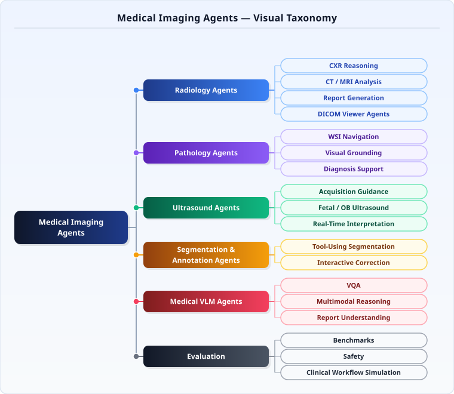

# Awesome Medical Imaging Agents 

> Agentic AI systems for medical image analysis, including radiology agents, pathology agents, ultrasound agents, surgical imaging agents, segmentation agents, and medical vision-language model agents.

This repository curates research papers, benchmarks, datasets, and open-source systems for medical imaging agents. It focuses on tool use, retrieval-augmented generation, multi-agent collaboration, planning, segmentation, report generation, clinical reasoning, safety, and evaluation across CT, MRI, chest X-ray, ultrasound, pathology, endoscopy, ophthalmology, PET, and other imaging modalities.

## Taxonomy

## Start Here

Twelve landmark systems, one per major domain, for readers who want the fastest path into the field.

| Paper | Domain | Year | Why it matters | Code |
|---|---|---|---|---|
| [MedRAX: Medical Reasoning Agent for Chest X-ray](https://arxiv.org/pdf/2502.02673v1) | Radiology | 2025 | Director-worker architecture where composable tool-using agents outperform single-model baselines on chest X-ray reasoning. | [Code](https://github.com/bowang-lab/MedRAX) |
| [RadAgent: A Tool-Using AI Agent for Stepwise Interpretation of Chest CT](https://arxiv.org/abs/2604.15231) | Radiology | 2026 | Generates chest CT reports through an explicit tool-calling workflow with inspectable intermediate reasoning traces. | — |
| [Agentic Systems in Radiology: Design, Applications, Evaluation, and Challenges](https://arxiv.org/pdf/2510.09404v2) | Survey · Radiology | 2025 | Best entry-point survey mapping agent design patterns, evaluation protocols, and open challenges across the full radiology pipeline. | — |
| [CPathAgent: An Agent-based Foundation Model for Interpretable High-Resolution Pathology Image Analysis](https://arxiv.org/abs/2505.20510) | Pathology | 2025 | Agentic pathology foundation model mimics pathologist diagnostic logic to deliver interpretable analysis of whole-slide images. | — |
| [Echo-alpha: Large Agentic Multimodal Reasoning Model for Ultrasound Interpretation](https://arxiv.org/abs/2604.28011) | Ultrasound | 2026 | Demonstrates that large agentic reasoning models can jointly localize lesions and perform grounded multimodal clinical interpretation of ultrasound studies. | — |
| [EndoAgent: A Memory-Guided Reflective Agent for Intelligent Endoscopic Vision-to-Decision Reasoning](https://arxiv.org/abs/2508.07292) | Endoscopy | 2025 | Memory-guided reflective agent for endoscopic vision-to-decision reasoning; representative model for specialty-specific imaging agent design. | [Code](https://github.com/Tyyds-ai/EndoAgent) |
| [VoxelPrompt: A Vision Agent for End-to-End Medical Image Analysis](http://arxiv.org/abs/2410.08397) | 3D Imaging | 2024 | Multi-stage vision agent for end-to-end volumetric medical image analysis covering segmentation, detection, and QA across CT, MRI, and PET. | — |
| [MedSAM-Agent: Empowering Interactive Medical Image Segmentation with Multi-turn Agentic Reinforcement Learning](https://arxiv.org/abs/2602.03320) | Segmentation | 2026 | Introduces multi-turn RL to train an interactive segmentation agent that decides which prompts to issue to SAM — the first RL-trained imaging segmentation agent. | [Code](https://github.com/CUHK-AIM-Group/MedSAM-Agent) |
| [MMedAgent: Learning to Use Medical Tools with Multi-modal Agent](https://arxiv.org/pdf/2407.02483) | Multimodal | 2024 | First paper to train a medical agent that selects and calls specialist tools (segmentation, retrieval, calculators) on demand across seven imaging modalities. | [Code](https://github.com/Wangyixinxin/MMedAgent) |
| [MedAgent-Pro: Towards Evidence-based Multi-modal Medical Diagnosis via Reasoning Agentic Workflow](https://openreview.net/forum?id=ZOuU0udyA4) | Medical VLM | 2026 | Integrates imaging, labs, and clinical guidelines via explicit tool calling; demonstrates evidence-based multimodal clinical reasoning. | [Code](https://github.com/jinlab-imvr/MedAgent-Pro) |
| [AgentClinic: A Multimodal Benchmark for Tool-Using Clinical AI Agents](https://www.nature.com/articles/s41746-026-02674-7) | Benchmark | 2026 | The canonical multimodal benchmark for tool-using clinical AI agents with an open simulator across imaging, EHR, and lab modalities. | [Code](https://github.com/SamuelSchmidgall/AgentClinic) |
| [ABRA: Agent Benchmark for Radiology Applications](https://arxiv.org/abs/2605.11224) | Benchmark · Radiology | 2026 | First benchmark where agents operate a real DICOM viewer (OHIF + Orthanc) via tool calls, testing end-to-end radiology agent workflows on live imaging software. | — |

## Scope

- Medical imaging agents for radiology, pathology, ultrasound, CT, MRI, chest X-ray, dermatology, endoscopy, PET, ophthalmology, and cardiac imaging.
- Agent workflows for tool use, retrieval-augmented generation, multi-agent collaboration, self-reflection, planning, report generation, quality control, and human-in-the-loop review.
- Research resources including peer-reviewed papers, arXiv preprints, benchmarks, datasets, reproducible code, and related open-source systems.
- Safety and evaluation work on hallucination detection, fairness, robustness, uncertainty, abstention, privacy, and clinically grounded evaluation.

## Contents

- [Taxonomy](#taxonomy)
- [Start Here](#start-here)
- [Scope](#scope)
- [Radiology Agents (43)](#radiology-agents-43)
- [Pathology Agents (Whole-Slide Imaging · Digital Pathology) (31)](#pathology-agents-whole-slide-imaging--digital-pathology-31)
- [Ultrasound Agents (Echocardiography · Robotic Ultrasound) (18)](#ultrasound-agents-echocardiography--robotic-ultrasound-18)
- [Endoscopy and Surgical Imaging Agents (17)](#endoscopy-and-surgical-imaging-agents-17)
- [Ophthalmology Agents (13)](#ophthalmology-agents-13)
- [3D CT / MRI / Volumetric Imaging Agents (19)](#3d-ct--mri--volumetric-imaging-agents-19)
- [Segmentation and Annotation Agents (14)](#segmentation-and-annotation-agents-14)
- [Report Generation Agents (16)](#report-generation-agents-16)
- [Medical Vision-Language Model (VLM) Agents (29)](#medical-vision-language-model-vlm-agents-29)
  - [Backbone Foundation Models (not agents) (32)](#backbone-foundation-models-not-agents-32)
- [Tool-Using and Multi-Agent Frameworks](#tool-using-and-multi-agent-frameworks)
  - [Clinical Reasoning Agents (72)](#clinical-reasoning-agents-72)
  - [Workflow and Simulation Agents (46)](#workflow-and-simulation-agents-46)
  - [Agent Skills and Tool Learning (10)](#agent-skills-and-tool-learning-10)
- [Benchmarks and Evaluation](#benchmarks-and-evaluation)
  - [Benchmark Table](#benchmark-table)
  - [Benchmark Papers (43)](#benchmark-papers-43)
  - [Safety, Robustness, and Fairness (34)](#safety-robustness-and-fairness-34)
- [Themes Index](#themes-index)
- [Datasets](#datasets)
- [Toolboxes](#toolboxes)
- [Surveys and Position Papers (19)](#surveys-and-position-papers-19)
- [Related Awesome Lists](#related-awesome-lists)
- [Footnotes](#footnotes)
- [Contributing](#contributing)

## Radiology Agents (43)

Agents for chest X-ray, CT, MRI, DICOM workflows, radiotherapy planning, and radiology decision support.

- [FRAC-MAS: A Safe and Explainable Multi-Agent System for Fracture Diagnosis](https://arxiv.org/abs/2608.28662) — arXiv (2026). Stacks four vision models with conformal prediction to produce statistically grounded differential fracture diagnoses, then hands off to a multi-agent workflow that independently verifies results, retrieves clinical guidelines, and drafts patient-accessible reports; the verification agent flags 86.6% of cases as high-confidence needing no escalation, and user studies rate its reports as significantly more comprehensible than reports from Llama, MedGemma, and Gemini.
- [A Modular Agent for Reliable and Auditable Spatial Relation Verification in CT Scans](https://arxiv.org/abs/2608.21140) — arXiv (2026). Decomposes binary spatial-relation verification in axial CT slices into language parsing, YOLO-based anatomical localization, and deterministic geometric verification instead of end-to-end VLM prediction, reaching 94.1% accuracy on the MIRP spatial QA benchmark and beating direct Qwen2-VL prompting by 42.5 points while keeping every intermediate step auditable.
- [DentAgent: Evidence-Centric Multi-Agent Coordination for Multimodal Dental Reasoning](https://arxiv.org/abs/2608.18878) — arXiv (2026). An Orchestrator agent coordinates five modality-specialist agents over radiographs, intraoral photographs, and 3D dental data, tracking each agent's findings as structured evidence on a shared blackboard before generating traceable diagnoses, surpassing senior specialists by 17.3 points on multi-label diagnosis across four benchmarks.
- [CT-PrepAgent: Bounded Policy and Controlled Execution for Adaptive CT Data Preparation](https://arxiv.org/abs/2608.01233) — arXiv (2026). Policy-driven CT data-preparation agent that profiles heterogeneous DICOM series and executes adaptive preprocessing through guarded, verified, and recoverable steps, lifting verified output yield from 61.7% to 70.0% on private data and improving downstream segmentation Dice across three public CT tasks.
- [One-for-All Adaptive Radiotherapy Planning Agent: A Foundation Framework for Daily CBCT-guided Radiotherapy](https://arxiv.org/abs/2607.14870) — arXiv (2026). Foundation-model agent that autonomously performs complete online adaptive radiotherapy planning directly from daily cone-beam CT in under two minutes, chaining synthetic CT generation, multimodal alignment, and tumor/organ segmentation into a human-in-the-loop workflow across head-and-neck, lung, abdominal, and prostate cancers.
- [Policy-Driven CT-Agent: Modeling Phase-Aware Diagnostic Control for Clinically Consistent CT Reasoning](https://arxiv.org/abs/2607.10748) — arXiv (2026). Policy-driven agent harmonizes heterogeneous CT phases into a unified evidence representation and iteratively requests additional contrast phases when diagnostic sufficiency is unmet, letting it flexibly follow different institutional, regional, or guideline-specific phase-selection protocols.
- [A Vision-Language Framework for Comparative Reasoning in Radiology](https://arxiv.org/abs/2606.06407) - Published in arXiv (2026). Entity-aware cross-image reasoning framework for reference-case retrieval and longitudinal comparison in radiology; introduces MedReCo-DB with 690K images from 160K patients across eight institutions and seven modalities.
- [A Machine-to-Machine Knowledge-Guided LLM Agent for Generalizable Radiotherapy Treatment Planning](https://arxiv.org/abs/2606.00922) - Published in arXiv (2026). Transfers DRL-derived treatment planning parameter knowledge to an LLM agent via in-context learning for autonomous, iterative radiotherapy planning without human intervention across prostate, liver, and complex anatomy cases.
- [MedExpMem: Adapting Experience Memory for Differential Diagnosis](https://arxiv.org/abs/2605.22872) - Published in MICCAI 2026 (2026). Experience-memory framework that lets VLM-based diagnostic agents accumulate differential diagnosis expertise from prior failures and retrieve it for radiology cases across 11 subspecialties.
- [A Discordance-Aware Multimodal Framework with Multi-Agent Clinical Reasoning](https://arxiv.org/abs/2604.16333) — arXiv (2026). Multimodal ensemble fuses ResNet18-derived knee MRI and X-ray embeddings with demographics and biomarkers, then a multi-agent clinical-reasoning layer interprets discordance between imaging-observed structural damage and patient-reported symptoms to assign osteoarthritis phenotypes and tailored management recommendations.
- [Evo-MedAgent: Beyond One-Shot Diagnosis with Agents That Remember, Reflect, and Improve](https://arxiv.org/abs/2604.14475) - Published in arXiv (2026). Self-evolving memory module that equips a chest X-ray agent with episodic, procedural, and tool-reliability memory stores for inter-case learning without retraining, lifting ChestAgentBench accuracy by up to 14 points.
- [Agentic Automation of BT-RADS Scoring: End-to-End Multi-Agent System for Standardized Brain Tumor Follow-up Assessment](https://arxiv.org/abs/2603.21494) - Published in arXiv (2026). Multi-agent system combining an extractor agent (clinical notes) and a scorer agent (BT-RADS decision logic + volumetric CNN segmentation) for standardized post-treatment glioma MRI response assessment.
- [Agentic LLM Workflow for MR Spectroscopy Volume-of-Interest Placements in Brain Tumors](https://arxiv.org/abs/2603.13371) - Published in arXiv (2026). LLM agent decomposes spectroscopy VOI placement into candidate generation and optimal selection via tool calls, enabling user-instruction-driven MRS acquisition planning for brain tumors.
- [An Explainable Agentic AI Framework for Uncertainty-Aware and Abstention-Enabled Acute Ischemic Stroke Imaging Decisions](https://arxiv.org/abs/2601.01008) - Published in arXiv (2026). Imaging agent that explains decisions and abstains under uncertainty for acute stroke workflows.
- [CXReasonAgent: Evidence-Grounded Diagnostic Reasoning Agent for Chest X-rays](https://arxiv.org/abs/2602.23276) - Published in arXiv (2026). Evidence-grounded chest X-ray agent that structures diagnostic reasoning around retrieved findings.
- [DUCX: Decomposing Unfairness in Tool-Using Chest X-ray Agents](https://arxiv.org/abs/2603.00777) - Published in arXiv (2026). Audits how unfairness arises across tool-selection and reasoning stages in CXR agents.
- [Evidential Reasoning Advances Interpretable Real-World Disease Screening](https://arxiv.org/abs/2605.15171) - Published in arXiv (2026). EviScreen retrieves region-level historical case evidence from dual knowledge banks to make medical image screening more interpretable.
- [Experience-Guided Self-Adaptive Cascaded Agents for Breast Cancer Screening and Diagnosis with Reduced Biopsy Referrals](https://arxiv.org/abs/2602.23899) - Published in arXiv (2026). Cascaded imaging agents adapt from prior cases to improve screening decisions while reducing unnecessary biopsies.
- [GAZE: Grounded Agentic Zero-shot Evaluation on Rare Brain MRI](https://arxiv.org/abs/2605.00876) - Published in arXiv (2026). Lets VLMs call DICOM viewer tools and PubMed-backed retrieval before generating reports for rare brain MRI cases.
- [MARCH: Multi-Agent Radiology Clinical Hierarchy for CT Report Generation](https://arxiv.org/abs/2604.16175) - Published in arXiv (2026). Hierarchical radiology agents emulate clinical oversight to reduce hallucinations in 3D CT report generation.
- [OPGAgent: An Agent for Auditable Dental Panoramic X-ray Interpretation](https://arxiv.org/abs/2603.00462) - Published in arXiv (2026). Dental X-ray agent with auditable reasoning traces for clinical review.
- [RadAgent: A Tool-Using AI Agent for Stepwise Interpretation of Chest CT](https://arxiv.org/abs/2604.15231) - Published in arXiv (2026). Generates chest CT reports through an explicit tool-calling workflow with inspectable intermediate reasoning traces.
- [Which Tool Response Should I Trust? Tool-Expertise-Aware Chest X-ray Agent with Multimodal Agentic Learning](https://arxiv.org/abs/2602.21517) - Published in arXiv (2026). Learns when to trust different tool outputs in chest X-ray workflows using expertise-aware agent collaboration.
- [XrayClaw: Cooperative-Competitive Multi-Agent Alignment for Trustworthy Chest X-ray Diagnosis](https://arxiv.org/abs/2604.02695) - Published in arXiv (2026). Uses cooperative and adversarial agent interactions to improve trustworthiness in chest X-ray diagnosis.
- [A Multi-Agent System for Complex Reasoning in Radiology Visual Question Answering](https://arxiv.org/abs/2508.02841) - Published in arXiv (2025). Coordinates specialized agents for question decomposition, visual evidence retrieval, and answer synthesis.
- [Agent-Based Output Drift Detection for Breast Cancer Response Prediction in a Multisite Clinical Decision Support System](https://arxiv.org/abs/2512.18450) - Published in arXiv (2025). Uses agents to detect performance drift across sites in clinical imaging decision support.
- [Agentic large language models improve retrieval-based radiology question answering](https://arxiv.org/abs/2508.00743) - Published in arXiv (2025). Multi-step retrieval-and-reasoning agent (RaR) for radiology QA.
- [AT-CXR: Uncertainty-Aware Agentic Triage for Chest X-rays](https://arxiv.org/abs/2508.19322) - Published in arXiv (2025). Triage agent that defers or escalates based on calibrated uncertainty.
- [Automated stereotactic radiosurgery planning using a human-in-the-loop reasoning large language model agent](http://arxiv.org/abs/2512.20586v1) - Published in arXiv (2025). Planning agent drafts SRS shot plans with clinician review loops for quality and safety.
- [Bridging Clinical Narratives and ACR Appropriateness Guidelines: A Multi-Agent RAG System for Medical Imaging Decisions](https://arxiv.org/abs/2510.04969) - Published in arXiv (2025). Maps free-text clinical context to imaging guideline recommendations with multi-agent retrieval and reasoning.
- [CT-Agent: A Multimodal-LLM Agent for 3D CT Radiology Question Answering](https://arxiv.org/abs/2505.16229) - Published in arXiv (2025). Slice-aware CT agent answers volumetric radiology questions with targeted tool calls over 3D imaging data.
- [CXRAgent: Director-Orchestrated Multi-Stage Reasoning for Chest X-Ray Interpretation](https://arxiv.org/abs/2510.21324) - Published in arXiv (2025). Director agent routes tasks among radiology specialists.
- [IMACT-CXR: An Interactive Multi-Agent Conversational Tutoring System for Chest X-Ray Interpretation](https://arxiv.org/abs/2511.15825) - Published in arXiv (2025). Multi-agent tutor combines gaze analysis, annotation, and retrieval for CXR education.
- [LungNoduleAgent: A Collaborative Multi-Agent System for Precision Diagnosis of Lung Nodules](https://arxiv.org/abs/2511.21042) - Published in arXiv (2025). Collaborative agents analyze CT nodules and reason about malignancy.
- [MAARTA: Multi-Agentic Adaptive Radiology Teaching Assistant](https://arxiv.org/abs/2506.17320) - Published in arXiv (2025). Tutoring agents guide trainees with attention feedback and targeted remediation.
- [MedRAX: Medical Reasoning Agent for Chest X-ray](https://arxiv.org/pdf/2502.02673v1) - Published in ICML 2025 (2025). Director-worker architecture where composable tool-using agents outperform single-model baselines on chest X-ray reasoning.
- [PASS: Probabilistic Agentic Supernet Sampling for Interpretable and Adaptive Chest X-Ray Reasoning](https://arxiv.org/abs/2508.10501) - Published in arXiv (2025). Builds interpretable reasoning paths with probabilistic agent selection.
- [RadAgents: Multimodal Agentic Reasoning for Chest X-ray Interpretation with Radiologist-like Workflows](https://arxiv.org/abs/2509.20490) - Published in arXiv (2025). Emulates radiology conferences with discussion-style agents.
- [RadFabric: Agentic AI System with Reasoning Capability for Radiology](https://arxiv.org/abs/2506.14142) - Published in arXiv (2025). Radiology agent blends visual grounding and text-based reasoning for CXR interpretation.
- [Radiologist Copilot: An Agentic Assistant with Orchestrated Tools for Radiology Reporting with Quality Control](https://arxiv.org/abs/2512.02814) - Published in arXiv (2025). Tool-orchestrated agent drafts volumetric reports with explicit quality-control passes.
- [Scan-do Attitude: Towards Autonomous CT Protocol Management using a Large Language Model Agent](https://arxiv.org/abs/2509.20270) - Published in arXiv (2025). LLM agent configures acquisition and reconstruction protocols for CT workflows.
- [Zero-Shot Large Language Model Agents for Fully Automated Radiotherapy Treatment Planning](https://arxiv.org/abs/2510.11754) - Published in arXiv (2025). Planning agent automates radiotherapy workflows with iterative plan refinement via zero-shot LLM reasoning.
- [RadioRAG: Online Retrieval-Augmented Generation for Radiology Question Answering](https://arxiv.org/abs/2407.15621) - Published in arXiv (2024). Streaming RAG agent that continuously pulls prior studies and reports while answering radiology questions.

## Pathology Agents (Whole-Slide Imaging · Digital Pathology) (31)

Agents for whole-slide image analysis, digital pathology, pathology reports, and slide navigation.

- [SlideBank: A Persistent Hierarchical Evidence Bank for Consistent Whole-Slide Reasoning](https://arxiv.org/abs/2609.00342) — arXiv (2026). Training-free framework builds a persistent, concept-indexed evidence bank per whole-slide image by hierarchically exploring informative regions and multi-scale views into explicit, patch-and-coordinate-grounded morphological observations, then answers queries by matching relevant evidence and fusing it via confidence-based cross-level consensus; reaches 52.77% on WSI-VQA with Patho-R1 and 50.92% on SlideBench-BCNB with Quilt-LLaVA, with over 99% answer consistency when the same bank is reused across rephrased queries.
- [LUCAID: Agentic Multimodal AI for Lung Cancer Precision Pathology](https://arxiv.org/abs/2608.23803) — arXiv (2026). Integrative agent couples diagnostic reasoning with nine clinically validated modules spanning quality control, tumor detection and subtyping, microenvironment profiling, and PD-L1/MET/TROP-2 biomarker scoring through to structured report generation, reaching 93.0% concordance with an expert-panel reference versus 68.3-81.1% for five thoracic pathologists in prospective clinical validation.
- [Interactive Whole Slide Images for RL-based Tumour Segmentation](https://arxiv.org/abs/2608.16607) — arXiv (2026). Formulates the whole-slide image itself as a hierarchical multi-resolution environment in which a PPO-trained actor-critic agent navigates via movement, zooming, and tumour-selection actions, performing end-to-end sequential tumour segmentation directly on full pulmonary adenocarcinoma slides in seconds rather than exhaustive patch-based inference.
- [Beyond Relevance: Bayesian Evidence Acquisition for Agentic Whole-Slide Image Reasoning](https://arxiv.org/abs/2608.05757) — arXiv (2026). BEACON reformulates whole-slide image reasoning as Bayesian evidence acquisition, maintaining a probabilistic belief over competing diagnoses and sequentially acquiring patches that maximize expected information gain rather than semantic relevance, achieving the strongest zero-shot results among training-free agentic frameworks across five WSI-VQA benchmarks. [Code](https://github.com/bryanwong17/BEACON)
- [Trust but Verify: Evidence-Linked Multi-Agent Clinical Information Extraction in Pathology](https://arxiv.org/abs/2607.06435) — arXiv (2026). Multi-agent workflow (nMAS) extracts structured clinical features from pathology reports via configurable field specifications, complexity-based routing, and report-level aggregation, linking every decision to verbatim source text; on 54 gastric biopsy reports covering 216 feature-case decisions it reaches 98.6% accuracy with all correct calls traceable to source evidence.
- [A Multi-modal Agentic Co-pilot for Evidence Grounded Computational Pathology](https://arxiv.org/abs/2606.08093) — arXiv (2026). PathPocket grounds pathology interpretation in a 110,472-document evidence corpus and a 4.55-million-entity multimodal hypergraph, coordinating input-understanding, evidence-retrieval, filtering, and diagnosis-generation agents to resolve tasks from text-only queries to gigapixel whole-slide diagnostics, improving pathologist diagnostic accuracy and confidence in user studies over 200,000 real-world cases.
- [Democratizing and accelerating AI-driven pathology research through agentic intelligence](https://arxiv.org/abs/2606.20677) — arXiv (2026). PathLab translates natural-language research objectives into executable, validated computational pathology workflows by composing reusable methodological modules for preprocessing, model development, evaluation, and interpretation, matching expert implementations across 12 public datasets spanning ROI classification, WSI classification, segmentation, and survival prediction while letting non-programmers design and run studies.
- [Act Like a Pathologist: Tissue-Aware Whole Slide Image Reasoning](https://arxiv.org/abs/2603.00667) — CVPR 2026 (2026). HistoSelect mimics pathologist visual search with a question-guided, tissue-aware, coarse-to-fine retrieval framework that narrows from broad tissue regions to diagnostic patches, cutting visual token usage 70% on gigapixel WSI question answering. [Code](https://github.com/winston52/HistoSelect)
- [SAGE: Agentic Framework for Interpretable and Clinically Translatable Computational Pathology Biomarker Discovery](https://arxiv.org/abs/2602.00953) - Published in arXiv (2026). Multi-agent system that automates pathology biomarker discovery by grounding hypothesis generation in biological knowledge graphs, applying debate-based novelty assessment, and running automated validation pipelines on multimodal pathology datasets.
- [An Interactive Trustworthy AI Pathology Copilot to Improve Biomarker-Driven Prognostic Stratification and Therapeutic Response Prediction](https://www.medrxiv.org/content/10.64898/2026.05.17.26352870v1) - Published in MedRxiv (2026). TEAM-Agent dynamically orchestrates WSI-based biomarker profiling, outcome prediction, uncertainty-aware clinical reasoning, and clinician-in-the-loop refinement for pathology prognosis and therapy-response support.
- [CellDX AI Autopilot: Agent-Guided Training and Deployment of Pathology Classifiers](https://arxiv.org/abs/2605.10362) - Published in arXiv (2026). Agent-guided platform that helps pathologists train, evaluate, and deploy whole-slide pathology classifiers with minimal ML engineering.
- [Exploring General-Purpose Autonomous Multimodal Agents for Pathology Report Generation](https://arxiv.org/abs/2601.11540) - Published in BVM 2026 (2026). Evaluates general-purpose agentic AI systems that autonomously navigate whole-slide tissue viewers and generate diagnostic pathology reports, reaching 68.6% accuracy on veterinary cases.
- [MMNavAgent: Multi-Magnification WSI Navigation Agent for Clinically Consistent Whole-Slide Analysis](https://arxiv.org/abs/2603.02079) - Published in arXiv (2026). Multi-magnification navigation agent that improves clinically consistent exploration of pathology slides.
- [PathNavigate: A Training-Free Pathology Agent with Surprise-Guided Scan and Shared Slide Memory for Whole-Slide Image VQA](https://arxiv.org/abs/2605.23559) - Published in arXiv (2026). Training-free WSI agent performs surprise-guided low-magnification scanning and shared-memory filtering to identify question-relevant regions before high-resolution evidence extraction for VQA.
- [PathoSage: Towards Multi-Source Evidence Adjudication in Pathology via Experience-Aware Agentic Workflow](https://arxiv.org/abs/2606.07549) - Published in arXiv (2026). Experience-aware pathology agent that separately gathers, deliberates over, and adjudicates evidence from multiple tools — tracking tool reliability with a Beta-Bernoulli experience system — to reduce hallucinations in patch-level whole-slide VQA.
- [LAMMI-Pathology: A Tool-Centric Bottom-Up LVLM-Agent Framework for Molecularly Informed Medical Intelligence in Pathology](https://arxiv.org/abs/2602.18773) - Published in arXiv (2026). Tool-centric bottom-up agent framework that organizes domain-specific pathology tools into Atomic Execution Nodes, enabling LVLMs to construct multi-step diagnostic reasoning trajectories for molecularly informed pathology analysis.
- [QCAgent: An Agentic Framework for Quality-Controllable Pathology Report Generation from Whole Slide Image](https://arxiv.org/abs/2603.01647) - Published in arXiv (2026). Pathology reporting agent framework with explicit quality-control loops over whole-slide analysis.
- [Agent-Based Large Language Model System for Extracting Structured Data from Breast Cancer Synoptic Reports: A Dual-Validation Study](https://www.medrxiv.org/content/10.1101/2025.11.25.25340989v1) - Published in MedRxiv (2025). Agentic LLM pipeline for structured extraction from breast cancer synoptic reports with dual validation.
- [CPathAgent: An Agent-based Foundation Model for Interpretable High-Resolution Pathology Image Analysis](https://arxiv.org/abs/2505.20510) - Published in arXiv (2025). Agentic pathology foundation model mimics pathologist diagnostic logic to deliver interpretable analysis of whole-slide images.
- [Evidence-based diagnostic reasoning with multi-agent copilot for human pathology](https://arxiv.org/abs/2506.20964) - Published in arXiv (2025). Multi-agent copilot integrates pathology slides with evidence-based reasoning.
- [GMAT: Grounded Multi-Agent Clinical Description Generation for Text Encoder in Vision-Language MIL for Whole Slide Image Classification](https://arxiv.org/abs/2508.01293) - Published in arXiv (2025). Multi-agent generation of clinical descriptions to steer WSI classification.
- [Navigating Gigapixel Pathology Images with Large Multimodal Models](https://arxiv.org/abs/2511.19652) - Published in arXiv (2025). GIANT enables large multimodal models to iteratively navigate whole-slide images at multiple scales, paired with MultiPathQA, a benchmark of 934 clinical pathology questions including 128 authored by professional pathologists.
- [NOVA: An Agentic Framework for Automated Histopathology Analysis and Discovery](https://arxiv.org/abs/2511.11324) - Published in arXiv (2025). Agentic framework converts pathology research queries into executable Python analysis pipelines using 49 domain-specific tools, introducing SlideQuest, a 90-question pathologist-verified benchmark for multi-step coding-agent reasoning over whole-slide images.
- [PathAgent: Toward Interpretable Analysis of Whole-slide Pathology Images via Large Language Model-based Agentic Reasoning](https://arxiv.org/pdf/2511.17052v1) - Published in arXiv (2025). Combines slide parsers with language agents to narrate lesion findings.
- [PathFinder: A Multi-Modal Multi-Agent System for Medical Diagnostic Decision-Making Applied to Histopathology](https://arxiv.org/pdf/2502.08916) - Published in arXiv (2025). Uses planner, analyzer, and verifier agents for histopathology question answering and diagnostic decision-making.
- [PathFound: An Agentic Multimodal Model Activating Evidence-seeking Pathological Diagnosis](https://arxiv.org/abs/2512.23545) - Published in arXiv (2025). Evidence-seeking pathology agent iterates between regions and findings.
- [Patho-AgenticRAG: Towards Multimodal Agentic Retrieval-Augmented Generation for Pathology VLMs via Reinforcement Learning](https://arxiv.org/abs/2508.02258) - Published in arXiv (2025). RL-trained agentic RAG reduces pathology VLM hallucinations.
- [Pathology-CoT: Learning Visual Chain-of-Thought Agent from Expert Whole Slide Image Diagnosis Behavior](https://arxiv.org/abs/2510.04587) - Published in arXiv (2025). Learns sequential field-of-view decisions for WSI diagnosis.
- [PathReasoning: A Multimodal Reasoning Agent for Query-Based ROI Navigation on Whole-Slide Images](https://arxiv.org/abs/2511.21902) - Published in arXiv (2025). Multimodal agent that navigates gigapixel whole-slide images through iterative reasoning cycles — sampling regions, reflecting on selections, and building reasoning chains — for cancer subtyping and survival prediction.
- [SurvAgent: Hierarchical CoT-Enhanced Case Banking and Dichotomy-Based Multi-Agent System for Multimodal Survival Prediction](https://arxiv.org/pdf/2511.16635v1) - Published in arXiv (2025). Multimodal agents pool pathology, imaging, and clinical signals for survival analysis.
- [WSI-Agents: A Collaborative Multi-Agent System for Multi-Modal Whole Slide Image Analysis](https://arxiv.org/pdf/2507.14680) - Published in MICCAI 2025 (2025). Delegates slide parsing, reporting, and triaging across specialized collaborative agents for whole-slide image analysis.

## Ultrasound Agents (Echocardiography · Robotic Ultrasound) (18)

Agents for echocardiography interpretation, fetal ultrasound, robotic scanning, and ultrasound-guided workflows.

- [Auditable agentic AI for evidence-grounded thyroid ultrasound diagnosis and reporting](https://arxiv.org/abs/2608.12590) — arXiv (2026). ThyroidXAgent coordinates nodule-segmentation, risk-stratification, and reporting tools into an auditable, clinician-correctable case-level evidence record for thyroid ultrasound, evaluated on 28,458 test cases across 35 centres and raising report diagnostic consistency from 70.3% to 86.2%.
- [UltraSAM3: A Concept-Driven Foundation Model for Universal Ultrasound Image Segmentation](https://arxiv.org/abs/2607.29200) — arXiv (2026). Adapts SAM3 to ultrasound image-mask-concept triplets across 37 datasets and 13 anatomical categories, pairing the segmentation model with an instruction-guided agent that parses complex natural-language queries into concise ultrasound concept prompts.
- [FetalAgents: A Multi-Agent System for Fetal Ultrasound Image and Video Analysis](https://arxiv.org/abs/2603.09733) - Published in arXiv (2026). Multi-agent system that coordinates specialized vision experts to analyze fetal ultrasound images and videos across diagnosis, measurement, and segmentation tasks, generating structured clinical reports from keyframe identification and anatomical plane analysis.
- [Unified Ultrasound Intelligence Toward an End-to-End Agentic System](https://arxiv.org/abs/2604.16914) - Published in arXiv (2026). Three-stage ultrasound intelligence system (USTri) that trains a universal model, adapts dataset-specific specialists, and orchestrates them via an agent to produce clinically structured reports across multiple organ types.
- [UltrasoundAgents: Hierarchical Multi-Agent Evidence-Chain Reasoning for Breast Ultrasound Diagnosis](https://arxiv.org/abs/2603.10852) - Published in arXiv (2026). Hierarchical multi-agent framework that mirrors clinical diagnostic workflows by localizing breast lesions, analyzing fine-grained attributes such as echogenicity and calcification, and integrating traceable evidence chains for BI-RADS classification.
- [Echo-alpha: Large Agentic Multimodal Reasoning Model for Ultrasound Interpretation](https://arxiv.org/abs/2604.28011) - Published in arXiv (2026). Demonstrates that large agentic reasoning models can jointly localize lesions and perform grounded multimodal clinical interpretation of ultrasound studies.
- [EchoAgent: Towards Reliable Echocardiography Interpretation with Eyes, Hands and Minds](https://arxiv.org/abs/2604.05541) - Published in arXiv (2026). Decomposes echocardiography interpretation into visual observation, measurement, and expert reasoning for more reliable cardiac assessment.
- [Evidence-Based Actor-Verifier Reasoning for Echocardiographic Agents](https://arxiv.org/abs/2604.06347) - Published in arXiv (2026). Adds an actor-verifier loop to echocardiography agents so image understanding is cross-checked against clinical evidence before conclusions.
- [From Scanning Guidelines to Action: A Robotic Ultrasound Agent with LLM-Based Reasoning](https://arxiv.org/abs/2603.14393) - Published in arXiv (2026). Turns ultrasound scanning guidelines into a reasoning-driven robotic agent for autonomous acquisition.
- [MARCUS: An Agentic, Multimodal Vision-Language Model for Cardiac Diagnosis and Management](https://arxiv.org/abs/2603.22179) - Published in arXiv (2026). Hierarchical agentic architecture with modality-specific expert models interprets ECGs, echocardiograms, and cardiac MRI, achieving nearly triple the multimodal accuracy of frontier models on cardiac cases.
- [RAG-RUSS: A Retrieval-Augmented Robotic Ultrasound for Autonomous Carotid Examination](https://arxiv.org/abs/2603.01153) - Published in arXiv (2026). Interpretable retrieval-augmented robotic ultrasound that autonomously plans probe motions and explains each scanning stage to complete a full carotid examination across transverse and longitudinal planes.
- [Towards Reliable Fetal Ultrasound Interpretation with Multi-Agent Collaboration](https://arxiv.org/abs/2605.25357) - Published in arXiv (2026). FetUSAgents coordinates specialized visual tools and LLM agents with Dual-Path Evidence Arbitration for fetal ultrasound interpretation; introduces FetUS-VQA benchmark with 1,892 images and 10 clinical tasks.
- [Anatomical Prior-Driven Framework for Autonomous Robotic Cardiac Ultrasound Standard View Acquisition](https://arxiv.org/abs/2603.21134) — arXiv (2026). RL-trained probe-adjustment agent uses a YOLO-based spatial-relation graph to embed cardiac anatomical priors into state representation, autonomously acquiring standard echocardiography views with a 92.5% success rate in simulation and 86.7% in phantom experiments.
- [Echo-CoPilot: A Multi-View, Multi-Task Agent for Echocardiography Interpretation and Reporting](http://arxiv.org/abs/2512.09944v2) - Published in arXiv (2025). Multi-stage agent handles view selection, measurements, and report drafting for echo studies.
- [EchoAgent: Guideline-Centric Reasoning Agent for Echocardiography Measurement and Interpretation](https://arxiv.org/abs/2511.13948) - Published in arXiv (2025). Orchestrates specialized echocardiography vision tools under LLM control for guideline-centric temporal localization, spatial measurement, and clinical interpretation of cardiac studies.
- [FUAS-Agents: Autonomous Multi-Modal LLM Agents for Treatment Planning in Focused Ultrasound Ablation Surgery](https://arxiv.org/abs/2505.21418) — arXiv (2025). Multi-modal LLM agent integrates MRI data and patient profiles to orchestrate specialized tools including segmentation for autonomous treatment plan generation in focused ultrasound ablation surgery across 3,000+ multicenter cases.
- [USPilot: An Embodied Robotic Assistant Ultrasound System with Large Language Model Enhanced Graph Planner](https://arxiv.org/abs/2502.12498) - Published in IEEE RA-L (2025). Embodied robotic assistant where an LLM-enhanced graph neural network planner selects and sequences ultrasound APIs to enable autonomous acquisition and patient query handling, tackling the global shortage of sonographers.
- [Image-Guided Navigation of a Robotic Ultrasound Probe for Autonomous Spinal Sonography Using a Shadow-aware Dual-Agent Framework](http://arxiv.org/abs/2111.02167) - Published in arXiv (2021). Cooperative perception-control agents for ultrasound-guided robotics.

## Endoscopy and Surgical Imaging Agents (17)

Agents for gastrointestinal endoscopy, surgical scene understanding, and autonomous endoscopic navigation.

- [MedClaw: Heuristic Agent Harness for Long-Horizon Surgical Video Reasoning](https://arxiv.org/abs/2608.14015) — arXiv (2026). A text-only orchestrator plans which visual evidence to gather and issues an auditable sequence of tool calls to frozen vision-language sub-agents that view, crop, and inspect frames of tens-of-minutes surgical recordings, improving via a gradient-free skill-distillation loop instead of weight updates. [Demo](https://fyycs.github.io/medclaw/)
- [Agentic AI-Powered Flexible Fiber-Bundle Endoscopy for High-Resolution NIR-II Fluorescence Imaging In Vivo](https://arxiv.org/abs/2608.08402) — arXiv (2026). Agent-Guided Mixture-of-Experts (GAME) pipeline uses a vision-language model to dynamically route each fiber-bundle NIR-II fluorescence endoscopy frame to the most suitable restoration expert, removing fiber-pattern artifacts for high-resolution in-vivo endoscopic imaging.
- [ARTEMIS: Agent-guided Reliability-aware Temporal Mask Evolution for Imperfectly Supervised Video Polyp Segmentation](https://arxiv.org/abs/2606.20161) — arXiv (2026). A debate-and-judge vision-language agent selects reliable temporal anchor frames under weak or sparse supervision, then propagates masks bidirectionally with SAM2 and trains the segmenter with reliability-weighted robust learning, reaching state-of-the-art imperfectly supervised video polyp segmentation on SUN-SEG and CVC-ClinicDB-612.
- [EndoWAM: A Grounded World-Action Model for Generalizable Endoscopic Navigation](https://arxiv.org/abs/2608.01221) — arXiv (2026). Couples a diffusion-transformer world model that predicts future target regions with an action-generation head sharing the same predictive representation, enabling autonomous endoscopic navigation across ureteroscopy, esophagoscopy, and ERCP with strong zero-shot generalization to unseen viewpoints and targets.
- [A 4D Representation for Training-Free Agentic Reasoning from Monocular Laparoscopic Video](https://arxiv.org/abs/2604.00867) — arXiv (2026). Fuses 2D vision-language understanding with 3D computer vision into an explicit 4D (space + time) scene representation, letting a multimodal LLM act training-free as an agent over trajectory-derived tools to answer clinically relevant spatiotemporal questions about laparoscopic surgery.
- [Long-Short Term Agents for Pure-Vision Bronchoscopy Robotic Autonomy](https://arxiv.org/abs/2603.07909) - Published in arXiv (2026). Hierarchical dual-agent framework for autonomous vision-only bronchoscopic navigation, combining a short-term reactive agent for continuous motion control with a long-term strategic agent for navigational decisions at ambiguous anatomical junctions, validated on phantoms, ex vivo tissue, and live animal models.
- [Anatomical Landmark-Guided Deep Reinforcement Learning for Autonomous Gastric Navigation](https://arxiv.org/abs/2605.08269) - Published in arXiv (2026). RL-trained agent uses anatomical landmarks to autonomously navigate the stomach during wireless capsule endoscopy, achieving >97% gastric coverage and decoupling diagnostic quality from specialist availability.
- [Reinforcement Learning for Follow-the-Leader Robotic Endoscopic Navigation via Synthetic Data](https://arxiv.org/abs/2601.02798) - Published in arXiv (2026). RL-trained agent drives a flexible continuum endoscope by combining monocular depth estimation with policy learning in a synthetic intestinal simulation, improving depth accuracy 39% over baselines.
- [EndoAgent: A Memory-Guided Reflective Agent for Intelligent Endoscopic Vision-to-Decision Reasoning](https://arxiv.org/abs/2508.07292) - Published in arXiv (2025). Memory-guided reflective agent for endoscopic vision-to-decision reasoning; representative model for specialty-specific imaging agent design.
- [EndoVLA: Dual-Phase Vision-Language-Action Model for Autonomous Tracking in Endoscopy](https://arxiv.org/abs/2505.15206) - Published in CoRL 2025 (2025). Dual-phase VLA model combines supervised fine-tuning with RL fine-tuning and task-aware rewards to autonomously track polyps, delineate abnormal mucosal regions, and follow markers in GI endoscopy, enabling zero-shot generalization to diverse gastrointestinal scenarios.
- [Multi-Agent Intelligence for Multidisciplinary Decision-Making in Gastrointestinal Oncology](https://arxiv.org/abs/2512.08674) - Published in arXiv (2025). Hierarchical multi-agent framework with a Visual-Language Endoscopy Agent plus domain-specialist agents for radiology, lab, and text analysis, emulating multidisciplinary team decision-making for GI oncology.
- [SCOPE: Speech-guided COllaborative PErception Framework for Surgical Scene Segmentation](https://arxiv.org/abs/2509.10748) - Published in arXiv (2025). Collaborative perception agent combines LLM reasoning with vision foundation models for real-time, hands-free speech-guided segmentation of surgical instruments and anatomy during operations.
- [AgentPolyp: Accurate Polyp Segmentation via Image Enhancement Agent](https://arxiv.org/abs/2504.10978) — arXiv (2025). Reinforcement-learning agent combines CLIP-based semantic degradation analysis with a quality-assessment feedback loop to dynamically select multi-modal image-enhancement operations before polyp segmentation on degraded endoscopic frames.
- [Surgical Agent Orchestration Platform for Voice-directed Patient Data Interaction](https://arxiv.org/pdf/2511.07392v2) - Published in arXiv (2025). Voice-first assistant that routes surgical team requests across documentation and data tools.
- [SurgicalVLM-Agent: Towards an Interactive AI Co-Pilot for Pituitary Surgery](https://arxiv.org/abs/2503.09474) - Published in arXiv (2025). AI co-pilot for image-guided pituitary surgery that plans and executes MRI tumor segmentation, endoscope anatomy analysis, intraoperative overlay, and surgical VQA through a planner–worker agent pair.
- [SurgVisAgent: Multimodal Agentic Model for Versatile Surgical Visual Enhancement](https://arxiv.org/abs/2507.02252) - Published in arXiv (2025). Identifies distortion categories and severity in endoscopic images via in-context few-shot reasoning and chain-of-thought to apply targeted enhancements such as low-light correction, smoke removal, and motion deblurring.
- [SurgRAW: Multi-Agent Workflow with Chain of Thought Reasoning for Robotic Surgical Video Analysis](https://arxiv.org/abs/2503.10265) — arXiv (2025). Hierarchical orchestrator directs specialized agents through parallel chain-of-thought reasoning streams with a panel-discussion mechanism and RAG-grounded surgical knowledge, introducing the SurgCoTBench reasoning benchmark. [Code](https://github.com/jinlab-imvr/SurgRAW)

## Ophthalmology Agents (13)

Agents for fundus, OCT, glaucoma, diabetic retinopathy, myopia, and neuro-ophthalmic decision support.

- [Guideline-as-Oracle: Zero-Annotation Training of an Ophthalmic Telephone Triage Agent](https://arxiv.org/abs/2608.04772) — arXiv (2026). Converts American Academy of Ophthalmology guidance into a 70-row operational rule table used to supervise 3,000 synthetic training dialogues across eight rule-to-dialogue conversion strategies, then fine-tunes a 9B GAO-Triage model with no expert-annotated data; agreement with reference triage decisions rises from 61.7% to 74.1% and emergent-case recall jumps from 9.5% to 69.0%, matching seven general-purpose systems without a frontier model at inference.
- [An Agentic AI Framework Overcomes Fundamental Limitations of Large Language Models for Glaucoma Detection from Fundus Photography](https://arxiv.org/abs/2608.07651) — arXiv (2026). Agentic workflow combining LLM assessment, function-calling image-quality and segmentation tools, and LLM reflection corrects monolithic-LLM failure modes in glaucoma detection from fundus photographs, improving classification accuracy by 16 to 47 percentage points across two public datasets.
- [An Autonomous Multimodal AI Agent for Evidence-Grounded Ophthalmic Diagnosis](https://doi.org/10.1016/j.xcrm.2026.102969) — Cell Reports Medicine (2026). AgentEYE routes fundus photographs and B-scan ultrasonography to specialized imaging tools, retrieves clinical guideline and web evidence, and synthesizes evidence-grounded reports, outperforming LLM-only baselines on diagnostic correctness, completeness, safety, and citation grounding across a 302-case internal benchmark and a 200-case blinded ophthalmologist evaluation. [Code](https://github.com/OpenMedAILab/AgentEYE)
- [OphAgent: A Generalisable Ophthalmic Agentic System for Global Eye Care](https://doi.org/10.21203/rs.3.rs-9189179/v1) — Research Square preprint (2026). Multi-agent ophthalmic system with a planner, executor, and verifier orchestrates LLM-driven specialist agents through dynamic diagnostic planning, guideline consultation, and structured inter-agent debate over four imaging modalities, improving diagnostic accuracy by up to 20% for 311 ophthalmologists across 86 centres in 22 countries.
- [Deliberative multi-agent large language models improve clinical reasoning in ophthalmology](https://arxiv.org/abs/2603.21447) - Published in arXiv (2026). Multi-agent council where LLMs independently answer ophthalmic clinical questions, peer-review each other's responses, and synthesize conclusions via a designated chair, consistently outperforming individual models in diagnostic accuracy while reducing harmful errors.
- [MAGIS: Evidence-Based Multi-Agent Reasoning for Interpretable Strabismus Clinical Decision-Making](https://arxiv.org/abs/2606.09249) - Published in arXiv (2026). Multi-agent framework that analyses nine-cardinal-gaze photographs with hypothesis-generation, dual-evidence-constrained, and verification agents to deliver interpretable, evidence-grounded strabismus diagnoses.
- [Evo-RAD: Navigating Rare Retinal Disease Diagnosis via Self-Evolving Agentic Retrieval](https://arxiv.org/abs/2606.22955) - Published in MICCAI 2026 (2026). Self-evolving agentic retrieval framework that reformulates evidence acquisition for rare retinal disease diagnosis as an MDP, dynamically inserting, deleting, and terminating reference-case retrieval to overcome the hubness problem of static retrieval. [Code](https://github.com/SDH-Lab/Evo-RAD)
- [ChatMyopia: An AI Agent for Pre-consultation Education in Primary Eye Care Settings](https://arxiv.org/abs/2507.19498) - Published in arXiv (2025). Pre-consultation education agent that integrates image tools and RAG for myopia counseling in primary eye care.
- [Detection and Diagnosis of Diabetic Retinopathy in Retinal Fundus Images Using Agentic AI Approaches](https://www.nature.com/articles/s41598-025-34016-0) - Published in Scientific Reports (2025). AADR-AI uses JADE/Mesa autonomous agents that specialize in preprocessing, feature extraction, fusion, classification, and clinical explanation for diabetic retinopathy detection from retinal fundus images.
- [EyeAgent: An Agentic AI System for Multimodal Clinical Decision Support in Ophthalmology](https://arxiv.org/abs/2511.09394) - Published in arXiv (2025). Tool-using agentic AI that orchestrates 53 validated ophthalmic tools across 23 imaging modalities with RAG-grounded reasoning from authoritative textbooks, matching or exceeding senior ophthalmologist performance.
- [LLM-based multi-agent system for neuro-ophthalmic diagnosis and personalized treatment planning](https://doi.org/10.3389/fnins.2025.1688509) - Published in Frontiers in Neuroscience (2025). Multi-agent framework with an Information Collection Agent and Diagnosis Agent synthesizes ophthalmic imaging and clinical records to produce uncertainty-aware, ensemble-ranked neuro-ophthalmic diagnoses.
- [MedChat: A Multi-Agent Framework for Multimodal Diagnosis with Large Language Models](https://arxiv.org/abs/2506.07400) - Published in IEEE MIPR 2025 (2025). Director agent coordinates role-specific LLM agents (ophthalmologist, glaucoma specialist, optometrist, pharmacist) each receiving deep-learning classifier outputs for fundus-based glaucoma diagnosis.
- [Multimodal reasoning agent for enhanced ophthalmic decision-making: a preliminary real-world clinical validation](https://doi.org/10.3389/fcell.2025.1642539) - Published in Frontiers in Cell and Developmental Biology (2025). Three-module agentic pipeline integrating GPT-4o visual understanding, RAG from ophthalmic guideline knowledge bases, and DeepSeek-R1 diagnostic reasoning; validated on 30 real-world ophthalmic cases matching ophthalmology resident accuracy.

## 3D CT / MRI / Volumetric Imaging Agents (19)

Agents for volumetric CT, MRI, PET, dosimetry, neuroimaging, and multi-organ image analysis.

- [An Integrated Diffusion-Weighted Imaging Processing and Interpretation Platform for MR-Guided Radiotherapy](https://arxiv.org/abs/2608.20519) — arXiv (2026). Web-based platform pairs a deep-learning MR-Linac DWI pipeline (distortion correction, denoising, IVIM/ADC fitting, longitudinal ROI analysis) with a retrieval-augmented interpretation agent that delegates arithmetic to deterministic tools and traces every statement to a source document, section, and line; across 54 expert ratings the pooled mean was 4.65/5 with 93% rated 4 or higher.
- [VLM- and LLM-Driven Multi-Agent System for PET Image Denoising](https://arxiv.org/abs/2608.13791) — arXiv (2026). Multi-agent framework where vision-language and language models assess PET image quality and lesion status, autonomously select denoising models and parameters, and support closed-loop rollback, outperforming UNet, GAN, and DDPM baselines at two low-dose settings.
- [NeuroPilot: An Agent-Driven Smart Pipeline for Processing, Quality Control, and Managing Neuroimages](https://arxiv.org/abs/2608.07541) — arXiv (2026). LLM-driven multi-agent pipeline digitalizes neuroimage-processing expertise into standardization, preprocessing, and quality-control skills, deployed across 17 cohorts of more than 123,000 subjects and compressing a typical two- to three-month manual processing timeline into one week.
- [NeuroClaw Technical Report](https://arxiv.org/abs/2604.24696) — arXiv (2026). A three-tier skill/agent hierarchy grounds decisions directly in raw neuroimaging data and BIDS metadata across sMRI, fMRI, dMRI, EEG, PET, ASL, and MEG, combining checkpointing, post-execution verification, and environment management to make multi-stage neuroimaging pipelines reproducible and auditable, evaluated with the accompanying NeuroBench system-level benchmark. [Demo](https://cuhk-aim-group.github.io/NeuroClaw/index.html)
- [CyberNeuro: A Privacy-Preserving Agentic Workbench for Cohort-Scale Neuroimage and Clinical Data Analysis](https://arxiv.org/abs/2607.28841) — arXiv (2026). Four-agent workbench (Planner, Validator, Dispatcher, Reporter) coordinated over a secure MCP bridge automates metadata curation, pipeline execution, and quality control for cohort-scale neuroimaging and clinical data while preserving clinical-grade data privacy.
- [CPAgents: Agentic Composite Phenotype Generation for Cardiac Disease Association](https://arxiv.org/abs/2606.28179) — MICCAI 2026. Agentic framework that automatically constructs and validates interpretable composite phenotypes from cardiac imaging features to surface disease associations beyond single-variable phenome-wide studies.
- [3DMedAgent: Unified Perception-to-Understanding for 3D Medical Analysis](https://arxiv.org/abs/2602.18064) - Published in arXiv (2026). Enables 2D MLLMs to perform general 3D CT analysis by coordinating visual and textual tools with a structured long-term memory for multi-step perception-to-understanding reasoning across 40+ tasks.
- [A multi-agent system for spine MRI report generation from multi-sequence imaging](https://arxiv.org/abs/2606.08897) - Published in arXiv (2026). Coordinates 37 specialised agents for classification, localisation, segmentation, and image-report retrieval across multi-sequence (T1/T2) spine MRI, integrating their outputs into a report agent for radiologist-level clinical report generation.
- [Agentic Large Language Models for Training-Free Neuro-Radiological Image Analysis](https://arxiv.org/abs/2604.16729) - Published in arXiv (2026). Tool-orchestrating LLM framework performs neuro-radiological analysis without retraining native 3D vision models.
- [BAAI Cardiac Agent: An intelligent multimodal agent for automated reasoning and diagnosis of cardiovascular diseases from cardiac magnetic resonance imaging](https://arxiv.org/abs/2604.04078) - Published in arXiv (2026). Multimodal cardiac MRI agent for automated cardiovascular diagnosis with integrated reasoning over image findings and clinical context.
- [BCER Agent: Reliable Long-Horizon MRI Workflow Execution via Compilation, Artifact Binding, and Bounded Local Recovery](https://arxiv.org/abs/2605.29163) - Published in arXiv (2026). Controller architecture that decouples planning from execution for long-horizon MRI analysis pipelines, with bounded local recovery to prevent cascading failures across multi-organ brain, prostate, and cardiac tasks.
- [CT-Flow: Orchestrating CT Interpretation Workflow with Model Context Protocol Servers](https://arxiv.org/abs/2603.00123) - Published in ACL 2026 (2026). MCP-based agentic CT interpreter that orchestrates radiomics, segmentation, and measurement tool calls over volumetric DICOM data; introduces CT-FlowBench, a 3D CT multi-step tool-use benchmark, surpassing static VLMs by 41% in diagnostic accuracy.
- [DosimeTron: Automating Personalized Monte Carlo Radiation Dosimetry in PET/CT with Agentic AI](https://arxiv.org/abs/2604.06280) - Published in arXiv (2026). Agentic PET/CT dosimetry system automates patient-specific internal radiation dose estimation with clinician-facing workflow support.
- [NeuroAgent: LLM Agents for Multimodal Neuroimaging Analysis and Research](https://arxiv.org/abs/2605.06584) - Published in arXiv (2026). Hierarchical multi-agent system that automates preprocessing, validation, and analysis of heterogeneous neuroimaging data (sMRI, fMRI, dMRI, PET) through a Generate-Execute-Validate engine with feedback-driven error recovery.
- [TheraAgent: Multi-Agent Framework with Self-Evolving Memory and Evidence-Calibrated Reasoning for PET Theranostics](https://arxiv.org/abs/2603.13676) - Published in arXiv (2026). Multi-agent PET theranostics framework with case memory and trial-grounded reasoning.
- [Towards a Virtual Neuroscientist: Autonomous Neuroimaging Analysis via Multi-Agent Collaboration](https://arxiv.org/abs/2605.09366) - Published in arXiv (2026). Multi-agent neuroimaging analyst that plans preprocessing, feature extraction, interpretation, and iterative workflow refinement.
- [AURA: A Multi-Modal Medical Agent for Understanding, Reasoning & Annotation](https://arxiv.org/abs/2507.16940) - Published in arXiv (2025). Unified multimodal agent that annotates and reasons over MRI, CT, and EHR text.
- [INFORM-CT: INtegrating LLMs and VLMs FOR Incidental Findings Management in Abdominal CT](https://arxiv.org/abs/2512.14732) — arXiv (2025). Plan-and-execute agentic framework where an LLM planner generates Python scripts and a VLM executor detects, classifies, and reports incidental findings in abdominal CT scans, outperforming pure VLM baselines.
- [VoxelPrompt: A Vision Agent for End-to-End Medical Image Analysis](http://arxiv.org/abs/2410.08397) - Published in arXiv (2024). Multi-stage vision agent for end-to-end volumetric medical image analysis covering segmentation, detection, and QA across CT, MRI, and PET.

## Segmentation and Annotation Agents (14)

Agents that plan, prompt, refine, or evaluate segmentation and annotation workflows.

- [Human and AI collaboration for pulmonary nodule segmentation](https://arxiv.org/abs/2606.22486) — arXiv (2026). Hi-Seg lets medical and non-medical annotators iteratively refine SAM prompts through trial-and-error and semantic reasoning for pulmonary nodule segmentation, reaching a mean Dice near 85% across 1,179 patients at 12 centers — 10-22% above five deep-learning baselines — while reducing annotation time for medical annotators.
- [Active few-shot segmentation by reinforcing data selection](https://arxiv.org/abs/2607.22371) — EMA4MICCAI 2026 (2026). Reinforcement-learning agent directly predicts the optimal support set from unlabeled candidate images to maximise downstream few-shot segmentation performance, outperforming per-sample active-selection baselines on cross-institutional pelvic MRI.
- [Understanding From Human Perspective: A Multi-agent System for Interactive Egocentric Medical Image Segmentation](https://arxiv.org/abs/2607.17341) — arXiv (2026). EgoMed-Agent confirms the clinician-intended target through a reliability-scored grounding workflow and keeps interactive segmentation locked onto that target across egocentric smart-glasses video via localization-guided mask propagation, reaching 71.34% average Dice versus 11.70% for the best text-prompted baseline. [Code](https://github.com/wdyyyyyy/EgoMed-Agent)
- [MedVeriSeg: Teaching LISA-Like Medical Segmentation Models to Verify Query Validity Without Extra Training](https://arxiv.org/abs/2604.10242) - Published in arXiv (2026). Training-free verification agent adds a similarity-based response quality score and a routed multi-agent module so LISA-like medical segmentation models can reject invalid or hallucinated queries without retraining.
- [TopoAgent: An Agentic Framework for Automated Topology Learning in Medical Imaging](https://arxiv.org/abs/2606.29763) - Published in arXiv (2026). LLM-driven agent that automatically selects and applies topological descriptors (persistent homology) for a given medical imaging dataset without task-specific training.
- [MARL-MambaContour: Unleashing Multi-Agent Deep Reinforcement Learning for Active Contour Optimization in Medical Image Segmentation](https://arxiv.org/abs/2506.18679) — arXiv (2026). Multi-agent RL framework where each contour point is an autonomous agent that iteratively refines its position using a Mamba-based SAC policy with entropy regularization for topologically consistent medical image segmentation across five datasets.
- [Camyla: Scaling Autonomous Research in Medical Image Segmentation](https://arxiv.org/abs/2604.10696) - Published in arXiv (2026). Autonomous research pipeline that transforms raw segmentation datasets into literature-grounded proposals, executable experiments, and complete manuscripts without human intervention, demonstrated across 31 benchmark datasets.
- [MedSAM-Agent: Empowering Interactive Medical Image Segmentation with Multi-turn Agentic Reinforcement Learning](https://arxiv.org/abs/2602.03320) - Published in arXiv (2026). Introduces multi-turn RL to train an interactive segmentation agent that decides which prompts to issue to SAM — the first RL-trained imaging segmentation agent.
- [Shifting Adaptation from Weight Space to Memory Space: A Memory-Augmented Agent for Medical Image Segmentation](https://arxiv.org/abs/2603.05873) - Published in arXiv (2026). Memory-augmented segmentation agent with an agentic controller that dynamically composes static, few-shot, and test-time working memories to generalize a fixed backbone across institutions without retraining.
- [Beyond Manual Annotation: A Human-AI Collaborative Framework for Medical Image Segmentation Using Only "Better or Worse" Expert Feedback](https://arxiv.org/abs/2507.05815) - Published in arXiv (2025). Clicking agent that learns from minimal expert 'better or worse' preference signals to decide where and how to annotate, eliminating pixel-level manual labeling while training a strong segmentation model.
- [Incentivizing Tool-augmented Thinking with Images for Medical Image Analysis](http://arxiv.org/abs/2512.14157v1) - Published in arXiv (2025). Adds vision-tool reward shaping so agents decide when to call segmentation, detection, or retrieval modules.
- [Policy to Assist Iteratively Local Segmentation: Optimising Modality and Location Selection for Prostate Cancer Localisation](https://arxiv.org/abs/2508.03953) - Published in arXiv (2025). Policy network agent iteratively recommends optimal imaging modalities and anatomical regions of interest to progressively localize prostate cancer in multiparametric MRI.
- [Towards User-Centered Interactive Medical Image Segmentation in VR with an Assistive AI Agent](https://arxiv.org/abs/2505.07214) - Published in arXiv (2025). SAMIRA is a conversational VR agent that assists radiologists with localizing, segmenting, and visualizing 3D medical image structures through speech and multimodal interaction.
- [Iteratively-Refined Interactive 3D Medical Image Segmentation with Multi-Agent Reinforcement Learning](https://arxiv.org/abs/1911.10334) - Published in CVPR (2020). Foundational paper modelling iterative 3D medical image segmentation as an MDP; each voxel acts as an independent agent sharing a behaviour policy, converging to accurate segmentations with fewer user interactions than prior methods.

## Report Generation Agents (16)

Agents focused on automated imaging report drafting, refinement, evaluation, and quality control.

- [STRIVE: Multi-Agent Structured Temporal Reasoning with Integrated Verification for Longitudinal Radiology Report Generation](https://arxiv.org/abs/2608.24237) — arXiv (2026). Diagnosis, Attribute, and Temporal Change Agents produce explicit intermediate evidence for longitudinal chest X-ray reports, with the Temporal Change Agent trained via Progression-Aware GRPO and a Consistency Gate plus Validation Agent verifying outputs, more than doubling Longitudinal Change Concordance on Longitudinal-MIMIC.
- [Multi-Agent AI System for Radiology Report Structuring and Quality Assurance with Independent Radiologist Evaluation](https://arxiv.org/abs/2608.18072) — arXiv (2026). Locally deployed multi-agent pipeline restructures 22,270 CT report sentences into standardized anatomical sections while flagging findings-impression mismatches, gender-anatomy conflicts, and undocumented critical-finding communication, rated "excellent" or "good" by independent radiologists in 84% of evaluated reports.
- [MonteRET: AI Agent Enhancing Multimodal LLMs with Multi-granularity Knowledge Retrieval for Chest CT Report Generation](https://arxiv.org/abs/2607.14264) — arXiv (2026). Region-aware retrieval-enhanced framework that integrates global and region-level chest CT representations, retrieves clinically relevant knowledge, and refines findings sections through a knowledge-guided report-rewriting agent, improving recall and radiologist-rated quality over prior methods.
- [CogRad: A Cognitively-Inspired Multi-Agent Framework for Radiology Report Generation](https://arxiv.org/abs/2607.03853) - Published in arXiv (2026). Coordinates Scout, Investigator, Writer, and Verifier agents that locate suspicious regions, focus analysis, draft findings, and validate each claim against the chest X-ray before finalizing the report.
- [AtomiMed: Hierarchical Atomic Fact-Checking for Universal Clinical-Aware Medical Report Evaluation](https://arxiv.org/abs/2606.31292) — arXiv (2026). Decomposes medical reports into a hierarchy of Atomic Clinical Facts and runs an agentic cross-verification loop that simulates multi-radiologist peer review to score diagnostic and descriptive accuracy, released with the OmniMRG-Bench benchmark spanning X-ray, CT, MRI, and ultrasound. [Code](https://github.com/Venn2336/MRGEvalkit)
- [XMedFusion: A Knowledge-Guided Multimodal Perception and Reasoning Framework for Autonomous Medical Systems](https://arxiv.org/abs/2606.14766) - Published in arXiv (2026). Decomposes chest X-ray report generation into coordinated visual-perception, knowledge-graph-construction, and synthesis agents for image-grounded radiology reporting.
- [AgentsEval: Clinically Faithful Evaluation of Medical Imaging Reports via Multi-Agent Reasoning](https://arxiv.org/abs/2601.16685) - Published in arXiv (2026). Multi-agent evaluation framework with a perturbation-based benchmark for report faithfulness.
- [EviAgent: Evidence-Driven Agent for Radiology Report Generation](https://arxiv.org/abs/2603.13956) - Published in arXiv (2026). Evidence-grounded radiology reporting agent that emphasizes interpretable report generation.
- [Grounded Multimodal Retrieval-Augmented Drafting of Radiology Impressions Using Case-Based Similarity Search](https://arxiv.org/abs/2603.17765) - Published in arXiv (2026). Retrieval-augmented pipeline combines contrastive image-text embeddings, case-based similarity search, and citation-constrained generation to draft grounded chest radiograph impressions, with confidence-based refusal when evidence is insufficient.
- [MARL-Rad: Multi-Modal Multi-Agent Reinforcement Learning for Radiology Report Generation](https://arxiv.org/abs/2603.16876) - Published in arXiv (2026). Jointly trains region-specific observation agents and a global integrating agent via clinically verifiable rewards, achieving state-of-the-art RadGraph and CheXbert scores on MIMIC-CXR.
- [MedScribe: Clinically Grounded CT Reporting through Agentic Workflows](https://arxiv.org/abs/2605.01779) - Published in arXiv (2026). Hypothesis-driven CT reporting agent iteratively acquires visual evidence to reduce hallucination and improve anatomical grounding.
- [A Multimodal Multi-Agent Framework for Radiology Report Generation](https://arxiv.org/abs/2505.09787) - Published in arXiv (2025). Multi-agent pipeline for chest imaging report drafting and refinement.
- [CBM-RAG: Demonstrating Enhanced Interpretability in Radiology Report Generation with Multi-Agent RAG and Concept Bottleneck Models](https://arxiv.org/abs/2504.20898) - Published in arXiv (2025). Improves report transparency via agentic RAG plus bottleneck concepts.
- [Clinically Grounded Agent-based Report Evaluation: An Interpretable Metric for Radiology Report Generation](https://arxiv.org/abs/2508.02808) - Published in arXiv (2025). Agent-based metric for clinically grounded evaluation of radiology report quality.
- [Medical AI Consensus: A Multi-Agent Framework for Radiology Report Generation and Evaluation](http://arxiv.org/abs/2509.17353) - Published in arXiv (2025). Ensembles expert agents to reach consensus on imaging impressions.
- [Hybrid Retrieval-Generation Reinforced Agent for Medical Image Report Generation](http://arxiv.org/abs/1805.08298) - Published in arXiv (2018). Early agent that jointly retrieves priors and drafts radiology reports.

## Medical Vision-Language Model (VLM) Agents (29)

Vision-language agents that combine imaging encoders, language models, tools, and clinical reasoning. Includes broad multimodal agents that reason jointly over multiple imaging modalities and clinical text.

- [BioMed-Agent-RL: A Meta Learning, All You Need for Biomedical Applications](https://arxiv.org/abs/2608.21864) — arXiv (2026). Unified medical agent for Clinical Vision Large Language Models adds adaptive orchestration on top of policy- and reward-based reinforcement learning and multimodal meta-learning, adaptively invoking clinical grounding, lesion segmentation, and field-specific synthesis across imaging modalities as a specialized expert system; reaches roughly 73% accuracy, a 5-point improvement over baseline models.
- [EVADE: Evidence-Verified Agentic Diagnosis with Escape](https://arxiv.org/abs/2608.18833) — arXiv (2026). Training-free method lets a frozen medical VLM localize the most diagnostically relevant region, re-answer on a zoomed view, and commit only when the whole-image and zoomed-view responses agree, otherwise abstaining, cutting expected calibration error by up to 45% on VQA-RAD, SLAKE, and PathVQA.
- [MIRA: Medical Image Reflection for Agentic Diagnosis](https://arxiv.org/abs/2608.10827) — arXiv (2026). Dynamically invokes zooming, grounding, pointing, rotation, measurement, and web search while reflectively verifying whether each tool action was necessary and whether the resulting evidence supports the current hypothesis, raising useful tool-use judgments from 56.2% to 73.8% across nine medical visual reasoning benchmarks. [Demo](https://mira-vl.github.io/)
- [Inference-Time Agentic Decision Rules Beat Longer Evolving Search for Multi-Image Medical Reasoning](https://arxiv.org/abs/2607.27564) — CVPR 2026 Workshop (2026). Controlled study of five inference-time agentic decision strategies for multi-image medical VQA on MedFrameQA, finding a simple order-vote evidence-aggregation policy significantly outperforms a fixed baseline and a more complex order-rerank variant, and that a larger evolutionary search budget for the decision rule does not improve held-out generalization.
- [OPERA: Offline Policy-guided Expert Routing and Adaptation for Universal Biomedical Image Analysis](https://arxiv.org/abs/2607.25108) — ACM MM 2026 (2026). Multi-agent ensemble that learns a gradient-free routing policy from a small validation set to assign each image to a specialized expert agent, using confidence calibration and distribution-aware test-time adaptation across 9 datasets spanning fundus photography, chest X-ray, CT, and MRI.
- [ARGUS: An Agentic Reasoning and General Understanding System with Applications in Medical Image Analysis](https://doi.org/10.3390/ai7070261) — AI (MDPI) (2026). Orchestrator Agent identifies the imaging modality and assembles task-specific pipelines of processing, quantification, verification, knowledge-retrieval, and reporting agents, demonstrated on brain MRI volumetry, digital-pathology nucleus counting, and OCT retinal-thickness estimation.
- [ArogyaSutra: A Multi-Agent Framework for Multimodal Medical Reasoning in Indic Languages](https://arxiv.org/abs/2606.13572) - Published in arXiv (2026). Actor-critic multi-agent framework with tool grounding and dual-memory mechanisms for step-wise medical reasoning over six imaging modalities and text spanning English and seven Indian languages.
- [MedVR: Annotation-Free Medical Visual Reasoning via Agentic Reinforcement Learning](https://arxiv.org/abs/2604.08203) - Published in ICLR 2026 (2026). RL-trained agent that uses entropy-guided visual regrounding and consensus-based credit assignment to improve medical VLM visual grounding without human annotation. [Code](https://github.com/alibaba-damo-academy/MedVR)
- [Towards Responsible Multimodal Medical Reasoning via Context-Aligned Vision-Language Models](https://arxiv.org/abs/2604.08815) - Published in arXiv (2026). Context-aligned reasoning framework that enforces multi-modal evidence agreement before generating diagnostic conclusions, substantially reducing hallucinated keywords on radiology tasks.
- [AD-CARE: A Guideline-grounded, Modality-agnostic LLM Agent for Real-world Alzheimer's Disease Diagnosis with Multi-cohort Assessment, Fairness Analysis, and Reader Study](https://arxiv.org/abs/2603.25322) - Published in arXiv (2026). Alzheimer's diagnosis agent validated across cohorts with fairness analysis and clinician reader study.
- [CARE: Towards Clinical Accountability in Multi-Modal Medical Reasoning with an Evidence-Grounded Agentic Framework](https://arxiv.org/abs/2603.01607) - Published in arXiv (2026). Evidence-grounded multimodal agent framework emphasizing traceability and accountable clinical reasoning.
- [When Models Learn to Ask Why: Adaptive Causal Reasoning for Trustworthy Medical Vision-Language Models](https://arxiv.org/abs/2603.23085) - Published in arXiv (2026). Two-stage adaptive self-reflection architecture with causal-analysis and verification tokens, refined via error-attributed reinforcement learning, reduces hallucination and improves causal diagnostic consistency in medical VLMs. [Code](https://github.com/zhcz328/MedCausalX)
- [DERM-3R: A Resource-Efficient Multimodal Agents Framework for Dermatologic Diagnosis and Treatment in Real-World Clinical Settings](https://arxiv.org/abs/2604.09596) - Published in arXiv (2026). Three collaborative agents (DERM-Rec, DERM-Rep, DERM-Reason) built on a resource-efficient multimodal LLM that integrate domain knowledge for real-world dermatologic diagnosis and treatment, matching larger models with only 103 training cases.
- [DermAgent: A Self-Reflective Agentic System for Dermatological Image Analysis with Multi-Tool Reasoning and Traceable Decision-Making](https://arxiv.org/abs/2605.14403) - Published in arXiv (2026). Dermatology agent orchestrates specialized vision, retrieval, and critic tools for traceable image diagnosis and self-correction.
- [M^3 Builder: A Multi-agent System for Automated Machine Learning in Medical Imaging](https://link.springer.com/chapter/10.1007/978-3-032-06004-4_12) - Published in Springer (2026). Automates imaging pipelines with planner, builder, and evaluator agents.
- [MedAgent-Pro: Towards Evidence-based Multi-modal Medical Diagnosis via Reasoning Agentic Workflow](https://openreview.net/forum?id=ZOuU0udyA4) - Published in ICLR 2026 (2026). Integrates imaging, labs, and clinical guidelines via explicit tool calling; demonstrates evidence-based multimodal clinical reasoning.
- [MedOpenClaw: Auditable Medical Imaging Agents Reasoning over Uncurated Full Studies](https://arxiv.org/abs/2603.24649) - Published in arXiv (2026). Imaging agent framework designed to reason over full uncurated studies with auditable intermediate decisions.
- [Meissa: Multi-modal Medical Agentic Intelligence](https://arxiv.org/abs/2603.09018) - Published in arXiv (2026). Lightweight offline 4B multimodal medical agent trained on structured trajectories for strategy selection and multi-step tool or multi-agent interaction.
- [MMedAgent-RL: Optimizing Multi-Agent Collaboration for Multimodal Medical Reasoning](https://arxiv.org/abs/2506.00555) - Published in ICLR 2026 (2026). RL-based collaboration among GP and specialist agents for multimodal diagnosis.
- [ProtoMedAgent: Multimodal Clinical Interpretability via Privacy-Aware Agentic Workflows](https://arxiv.org/abs/2605.14113) - Published in arXiv (2026). Privacy-aware multimodal workflow converts prototype-model evidence into clinically interpretable documentation while auditing retrieval-driven hallucinations.
- [Route, Retrieve, Reflect, Repair: Self-Improving Agentic Framework for Visual Detection and Linguistic Reasoning in Medical Imaging](https://arxiv.org/abs/2601.08192) - Published in arXiv (2026). Iterative vision-language agent that refines detections and rationales with retrieval and repair loops.
- [SkinGPT-X: A Self-Evolving Collaborative Multi-Agent System for Transparent and Trustworthy Dermatological Diagnosis](https://arxiv.org/abs/2603.26122) - Published in arXiv (2026). Collaborative dermatology agents iteratively refine diagnoses and explanations for transparent skin-condition assessment.
- [Can Agents Distinguish Visually Hard-to-Separate Diseases in a Zero-Shot Setting? A Pilot Study](https://arxiv.org/abs/2602.22959) - Published in MICCAI 2026 (2026). Multi-agent contrastive-adjudication framework probes zero-shot agent performance on visually confounded disease pairs (melanoma vs. atypical nevus; pulmonary edema vs. pneumonia), improving accuracy but finding it still short of clinical deployment. [Code](https://github.com/TruhnLab/Contrastive-Agent-Reasoning)
- [A Medical Multimodal Diagnostic Framework Integrating Vision-Language Models and Logic Tree Reasoning](https://arxiv.org/abs/2512.21583) - Published in arXiv (2025). Combines VLM alignment with a reasoning controller that decomposes diagnostic tasks into stepwise premises and a logic tree generator that assembles verifiable conclusions for interpretable multi-step diagnosis.
- [Med-VRAgent: A Framework for Medical Visual Reasoning-Enhanced Agents](http://arxiv.org/abs/2510.18424) - Published in arXiv (2025). Couples visual question answering with tool-use planning.
- [AMANDA: Agentic Medical Knowledge Augmentation for Data-Efficient Medical Visual Question Answering](https://arxiv.org/abs/2510.02328) - Published in arXiv (2025). Training-free agentic framework augments medical VLMs at inference time through intrinsic question decomposition and extrinsic biomedical knowledge-graph retrieval, improving zero- and few-shot accuracy across eight Med-VQA benchmarks without additional labeled data. [Code](https://github.com/REAL-Lab-NU/AMANDA)
- [MedMMV: A Controllable Multimodal Multi-Agent Framework for Reliable and Verifiable Clinical Reasoning](https://arxiv.org/abs/2509.24314) - Published in arXiv (2025). Multi-agent clinical reasoning framework with dedicated ImageDoctor and TextDoctor agents that ground intermediate steps in a structured evidence graph under Hallucination Detector supervision to prevent cascading reasoning errors.
- [MMedAgent: Learning to Use Medical Tools with Multi-modal Agent](https://arxiv.org/pdf/2407.02483) - Published in arXiv (2024). First paper to train a medical agent that selects and calls specialist tools (segmentation, retrieval, calculators) on demand across seven imaging modalities.
- [Inquire, Interact, and Integrate: A Proactive Agent Collaborative Framework for Zero-Shot Multimodal Medical Reasoning](http://arxiv.org/abs/2405.11640) - Published in arXiv (2024). Planner-agent loop that interleaves questioning, evidence integration, and summarization.

### Backbone Foundation Models (not agents) (32)

Pretrained medical LLMs, multimodal LLMs, and image encoders frequently wrapped by the agent systems above; included for reference, not as agents themselves.

- [BioGPT: Generative Pre-trained Transformer for Biomedical Text Generation and Mining](https://arxiv.org/abs/2210.10341) - Published in arXiv (2023). — Model (LLM). Biomedical text generation backbone often used inside downstream agent pipelines.
- [BiomedCLIP: a multimodal biomedical foundation model pretrained from fifteen million scientific image-text pairs](https://arxiv.org/abs/2303.00915) - Published in arXiv (2023). — Model (VLM encoder). Contrastive image-text encoder trained on PMC-15M; the default retrieval and zero-shot classification backbone inside many biomedical agent toolchains.
- [BioMedGPT: Open Multimodal Generative Pre-trained Transformer for BioMedicine](https://arxiv.org/abs/2308.09442) - Published in arXiv (2023). — Model (MLLM). Vision-language foundation model for biomedical image/text understanding; typically wrapped by agent controllers.
- [ChatCAD+: Towards a Universal and Reliable Interactive CAD using LLMs](https://arxiv.org/abs/2305.15964) - Published in arXiv (2023). — Model (MLLM). Interactive CAD/VQA backbone for medical imaging workflows, not an agent by itself.
- [ChatDoctor: A Medical Chat Model Fine-Tuned on a Large Language Model Meta-AI (LLaMA) Using Medical Domain Knowledge](https://arxiv.org/abs/2303.14070) - Published in arXiv (2023). — Model (LLM). Clinical dialogue-tuned base model commonly embedded inside agent toolchains.
- [CheXagent: A Vision-Language Foundation Model to Enhance Efficiency of Chest X-ray Interpretation](https://arxiv.org/abs/2401.12208) - Published in arXiv (2024). — Model (MLLM). Instruction-tuned chest X-ray foundation model with the CheXbench evaluation suite; widely used as the imaging expert wrapped by radiology agents. [Code](https://github.com/Stanford-AIMI/CheXagent)
- [ClinFusion: A Vision-Centric Multimodal LLM System for Holistic Medical Understanding](https://arxiv.org/abs/2607.24743) - Published in arXiv (2026). — Model (MLLM). Vision-centric multimodal LLM with a cascaded 2D/3D medical image encoder and a region-of-interest-grounded evaluation framework (MedIF-Bench); state-of-the-art open medical MLLM that downstream systems can augment with agentic tool use.
- [CONCH: A visual-language foundation model for computational pathology](https://www.nature.com/articles/s41591-024-02856-4) - Published in Nature Medicine (2024). — Model (VLM encoder). Histopathology vision-language model trained on 1.17M image-caption pairs; provides the text-alignable tile representations that pathology agents query. [Code](https://github.com/mahmoodlab/CONCH)
- [CT-CLIP: Generalist Foundation Models from a Multimodal Dataset for 3D Computed Tomography](https://arxiv.org/abs/2403.17834) - Published in arXiv (2024). — Model (VLM encoder). Chest CT vision-language model and CT-CHAT conversational assistant released with the CT-RATE dataset; a common 3D volumetric backbone for CT agents. [Code](https://github.com/ibrahimethemhamamci/CT-CLIP)
- [DoctorGLM: Fine-tuning your Chinese Doctor is not a Herculean Task](https://arxiv.org/abs/2304.01097) - Published in arXiv (2023). — Model (LLM). Chinese clinical assistant model leveraged as the core reasoning engine in many agent systems.
- [HealthGPT: A Medical Large Vision-Language Model for Unifying Comprehension and Generation via Heterogeneous Knowledge Adaptation](https://arxiv.org/abs/2502.09838) - Published in arXiv (2025). — Model (MLLM). Unifies medical visual comprehension and image generation in one autoregressive model, giving agent controllers a single backbone for both reading and synthesizing images. [Code](https://github.com/DCDmllm/HealthGPT)
- [HuatuoGPT-Vision, Towards Injecting Medical Visual Knowledge into Multimodal LLMs at Scale](https://arxiv.org/abs/2406.19280) - Published in arXiv (2024). — Model (MLLM). Scales medical visual instruction tuning with the 1.3M-sample PubMedVision corpus; a widely adopted open multimodal backbone for Chinese and English medical agents. [Code](https://github.com/FreedomIntelligence/HuatuoGPT-Vision)
- [HuatuoGPT: Towards Taming Language Model to Be a Doctor](https://arxiv.org/abs/2305.15075) - Published in arXiv (2023). — Model (LLM). Chinese clinical dialogue and diagnosis base model used in downstream agent systems.
- [Lingshu: A Generalist Foundation Model for Unified Multimodal Medical Understanding and Reasoning](https://arxiv.org/abs/2506.07044) - Published in arXiv (2025). — Model (MLLM). Generalist medical MLLM with a multi-stage training recipe and the MedEvalKit evaluation harness; a strong open reasoning backbone for downstream agents. [Code](https://github.com/alibaba-damo-academy/lingshu)
- [LLaVA-Med: Training a Large Language-and-Vision Assistant for Biomedicine in One Day](https://arxiv.org/abs/2306.00890) - Published in arXiv (2023). — Model (MLLM). Rapidly trained LVLM used as a base for multimodal agents.
- [LLaVA-Rad: Towards a clinically accessible radiology foundation model: open-access and lightweight, with automated evaluation](https://arxiv.org/abs/2403.08002) - Published in arXiv (2024). — Model (MLLM). 7B chest X-ray report-generation model trainable and servable on a single GPU, released with the CheXprompt automated evaluator; the lightweight option for locally hosted radiology agents. [Code](https://github.com/microsoft/LLaVA-Rad)
- [M3D: Advancing 3D Medical Image Analysis with Multi-Modal Large Language Models](https://arxiv.org/abs/2404.00578) - Published in arXiv (2024). — Model (MLLM). 3D medical MLLM covering volumetric VQA, report generation, and referring segmentation; supplies the volumetric perception layer for CT and MRI agents. [Code](https://github.com/BAAI-DCAI/M3D)
- [MAIRA-2: Grounded Radiology Report Generation](https://arxiv.org/abs/2406.04449) - Published in arXiv (2024). — Model (MLLM). Grounded chest X-ray reporting model that emits bounding boxes alongside report sentences, providing the spatial evidence that verification agents check.
- [Med-Flamingo: a Multimodal Medical Few-shot Learner](https://arxiv.org/abs/2307.15189) - Published in arXiv (2023). — Model (MLLM). Few-shot LVLM pretraining that agents wrap for image+text diagnostic reasoning.
- [Med-Gemini: Capabilities of Gemini Models in Medicine](https://arxiv.org/abs/2404.18416) - Published in arXiv (2024). — Model (MLLM). Multimodal medical model family with self-training and built-in web search; an early demonstration of tool-augmented reasoning at foundation-model scale.
- [Med-PaLM M: Towards Generalist Biomedical AI](https://arxiv.org/abs/2307.14334) - Published in arXiv (2023). — Model (MLLM). First generalist biomedical model spanning imaging, text, and genomics on the MultiMedBench suite; the reference point for later multimodal medical backbones.
- [MedGemma Technical Report](https://arxiv.org/abs/2507.05201) - Published in arXiv (2025). — Model (MLLM). Open 4B/27B medical vision-language models built on Gemma 3 with the MedSigLIP encoder; the most commonly self-hosted backbone in recent open medical agent stacks. [Code](https://github.com/google-health/medgemma)
- [MedImageInsight: An Open-Source Embedding Model for General Domain Medical Imaging](https://arxiv.org/abs/2410.06542) - Published in arXiv (2024). — Model (image encoder). Cross-modality medical embedding model for classification and image-image search, reporting stronger demographic fairness than prior public encoders; used as the retrieval index behind image-grounded agents.
- [MEDITRON-70B: Scaling Medical Pretraining for Large Language Models](https://arxiv.org/abs/2311.16079) - Published in arXiv (2023). — Model (LLM). Strong medical foundation model often paired with external tools in agent workflows.
- [MedVersa: A Generalist Foundation Model for Medical Image Interpretation](https://arxiv.org/abs/2405.07988) - Published in arXiv (2024). — Model (MLLM). Generalist learner that dispatches to segmentation, detection, and reporting heads from a single interface, making it a natural drop-in perception module for imaging agents.
- [Merlin: A Computed Tomography Vision-Language Foundation Model and Dataset](https://arxiv.org/abs/2406.06512) - Published in arXiv (2024). — Model (VLM encoder). 3D abdominal CT vision-language model supervised by EHR diagnosis codes and radiology reports; a volumetric backbone for CT retrieval and triage agents. [Code](https://github.com/StanfordMIMI/Merlin)
- [PMC-LLaMA: Towards Building Open-source Language Models for Medicine](https://arxiv.org/abs/2304.14454) - Published in arXiv (2023). — Model (LLM). PMC-pretrained medical LLM used as a lightweight base for agent orchestration.
- [Prov-GigaPath: A whole-slide foundation model for digital pathology from real-world data](https://www.nature.com/articles/s41586-024-07441-w) - Published in Nature (2024). — Model (image encoder). Whole-slide model pairing a tile encoder with a LongNet slide encoder over 1.3B tiles; supplies slide-level context to WSI navigation agents. [Code](https://github.com/prov-gigapath/prov-gigapath)
- [RAD-DINO: Exploring scalable medical image encoders beyond text supervision](https://arxiv.org/abs/2401.10815) - Published in arXiv (2024). — Model (image encoder). Image-only DINOv2-style chest X-ray encoder that matches text-supervised encoders without paired reports; the vision tower under several radiology report agents.
- [RadFM: Towards Generalist Foundation Model for Radiology by Leveraging Web-scale 2D&3D Medical Data](https://arxiv.org/abs/2308.02463) - Published in arXiv (2023). — Model (MLLM). Radiology generalist trained on the MedMD 2D and 3D corpus with interleaved image-text inputs; an early multi-image backbone reused by volumetric agents. [Code](https://github.com/chaoyi-wu/RadFM)
- [SurgicalGPT: End-to-End Language-Vision GPT for Visual Question Answering in Surgery](https://arxiv.org/abs/2304.09974) - Published in arXiv (2023). — Model (MLLM). Surgical VQA model that can be wrapped by agent controllers.
- [UNI: Towards a general-purpose foundation model for computational pathology](https://www.nature.com/articles/s41591-024-02857-3) - Published in Nature Medicine (2024). — Model (image encoder). Self-supervised histopathology encoder pretrained on 100M tiles from 100k slides across 20 tissue types; the default tile feature extractor for pathology agents. [Code](https://github.com/mahmoodlab/UNI)

## Tool-Using and Multi-Agent Frameworks

Agents and frameworks for general clinical reasoning, workflow automation, simulation, and tool/skill learning that span beyond a single imaging modality.

### Clinical Reasoning Agents (72)

Agents for diagnosis, differential reasoning, treatment planning, retrieval, and clinical decision support.

- [Examining the Vulnerability of Multi-Agent Medical Systems to Human Interventions for Clinical Reasoning](https://arxiv.org/abs/2609.02191) — arXiv (2026). Identifies "fault points" — moments in simulated multi-agent MedQA dialogues where an agent's reasoning is most vulnerable to external influence — and measures how human intervention there reshapes outcomes: well-targeted interventions raise diagnostic accuracy by up to 40%, while poorly timed or misleading ones cut accuracy by 6% and increase diagnostic uncertainty; the simulated agents also reproduce clinician-like reasoning shortcuts such as premature closure.
- [MedAgent-R1: Faithfulness-Aware Reinforcement Learning for Evidence-Grounded Medical Reasoning](https://arxiv.org/abs/2608.30676) — arXiv (2026). Identifies that outcome-only RL rewards on retrieval agents produce "confident hallucination" — accuracy rises while citation fabrication climbs from 16.5% to 31.8% — and fixes it with a faithfulness-gated reward that only credits accuracy when the answer is properly evidence-grounded, cutting fabrication to 4.7% and outscoring GPT-4o on factual support and overclaiming, though still trailing it on raw accuracy.
- [From Analytics to Tumor Boards: An Evidence-Linked Multi-Agent Workflow for Oncology Feature Extraction](https://arxiv.org/abs/2608.28974) — arXiv (2026). OncoLens selects and aggregates fragmented oncology documents across a patient's record, then the NimbleMind Multi-Agent System (nMAS) extracts a clinician-informed schema of 328 attributes spanning diagnosis, staging, and cancer-specific fields; on 230 documents from 40 patients it reaches 82.6% precision, 87.5% recall, and 85.0% F1, substantially outpacing a comparison baseline.
- [From Conflict to Consensus: Boosting Medical Reasoning via Multi-Round Agentic RAG](https://arxiv.org/abs/2603.03292) — ICML 2026. MA-RAG treats disagreement among candidate answers as a constructive signal rather than noise: each round it identifies semantic conflict across candidates to generate targeted retrieval queries, then compresses reasoning history to counter long-context degradation, iterating evidence and reasoning together as an agentic refinement loop; averages +6.8 points of accuracy over the backbone model across seven medical QA benchmarks. [Code](https://github.com/NJU-RL/MA-RAG)
- [Evidence, Logic, and Compliance: Multi-Agent Structured Graph Reasoning with Expert Arbitration for Medical Referral](https://arxiv.org/abs/2608.30938) — arXiv (2026). MASGR reframes hospital-department referral as structured graph construction: specialized agents extract evidence from patient narratives, labs, and imaging into a clinical reasoning graph that makes logical connections between conflicting findings explicit, and a knowledge-guided arbitration mechanism prioritizes patient-safety protocols over standard diagnostic classification when they conflict, substantially outperforming LLMs and looser multi-agent baselines on real medical records.
- [Towards Autonomous Medical Artificial Intelligence Agents](https://www.nature.com/articles/s41586-026-10675-5) — Nature (2026). MIRA, an autonomous agent operating within a sandboxed EHR environment, obtains patient histories, orders and interprets labs, imaging, and microbiology tests, generates differential diagnoses, and formulates treatment plans, outperforming physicians in diagnostic accuracy across real patient case simulations.
- [Cura 1T: Specialized Model for Agentic Healthcare](https://arxiv.org/abs/2607.15314) — arXiv (2026). Healthcare-specialized LLM trained through a human-gated self-evolution loop in which a training agent plans target capabilities, trains the model, evaluates benchmark trajectories, and refines the data mixture from observed failures — spanning patient consultation, clinical reasoning over text and images, interactive diagnosis, and EHR tool use.
- [SAGEAgent: A Self-Evolving Agent for Cost-Aware Modality Acquisition in Multimodal Survival Prediction](https://arxiv.org/abs/2607.09521) — arXiv (2026). Self-evolving LLM-based clinical agent that sequentially decides whether acquiring the next diagnostic modality along an ordered, escalating-burden workflow is justified for a given patient, using episodic and semantic memory to balance survival-prediction accuracy against acquisition burden and cutting average acquisition burden by 55% on a glioma cohort.
- [Cerebra: A Multidisciplinary AI Board for Multimodal Dementia Characterization and Risk Assessment](https://arxiv.org/abs/2603.21597) - Published in arXiv (2026). Multi-agent "AI board" coordinates specialist agents over EHR, clinical notes, and medical imaging to characterize dementia and assess risk, reaching 0.80 AUROC for risk prediction and 0.86 for diagnosis classification.
- [MedRoute: RL-Based Dynamic Specialist Routing in Multi-Agent Medical Diagnosis](https://arxiv.org/abs/2604.06180) - Published in arXiv (2026). RL-trained General Practitioner agent dynamically routes each case to specialist LMM agents, with a Moderator synthesizing their outputs into a final diagnosis across text- and image-based medical datasets. [Code](https://github.com/UCF-CRCV/MedRoute/)
- [MedRLM: Recursive Multimodal Health Intelligence for Long-Context Clinical Reasoning, Sensor-Guided Screening, Evidence-Grounded Decision Support, and Community-to-Tertiary Referral Optimization](https://arxiv.org/abs/2606.20164) - Published in arXiv (2026). Recursive multimodal framework coordinates specialized agents over EHRs, medical imaging, and sensor streams for long-context clinical reasoning, sensor-guided screening, and community-to-tertiary referral optimization.
- [Baichuan-M4: A Clinical-Grade Medical Agent System for Continuous Care](https://arxiv.org/abs/2606.08982) - Published in arXiv (2026). Clinical-grade medical agent system built on a unified tool-use runtime and continuous-care reinforcement learning, combining patient memory, evidence retrieval, and multimodal perception across documents, X-rays, and dermatology images.
- [TumorBoard: Evidence-Grounded Multi-Agent Decision Support for Longitudinal Neuro-Oncology](https://arxiv.org/abs/2608.03190) — arXiv (2026). Specialist agents for radiology, neuropathology, molecular analysis, clinical guidelines, and therapy planning each produce evidence-linked claims that an adversarial critic checks for contradictions before a safety-gated release policy decides whether to issue a recommendation; across 360 longitudinal brain tumor cases it reaches 0.772 F1 on action identification and 0.914 evidence-grounding accuracy, defers 84.2% of cases with incomplete evidence, and keeps harmful recommendations under 5.8%.
- [Dementia-Agents: A Multi-Modal Multi-Agent System for Dementia Staging and Phenotyping](https://arxiv.org/abs/2606.21168) — arXiv (2026). Three-stage clinically-informed framework — a data agent that converts structured clinical records into missingness-aware text, five fine-tuned expert agents that each generate a domain-specific prediction, and a coordinator agent that probabilistically aggregates them — targets syndrome-level dementia staging and phenotyping across etiologies; on 1,066 patients from two cognitive neurology clinics it outperforms monolithic MLLMs and prior medical multi-agent systems while keeping domain-level interpretability.
- [A multi-agent framework combining large language models with medical flowcharts for self-triage](https://www.nature.com/articles/s44360-026-00112-2) - Published in Nature Health (2026). Structured and auditable self-triage system with retrieval, decision, and conversation agents grounded in validated medical flowcharts.
- [A Versatile AI Agent for Rare Disease Diagnosis and Risk Gene Prioritization](https://arxiv.org/abs/2605.06226) - Published in arXiv (2026). Hygieia integrates phenotypes, genetic profiles, and clinical records with router-based knowledge-enhanced reasoning for rare-disease diagnosis and risk-gene prioritization.
- [Agentic clinical reasoning over longitudinal myeloma records: a retrospective evaluation against expert consensus](https://arxiv.org/abs/2604.24473) - Published in arXiv (2026). Evaluates agentic synthesis of long-horizon myeloma EHR records against expert consensus across years of therapy history.
- [Agentic Cognitive Profiling: Realigning Automated Alzheimer's Disease Detection with Clinical Construct Validity](https://arxiv.org/abs/2603.17392) - Published in arXiv (2026). Reframes Alzheimer's screening as an agentic cognitive profiling workflow designed to better match clinical constructs.
- [AgenticSum: An Agentic Inference-Time Framework for Faithful Clinical Text Summarization](https://arxiv.org/abs/2602.20040) - Published in arXiv (2026). Multi-step clinical summarization pipeline designed to improve faithfulness and preserve source-grounded facts.
- [ClinicalAgents: Multi-Agent Orchestration for Clinical Decision Making with Dual-Memory](https://arxiv.org/abs/2603.26182) - Published in arXiv (2026). Adds short- and long-term memory modules to improve multi-step clinical decision making.
- [ClinSeekAgent: Automating Multimodal Evidence Seeking for Agentic Clinical Reasoning](https://arxiv.org/abs/2605.20176) - Published in arXiv (2026). Automated evidence-seeking agent that queries medical knowledge bases, EHRs, and medical imaging tools to assemble multimodal clinical evidence, with a distillation pipeline for compact open-source models and significant gains on CXR and EHR benchmarks.
- [Closing Reasoning Gaps in Clinical Agents with Differential Reasoning Learning](https://arxiv.org/abs/2602.09945) - Published in arXiv (2026). Learns from discrepancies between agent reasoning and reference rationales, then retrieves targeted instructions to patch likely logic gaps at inference time.
- [CoMMa: Contribution-Aware Medical Multi-Agents From A Game-Theoretic Perspective](https://arxiv.org/abs/2602.09159) - Published in arXiv (2026). Decentralized specialist agents estimate marginal evidence contribution to produce more stable and interpretable oncology decisions.
- [COTCAgent: Preventive Consultation via Probabilistic Chain-of-Thought Completion](https://arxiv.org/abs/2605.15016) - Published in arXiv (2026). Hierarchical longitudinal-EHR reasoning agent that combines executable temporal statistics, symptom-trend matching, and bounded follow-up inquiry for preventive consultation.
- [EHRNavigator: A Multi-Agent System for Patient-Level Clinical Question Answering over Heterogeneous Electronic Health Records](https://arxiv.org/abs/2601.10020) - Published in arXiv (2026). Multi-agent QA system that navigates heterogeneous EHR sources to answer patient-level clinical questions.
- [EvoClinician: A Self-Evolving Agent for Multi-Turn Medical Diagnosis via Test-Time Evolutionary Learning](https://arxiv.org/abs/2601.22964) - Published in arXiv (2026). Self-evolving agent that refines multi-turn diagnostic strategy through a Diagnose-Grade-Evolve loop and introduces the Med-Inquire benchmark for iterative clinical diagnosis. [Code](https://github.com/yf-he/EvoClinician)
- [EndoGov: A knowledge-governed multi-agent expert system for endometrial cancer risk stratification](https://arxiv.org/abs/2604.23802) - Published in arXiv (2026). Two-tier specialist-and-governance agents enforce guideline overrides for interpretable endometrial cancer risk stratification.
- [From Physician Expertise to Clinical Agents: Preserving, Standardizing, and Scaling Physicians' Medical Expertise with Lightweight LLM](https://arxiv.org/abs/2603.23520) - Published in arXiv (2026). Encodes expert physician diagnostic and therapeutic styles into a lightweight model to standardize and scale case-dependent clinical reasoning.
- [GSEM: Graph-based Self-Evolving Memory for Experience Augmented Clinical Reasoning](https://arxiv.org/abs/2603.22096) - Published in arXiv (2026). Organizes prior clinical experiences as a graph memory to support retrieval and adaptation during reasoning.
- [HypAgent: A Hypothesis-Driven LLM Agent for Clinical Phenotyping and Prediction from EHR Data](https://arxiv.org/abs/2602.16378) - Published in arXiv (2026). Hypothesis-first agent pipeline for EHR phenotyping and downstream risk prediction.
- [Improving Clinical Diagnosis with Counterfactual Multi-Agent Reasoning](https://arxiv.org/abs/2603.27820) - Published in arXiv (2026). Uses counterfactual critique across agents to test competing diagnostic hypotheses before commitment.
- [Joint Optimization of Reasoning and Dual-Memory for Self-Learning Diagnostic Agent](https://arxiv.org/abs/2604.07269) - Published in arXiv (2026). Improves clinical diagnostic agents by jointly refining reasoning behavior and dual-memory retrieval from accumulated case experience.
- [MedBeads: An Agent-Native, Immutable Data Substrate for Trustworthy Medical AI](https://arxiv.org/abs/2602.01086) - Published in arXiv (2026). Proposes an immutable, graph-structured clinical data substrate to give medical agents deterministic and tamper-evident patient context.
- [MedClarify: An information-seeking AI agent for medical diagnosis with case-specific follow-up questions](https://arxiv.org/abs/2602.17308) - Published in arXiv (2026). Diagnostic agent that asks targeted follow-up questions to reduce ambiguity before final recommendations.
- [MedCollab: Causal-Driven Multi-Agent Collaboration for Full-Cycle Clinical Diagnosis via IBIS-Structured Argumentation](https://arxiv.org/abs/2603.01131) - Published in arXiv (2026). Multi-agent diagnostic workflow that structures debate as causal arguments across the full clinical cycle.
- [MedCoRAG: Interpretable Hepatology Diagnosis via Hybrid Evidence Retrieval and Multispecialty Consensus](https://arxiv.org/abs/2603.05129) - Published in arXiv (2026). Evidence-grounded hepatology diagnosis agent that fuses hybrid retrieval with multispecialty consensus.
- [MediHive: A Decentralized Agent Collective for Medical Reasoning](https://arxiv.org/abs/2603.27150) - Published in arXiv (2026). Decentralized specialist agents collaborate on complex medical reasoning while exposing uncertainty and disagreement.
- [MedLA: A Logic-Driven Multi-Agent Framework for Complex Medical Reasoning with Large Language Models](https://arxiv.org/abs/2509.23725) - Published in AAAI (2026). Logic-tree agents use graph-guided discussion to resolve premise-level inconsistencies in complex medical reasoning.
- [PubMed Reasoner: Dynamic Reasoning-based Retrieval for Evidence-Grounded Biomedical Question Answering](https://arxiv.org/abs/2603.27335) - Published in arXiv (2026). Couples iterative retrieval with reasoning to produce evidence-grounded biomedical answers from current literature.
- [QuarkMedSearch: A Long-Horizon Deep Search Agent for Exploring Medical Intelligence](https://arxiv.org/abs/2604.12867) - Published in arXiv (2026). Chinese medical deep-search agent with multi-hop data construction, tool invocation, reflection training, and expert-verified evaluation.
- [SEMA-RAG: A Self-Evolving Multi-Agent Retrieval-Augmented Generation Framework for Medical Reasoning](https://arxiv.org/abs/2605.17101) - Published in Findings of ACL 2026 (2026). Three-agent system where a self-evolving Explorer agent iterates retrieval until evidence is sufficient, and an Arbiter adjudicates; outperforms strong baselines by +6.46 pp on average across five medical QA benchmarks.
- [SymptomAI: Towards a Conversational AI Agent for Everyday Symptom Assessment](https://arxiv.org/abs/2605.04012) - Published in arXiv (2026). Patient-facing conversational agents conduct symptom interviews and differential diagnosis for everyday symptom-assessment scenarios.
- [Text Knows What, Tables Know When: Clinical Timeline Reconstruction via Retrieval-Augmented Multimodal Alignment](https://arxiv.org/abs/2605.15168) - Published in arXiv (2026). Retrieval-augmented multimodal alignment reconstructs clinical timelines by anchoring narrative events to structured EHR evidence.
- [TheraAgent: Self-Improving Therapeutic Agent for Precise and Comprehensive Treatment Planning](https://arxiv.org/abs/2605.05963) - Published in ACL 2026 (2026). Iterative generate-judge-refine treatment-planning agent with a treatment-specific evaluator for safer and more complete therapeutic recommendations.
- [Thinking Like a Clinician: A Cognitive AI Agent for Clinical Diagnosis via Panoramic Profiling and Adversarial Debate](https://arxiv.org/abs/2604.23605) - Published in arXiv (2026). DxChain mirrors clinician cognitive steps with memory anchoring, profiling, and adversarial debate over EHR evidence.
- [TrajOnco: a multi-agent framework for temporal reasoning over longitudinal EHR for multi-cancer early detection](https://arxiv.org/abs/2604.10386) - Published in arXiv (2026). Chain-of-agents with long-term memory reasons over longitudinal EHR trajectories to generate evidence-linked cancer risk estimates.
- [WiseMind: a knowledge-guided multi-agent framework for accurate and empathetic psychiatric diagnosis](https://www.nature.com/articles/s41746-026-02559-9) - Published in npj Digital Medicine (2026). Knowledge-guided psychiatric diagnosis agents combine structured clinical reasoning with empathetic dialogue.
- [Within the MDT Room: Situated in Multidisciplinary Team-Grounded Agent Debate for Clinical Diagnosis](https://arxiv.org/abs/2603.28393) - Published in arXiv (2026). Frames rare-disease diagnosis as a multidisciplinary team debate grounded in situated clinical evidence.
- [Agentic Medical Knowledge Graphs Enhance Medical Question Answering: Bridging the Gap Between LLMs and Evolving Medical Knowledge](http://arxiv.org/abs/2502.13010) - Published in arXiv (2025). Grounds agents in dynamic knowledge graphs for up-to-date recommendations.
- [Agentic memory-augmented retrieval and evidence grounding for medical question-answering tasks](https://www.medrxiv.org/content/10.1101/2025.08.06.25333160v1) - Published in MedRxiv (2025). Couples tool-augmented recall with long-horizon QA to reduce hallucinations.
- [CDR-Agent: Intelligent Selection and Execution of Clinical Decision Rules Using Large Language Model Agents](https://arxiv.org/pdf/2505.23055v1) - Published in arXiv (2025). Agent coordinates retrieval and rule execution to surface guideline-backed recommendations.
- [ClinNoteAgents: An LLM Multi-Agent System for Predicting and Interpreting Heart Failure 30-Day Readmission from Clinical Notes](https://arxiv.org/abs/2512.07081) - Published in arXiv (2025). Multi-agent clinical note understanding for HF readmission risk and interpretation.
- [ConfAgents: A Conformal-Guided Multi-Agent Framework for Cost-Efficient Medical Diagnosis](https://arxiv.org/abs/2508.04915) - Published in arXiv (2025). Confidence-guided triage escalates uncertain diagnosis cases to collaborative agents while reducing unnecessary multi-agent computation.
- [DeepRare: A Rare Disease Diagnosis Agentic System Powered by LLMs](https://arxiv.org/abs/2506.20430) - Published in arXiv (2025). Multi-agent rare-disease diagnosis with tool use and evidence-linked reasoning.
- [DoctorAgent-RL: A Multi-Agent Collaborative Reinforcement Learning System for Multi-Turn Clinical Dialogue](https://arxiv.org/abs/2505.19630) - Published in arXiv (2025). RL-trained doctor and patient agents for multi-turn clinical consultations.
- [HARMON-E: Hierarchical Agentic Reasoning for Multimodal Oncology Notes to Extract Structured Data](http://arxiv.org/abs/2512.19864v2) - Published in arXiv (2025). Cascaded agents turn free-text oncology encounters into structured registries with validator feedback.
- [KERAP: A Knowledge-Enhanced Reasoning Approach for Accurate Zero-shot Diagnosis Prediction Using Multi-agent LLMs](https://arxiv.org/abs/2507.02773) - Published in arXiv (2025). Hierarchical agents blend retrieval-augmented prompts with structured reasoning for rare cases.
- [Large language model agents can use tools to perform clinical calculations](https://www.nature.com/articles/s41746-025-01475-8) - Published in npj Digital Medicine (2025). Tool-use agents improve clinical calculator accuracy via OpenMedCalc and code-interpreter style tools.
- [MAM: Modular Multi-Agent Framework for Multi-Modal Medical Diagnosis via Role-Specialized Collaboration](https://arxiv.org/abs/2506.19835) — Findings of ACL 2025. Decomposes multimodal medical diagnosis into five role-specialized LLM agents — General Practitioner, Specialist Team, Radiologist, Medical Assistant, and Director — improving 18-365% over baselines across text, image, audio, and video medical datasets with efficient knowledge updates. [Code](https://github.com/yczhou001/MAM)
- [Mapis: A Knowledge-Graph Grounded Multi-Agent Framework for Evidence-Based PCOS Diagnosis](http://arxiv.org/abs/2512.15398v1) - Published in arXiv (2025). Agents route KG lookups, case comparison, and critique to support difficult endocrine diagnoses.
- [MedOrch: Medical Diagnosis with Tool-Augmented Reasoning Agents for Flexible Extensibility](https://arxiv.org/abs/2506.00235) - Published in arXiv (2025). Modular framework orchestrates a web-search agent alongside specialized imaging and reasoning tools for transparent, traceable medical decision support, evaluated on Alzheimer's diagnosis (93.26% accuracy), chest X-ray interpretation, and medical visual question answering.
- [MedReflect: Teaching Medical LLMs to Self-Improve via Reflective Correction](https://arxiv.org/abs/2510.03687) - Published in arXiv (2025). Trains medical LLMs to generate a reflective correction chain — hypothesis, self-questioning, self-answering, and decision refinement — improving benchmark accuracy with only 2,000 training examples and no external retrieval.
- [Multi Agent based Medical Assistant for Edge Devices](http://arxiv.org/abs/2503.05397) - Published in arXiv (2025). Lightweight cooperating agents for remote/edge clinical deployments.
- [OEMA: Ontology-Enhanced Multi-Agent Collaboration Framework for Zero-Shot Clinical Named Entity Recognition](https://arxiv.org/pdf/2511.15211v2) - Published in arXiv (2025). Uses planner-critic agents grounded in medical ontologies for accurate NER on EHR notes.
- [RiskAgent: Synergizing Language Models with Validated Tools for Evidence-Based Risk Prediction](https://arxiv.org/abs/2503.03802) - Published in arXiv (2025). Tool-using agent that collaborates with evidence-based clinical decision tools for generalist risk prediction.
- [SOLVE-Med: Specialized Orchestration for Leading Vertical Experts across Medical Specialties](https://arxiv.org/abs/2511.03542) - Published in arXiv (2025). Router-and-orchestrator agents coordinate domain-specialist models for medical QA.
- [Tree-of-Reasoning: Towards Complex Medical Diagnosis via Multi-Agent Reasoning with Evidence Tree](https://arxiv.org/abs/2508.03038) - Published in ACM MM 2025 (2025). ToR records each agent's reasoning path and supporting clinical evidence as an explicit tree structure rather than a flat chat log, with dedicated radiology-doctor and pathology-doctor agents contributing modality-specific findings and a cross-validation mechanism checking consistency across agents before a diagnosis is finalized.
- [TxAgent: An AI Agent for Therapeutic Reasoning Across a Universe of Tools](https://arxiv.org/pdf/2503.10970v1) - Published in arXiv (2025). Tool-using agent that navigates drug facts, contraindications, and dosing rules step by step.
- [MDAgents: An Adaptive Collaboration of LLMs for Medical Decision-Making](https://proceedings.neurips.cc/paper_files/paper/2024/file/90d1fc07f46e31387978b88e7e057a31-Paper-Conference.pdf) - Published in NeurIPS 2024 (2024). Uses self-reflection and role specialization to step adaptively through complex treatment decisions.
- [MedAgents: Large Language Models as Collaborators for Zero-shot Medical Reasoning](https://aclanthology.org/2024.findings-acl.33.pdf) - Published in Findings of ACL 2024 (2024). Introduces collaborating LLM roles for zero-shot differential diagnosis and medical reasoning.
- [MedAide: Information Fusion and Anatomy of Medical Intents via LLM-based Agent Collaboration](http://arxiv.org/abs/2410.12532) - Published in arXiv (2024). Decomposes physician intents into coordinated agent subtasks.
- [Multi-agent Searching System for Medical Information](http://arxiv.org/abs/2203.12465) - Published in arXiv (2022). Early agentic pipeline that dispatches searchers and summarizers for literature triage.

### Workflow and Simulation Agents (46)

Agents and environments for clinical workflow automation, simulation, and operational task execution.

- [Towards Fully Automated Medical Imaging Code Generation via Validation-based Context Engineering](https://arxiv.org/abs/2608.29016) — arXiv (2026). AutoMedImg designs an architecture with built-in verification checks from the dataset, then generates and validates medical-image-processing code modules in parallel, retrieving previously validated components from similar past projects to build context automatically; across six medical imaging datasets and multiple backing LLMs it reaches Dice scores up to 0.90 for segmentation and 99% classification accuracy with zero human intervention.
- [Can Coding Agents Build Robust Baselines? A Skill-Based Approach for Automating the Medical Imaging Model-Development Pipeline](https://arxiv.org/abs/2608.23336) — arXiv (2026). Skill-based coding-agent workflow combines literature-guided reasoning, automated code generation, and hypothesis-driven experimentation to build baseline medical imaging models, reaching competitive leaderboard placements (6th on PUMA, 31st on MILK10k) across segmentation, classification, and detection challenges with no task-specific redesign.
- [BaT: Towards Self-Evolving Medical Research Agent with Stage Rubrics](https://arxiv.org/abs/2608.16211) — arXiv (2026). Benchmark-as-Teacher recursively post-trains a medical-imaging research agent by synthesizing content-isolated training states outside the policy loop and using a bilevel curriculum reinforcement-learning method to verify rollouts against stage-level rubrics, more than doubling its base model's score on AutoMedBench-Lite.
- [RadHarmony: Radiological Data Handling in the Era of Agentic AI](https://arxiv.org/abs/2607.27235) — arXiv (2026). Open-source library standardizes metadata from 24 public radiology datasets into one schema, wraps MONAI map-style datasets for classification, segmentation, detection, and report-text supervision behind a unified API, and ships an AI-agent skill that walks a coding agent through inspecting, integrating, and testing a new dataset end to end, validated by training a chest-radiograph ViT baseline across three merged datasets with no dataset-specific code. [Code](https://github.com/f10409/RadHarmony)
- [SWoMo: Neuro-Symbolic World Model for Cataract Surgery Simulation](https://arxiv.org/abs/2605.16530) — MICCAI 2026 (2026). A neuro-symbolic world model decouples cataract-surgery motion generation, driven by a rule-based simulator and scene graphs, from visual realism, driven by a diffusion model, enabling training-scale simulation for autonomous surgical agents that generalizes to unseen tool-tissue interaction geometries and improves downstream surgical phase detection. [Code](https://github.com/MECLabTUDA/SWoMo) · [Demo](https://ssharvienkumar.github.io/SWoMo/)
- [A Multi-Agent Framework for Interpreting Multivariate Physiological Time Series](https://arxiv.org/abs/2603.04142) - Published in arXiv (2026). Coordinates specialized agents to interpret multivariate physiological signals for clinical decision support.
- [ADAPTS: Agentic Decomposition for Automated Protocol-agnostic Tracking of Symptoms](https://arxiv.org/abs/2605.03212) - Published in arXiv (2026). Mixture-of-agents decomposes long clinical interviews into symptom-specific reasoning tasks for depression and anxiety severity tracking.
- [Agentic AI for Personalized Physiotherapy: A Multi-Agent Framework for Generative Video Training and Real-Time Pose Correction](https://arxiv.org/abs/2604.21154) - Published in arXiv (2026). Multi-agent tele-rehabilitation loop generates personalized exercise videos and provides real-time pose correction.
- [Agentifying Patient Dynamics within LLMs through Interacting with Clinical World Model](https://arxiv.org/abs/2605.14723) - Published in arXiv (2026). SepsisAgent uses a clinical world model in a propose-simulate-refine loop for ICU sepsis treatment recommendation.
- [An Agentic LLM-Based Framework for Population-Scale Mental Health Screening](https://arxiv.org/abs/2605.13046) - Published in arXiv (2026). Agentic framework for processing large-scale mental-health screening records and supporting population-level risk stratification.
- [An Artifact-based Agent Framework for Adaptive and Reproducible Medical Image Processing](https://arxiv.org/abs/2604.21936) - Published in arXiv (2026). Formalizes intermediate pipeline outputs as artifact contracts so a goal-conditioned agent assembles modular processing rules and tracks provenance, enabling adaptive and reproducible medical image workflows across heterogeneous clinical CT and MRI datasets.
- [BioResearcher: Scenario-Guided Multi-Agent for Translational Medicine](https://arxiv.org/abs/2605.05985) - Published in arXiv (2026). Scenario-guided agents orchestrate literature, trials, patents, omics tools, and claim reconciliation for translational medicine research.
- [Can LLM Agents Generate Real-World Evidence? Evaluating Observational Studies in Medical Databases](https://arxiv.org/abs/2603.22767) - Published in arXiv (2026). Evaluates whether agents can execute end-to-end observational study workflows over medical databases.
- [CarePilot: A Multi-Agent Framework for Long-Horizon Computer Task Automation in Healthcare](https://arxiv.org/abs/2603.24157) - Published in arXiv (2026). Targets long-horizon healthcare desktop workflows such as navigation, documentation, and task completion across software systems.
- [Causal-Enhanced AI Agents for Medical Research Screening](https://arxiv.org/abs/2601.02814) - Published in arXiv (2026). Agentic screening pipeline for systematic reviews that adds causal signals to reduce hallucinations.
- [ClinicalReTrial: A Self-Evolving AI Agent for Clinical Trial Protocol Optimization](https://arxiv.org/abs/2601.00290) - Published in arXiv (2026). Self-improving agent that iterates on trial protocol drafts to reduce design flaws and improve feasibility.
- [DemMA: Dementia Multi-Turn Dialogue Agent with Expert-Guided Reasoning and Action Simulation](https://arxiv.org/abs/2601.06373) - Published in arXiv (2026). Multi-turn dialogue agent that simulates dementia patient behavior for training and evaluation.
- [Eligibility-Aware Evidence Synthesis: An Agentic Framework for Clinical Trial Meta-Analysis](https://arxiv.org/abs/2604.02678) - Published in arXiv (2026). Agentic evidence-synthesis pipeline for trial retrieval, eligibility normalization, and meta-analytic aggregation across heterogeneous studies.
- [End-to-End Evaluation and Governance of an EHR-Embedded AI Agent for Clinicians](https://arxiv.org/abs/2604.27309) - Published in arXiv (2026). Governance framework for an EHR-embedded ambient documentation agent, covering rubric validation, live feedback, monitoring, cost, and gated iteration.
- [FastOMOP: A Foundational Architecture for Reliable Agentic Real-World Evidence Generation on OMOP CDM data](https://arxiv.org/abs/2604.24572) - Published in arXiv (2026). Architecture for reliable agentic real-world evidence generation over OMOP common-data-model repositories.
- [GraphFlow: An Architecture for Formally Verifiable Visual Workflows Enabling Reliable Agentic AI Automation](https://arxiv.org/abs/2605.14968) - Published in arXiv (2026). Visual workflow architecture for auditable clinical-site automation with contracts, durable execution, and explicit trust boundaries.
- [OpenHospital: A Thing-in-itself Arena for Evolving and Benchmarking LLM-based Collective Intelligence](https://arxiv.org/abs/2603.14771) - Published in arXiv (2026). Introduces a hospital-style arena for evolving and benchmarking collaborative medical agent systems.
- [Orchestrated multi agents sustain accuracy under clinical-scale workloads compared to a single agent](https://www.nature.com/articles/s44401-026-00077-0) - Published in npj Health Systems (2026). Clinical workload study showing orchestrated task-specific agents preserve accuracy and efficiency better than a single agent at scale.
- [Symphony for Medical Coding: A Next-Generation Agentic System for Scalable and Explainable Medical Coding](https://arxiv.org/abs/2603.29709) - Published in arXiv (2026). Multi-agent coding workflow for scalable ICD-style coding with explicit rationale and validation steps.
- [Tool-wielding language model-based agent offers conversational exploration of clinical tabular data](https://www.nature.com/articles/s44387-025-00070-2) - Published in npj Artificial Intelligence (2026). Tool-using agent lets clinicians explore clinical tables conversationally while invoking data-analysis operations.
- [Towards Autonomous and Auditable Medical Imaging Model Development](https://arxiv.org/abs/2607.10522) — arXiv (2026). AMID automates machine learning engineering for medical imaging via LLM agents that perform data-conditioned method planning and verification-guided two-stage optimization, matching or exceeding human-expert solutions across 20 medical imaging challenge tasks. [Code](https://github.com/CUHK-AIM-Group/AMID)
- [TSAssistant: A Human-in-the-Loop Agentic Framework for Automated Target Safety Assessment](https://arxiv.org/abs/2604.23938) - Published in arXiv (2026). Modular multi-agent system drafts target safety assessment reports from genetics, omics, pharmacology, and clinical evidence with expert review.
- [VERITAS: Verifiable Epistemic Reasoning for Image-Derived Hypothesis Testing via Agentic Systems](https://arxiv.org/abs/2604.12144) - Published in arXiv (2026). Role-specialised multi-agent system that autonomously segments cardiac and brain-glioma MRI, runs statistical analyses, and classifies natural-language hypotheses as supported, refuted, underpowered, or invalid with auditable evidence trails.
- [Virtual Speech Therapist: A Clinician-in-the-Loop AI Speech Therapy Agent for Personalized and Supervised Therapy](https://arxiv.org/abs/2605.01101) - Published in arXiv (2026). Agentic speech-therapy platform combines stuttering classification, adaptive treatment planning, and clinician supervision.
- [When OpenClaw Meets Hospital: Toward an Agentic Operating System for Dynamic Clinical Workflows](https://arxiv.org/abs/2603.11721) - Published in arXiv (2026). Proposes an agentic operating system for hospital workflows that coordinates documentation, tool use, and adaptive task execution.
- [A co-evolving agentic AI system for medical imaging analysis](https://arxiv.org/abs/2509.20279) - Published in arXiv (2025). TissueLab integrates standardized tool factories across pathology, radiology, and spatial omics domains and enables real-time expert feedback for iterative, explainable multi-domain imaging analysis.
- [An Agentic AI Framework for Training General Practitioner Student Skills](https://arxiv.org/abs/2512.18440) - Published in arXiv (2025). Simulated patient and tutor agents improve GP student training in virtual consultations.
- [An Autonomous Agent for Auditing and Improving the Reliability of Clinical AI Models](https://arxiv.org/abs/2507.05755) - Published in arXiv (2025). ModelAuditor converses with practitioners to understand deployment context, selects task-specific evaluation metrics, and simulates clinically relevant distribution shifts via a multi-agent debate mechanism, then generates interpretable reports naming specific failure modes, root causes, and remedies; across histopathology site variation, dermatology demographic shift, and chest-radiograph equipment differences it recovers 15-25% of performance lost to distribution shift. [Code](https://github.com/MLO-lab/ModelAuditor)
- [Autonomous Computer Vision Development with Agentic AI](https://arxiv.org/abs/2506.11140) - Published in arXiv (2025). LLM-based agent autonomously configures, trains, and tests medical image analysis pipelines by extending SimpleMind with automated planning and tool-calling, achieving strong chest X-ray segmentation performance.
- [From Passive to Proactive: A Multi-Agent System with Dynamic Task Orchestration for Intelligent Medical Pre-Consultation](https://arxiv.org/abs/2511.01445) - Published in arXiv (2025). Hierarchical agent orchestration for proactive triage and history collection.
- [Hybrid-Code: A Privacy-Preserving, Redundant Multi-Agent Framework for Reliable Local Clinical Coding](https://arxiv.org/abs/2512.23743) - Published in arXiv (2025). Redundant, on-prem agents deliver resilient clinical coding while preserving patient privacy.
- [Learning to Be a Doctor: Searching for Effective Medical Agent Architectures](https://arxiv.org/abs/2504.11301) - Published in arXiv (2025). Benchmarks agent-based curricula across simulated clinical tasks.
- [M^3Builder: A Multi-Agent System for Automated Machine Learning in Medical Imaging](https://arxiv.org/abs/2502.20301) - Published in arXiv (2025). Four collaborating agents (task manager, data engineer, module architect, model trainer) automate end-to-end medical imaging ML pipelines, from data processing to auto-debugged model training, achieving 94.29% build success across 14 datasets. [Code](https://github.com/MAGIC-AI4Med/M3Builder)
- [MedAgentSim: Self-Evolving Multi-Agent Simulations for Realistic Clinical Interactions](https://arxiv.org/abs/2503.22678) - Published in MICCAI 2025 (2025). MICCAI 2025 oral; open-source simulated clinical environment where self-evolving doctor agents engage in multi-turn conversations with patient and measurement agents, requesting examinations and imaging results to mimic real-world diagnostic workflows.
- [MedDCR: Learning to Design Agentic Workflows for Medical Coding](https://arxiv.org/pdf/2511.13361v1) - Published in arXiv (2025). Trains agents to chain codebook retrieval, reasoning, and validation for ICD/DRG assignment.
- [Mediator-Guided Multi-Agent Collaboration among Open-Source Models for Medical Decision-Making](http://arxiv.org/abs/2508.05996) - Published in arXiv (2025). Introduces a mediator agent that coaches specialized LLMs through patient encounters.
- [MedTutor-R1: Socratic Personalized Medical Teaching with Multi-Agent Simulation](https://arxiv.org/abs/2512.05671) - Published in arXiv (2025). Multi-agent pedagogical simulator and Socratic tutor for one-to-many clinical teaching.
- [Multi-Agent Medical Decision Consensus Matrix System: An Intelligent Collaborative Framework for Oncology MDT Consultations](http://arxiv.org/abs/2512.14321v1) - Published in arXiv (2025). Coordinates planner, specialist, and auditor agents to reach treatment consensus in tumor boards.
- [ReclAIm: A Multi-Agent Framework for Monitoring and Correcting Performance Decline in Medical Imaging AI](https://arxiv.org/abs/2510.17004) - Published in Radiology: Artificial Intelligence (2025). LLM-agent framework coordinated by a master agent monitors deployed medical image classifiers, detects performance decline, and triggers targeted fine-tuning (data augmentation, class balancing, forgetting-resistant regularization) through natural-language conversation rather than code; across 18 models spanning brain MRI, chest CT, and radiography it caught degradation in 8, restoring accuracy to within 2% of baseline even after drops as large as 40.6%.
- [Simple Agents Outperform Experts in Biomedical Imaging Workflow Optimization](https://arxiv.org/abs/2512.06006) - Published in arXiv (2025). Simple LLM agent framework automatically generates adaptation code for production biomedical imaging pipelines using small gold-standard validation sets, consistently outperforming human-expert manual adaptation.
- [Agent Hospital: A Simulacrum of Hospital with Evolvable Medical Agents](https://arxiv.org/pdf/2405.02957) - Published in arXiv (2024). End-to-end hospital simulator with evolvable patient, clinician, and administrative agents.

### Agent Skills and Tool Learning (10)

Agents and audits focused specifically on how medical agents acquire, retrieve, and govern reusable tools and skills.

- [Scientific Agent Skills: A Library of Procedural Knowledge for Research Agents](https://arxiv.org/abs/2609.00065) — arXiv (2026). Open library of 163 versioned, human-readable procedures across 16 scientific domains — including medical imaging, genomics, cheminformatics, and study design — encoding the field-specific procedural choices (accepted tests, authoritative identifier systems, required caveats) that a defensible analysis depends on, so agents follow the same conventions a domain expert would rather than an unconstrained model's improvised approach. [Code](https://github.com/K-Dense-AI/scientific-agent-skills)
- [Evolving Medical Imaging Agents via Experience-driven Self-skill Discovery](https://arxiv.org/abs/2603.05860) - Published in arXiv (2026). Self-evolving imaging agent that discovers effective composite tool chains from successful trajectories and reuses them as new skills.
- [Experience Makes Skillful: Enabling Generalizable Medical Agent Reasoning via Self-Evolving Skill Memory](https://arxiv.org/abs/2606.09365) - Published in arXiv (2026). Post-deployment self-evolution framework (SkeMex) that distills agent interaction trajectories into structured, reusable skills organized in a multi-branch memory without model retraining.
- [An Empirical Study of Agent Skills for Healthcare: Practice, Gaps, and Governance](https://arxiv.org/abs/2605.02709) - Published in arXiv (2026). Empirical study of public healthcare agent skills, documenting practice patterns, transfer gaps, and governance needs.
- [MedSkillAudit: A Domain-Specific Audit Framework for Medical Research Agent Skills](https://arxiv.org/abs/2604.20441) - Published in arXiv (2026). Audit framework for medical research agent skills emphasizing scientific integrity, reproducibility, methodological validity, and boundary safety.
- [Picking the Right Specialist: Attentive Neural Process-based Selection of Task-Specialized Models as Tools for Agentic Healthcare Systems](https://arxiv.org/abs/2602.14901) - Published in arXiv (2026). Learns specialist-tool routing policies so healthcare agents can select the most suitable expert model per task.
- [Reinforcement Learning for Tool-Calling Agents in Fast Healthcare Interoperability Resources (FHIR)](https://arxiv.org/abs/2605.14126) - Published in arXiv (2026). RL post-training improves multi-turn CodeAct agents for clinically meaningful question answering over FHIR resource graphs.
- [TARSE: Test-Time Adaptation via Retrieval of Skills and Experience for Reasoning Agents](https://arxiv.org/abs/2603.01241) - Published in arXiv (2026). Clinical QA agent that aligns reasoning at inference time by retrieving guideline-level clinical skills and prior verified experience traces, verifying each reasoning step before committing.
- [Empowering Locally Deployable Medical Agent via State Enhanced Logical Skills for FHIR-based Clinical Tasks](https://arxiv.org/abs/2603.06902) - Published in arXiv (2026). Training-free logical-skill memory improves privacy-preserving local agents on FHIR-based clinical information system tasks.
- [AgentMD: Empowering Language Agents for Risk Prediction with Large-Scale Clinical Tool Learning](https://www.nature.com/articles/s41467-025-64430-x) - Published in Nature Communications (2025). Agent curates and selects validated risk calculators at scale to improve clinical risk prediction.

## Benchmarks and Evaluation

Benchmarks, datasets, simulators, and evaluation frameworks for medical and imaging agents.

### Benchmark Table

Benchmarks with explicit imaging modality and task metadata.

| Benchmark | Modality | Task | Link |
|---|---|---|---|
| AutoMedBench | CT, MRI, CXR | benchmark, segmentation, report generation, VQA | [Paper](https://arxiv.org/abs/2606.01961) |
| AgentClinic | CXR, EHR, lab tables | tool use, diagnosis, multimodal reasoning | [Paper](https://www.nature.com/articles/s41746-026-02674-7) · [Site](https://agentclinic.github.io/) · [Code](https://github.com/SamuelSchmidgall/AgentClinic) |
| ABRA | CT, MRI, DICOM | DICOM viewer navigation, tool use, report generation | [Paper](https://arxiv.org/abs/2605.11224) |
| MedAgentBench | EHR | longitudinal task completion, clinical decision making | [Paper](https://arxiv.org/abs/2501.14654) · [Code](https://github.com/stanfordmlgroup/MedAgentBench) |
| MedAgentBoard | CXR, EHR | multi-agent collaboration, diagnosis, question answering | [Paper](https://arxiv.org/abs/2505.12371) |
| DeepTumorVQA | CT | visual question answering, tool use, localization | [Paper](https://arxiv.org/abs/2605.09679) |
| MedRCube | CXR, CT, MRI, histopathology | evaluation, benchmark | [Paper](https://arxiv.org/abs/2604.13756) |
| Trustworthy Medical Imaging with LLMs | CXR, CT, MRI | safety, hallucination detection | [Paper](https://arxiv.org/abs/2508.07031) |
| MedCTA | CXR, WSI | tool use, benchmark | [Paper](https://arxiv.org/abs/2606.11702) |
| Colon-Bench | colonoscopy | lesion detection, annotation, benchmark | [Paper](https://arxiv.org/abs/2603.25645) |
| MEDVISTAGYM | multi-modality | training environment, tool use, visual reasoning | [Paper](https://arxiv.org/abs/2601.07107) |
| DALPHIN | WSI | VQA, evaluation, benchmark | [Paper](https://arxiv.org/abs/2605.03544) · [Site](https://dalphin.grand-challenge.org) |
| SpatialMed | CT | VQA, 3D spatial reasoning, benchmark | [Paper](https://arxiv.org/abs/2603.13800) |

### Benchmark Papers (43)

- [GPAgentBench-2K: Benchmarking Large Language Model Agents in Complex Clinical Action Space](https://arxiv.org/abs/2608.30188) — arXiv (2026). First constrained-MDP LLM-agent benchmark for primary care, built from expert-validated real GP encounters, modeling six foundational clinical actions under a topological workflow prior and treating safety-informed abstention as a first-class outcome; evaluating 16 frontier LLMs shows performance degrades sharply as the action space scales and reveals a quality-safety gap where even the most diagnostically accurate models violate safety constraints in over half of high-risk cases.
- [A Source-Grounded Framework for Constructing and Evaluating Progressive Multimodal Diagnostic Dialogues from Clinical Case Reports](https://arxiv.org/abs/2608.22713) — arXiv (2026). Converts published case reports into progressive multimodal diagnostic dialogues interleaving history, exam, labs, and images, then scores MLLMs separately on final diagnosis, reasoning quality, and image-finding interpretation; frontier models o4-mini and Claude Haiku 4.5 reach only 2.5-2.75/5 on reasoning quality despite fluent answers.
- [DALPHIN: Benchmarking Digital Pathology AI Copilots Against Pathologists on an Open Multicentric Dataset](https://arxiv.org/abs/2605.03544) — arXiv (2026). Open multicentric benchmark of 1,236 pathology images across 300 cases, 130 diagnoses, and 14 subspecialties pits general-purpose and pathology-specific AI copilots against 31 pathologists from 10 countries, finding no statistically significant gap from expert performance on only one to four of six diagnostic tasks depending on the model. [Site](https://dalphin.grand-challenge.org)
- [Beyond Medical Diagnostics: How Medical Multimodal Large Language Models Think in Space](https://arxiv.org/abs/2603.13800) — arXiv (2026). An agentic pipeline orchestrates volume-estimation and bounding-box tools with multi-agent collaboration and expert radiologist validation to autonomously synthesize SpatialMed, a 31,253-question benchmark of 3D spatial VQA across organs and tumor types, finding that 24 state-of-the-art medical MLLMs lack robust spatial reasoning.
- [SurgCoT: Advancing Spatiotemporal Reasoning in Surgical Videos through a Chain-of-Thought Benchmark](https://arxiv.org/abs/2604.20319) - Published in CVPR 2026 (2026). Chain-of-thought benchmark evaluating spatiotemporal reasoning in surgical videos across five dimensions — causal action ordering, cue-action alignment, affordance mapping, micro-transition localization, and anomaly onset tracking. [Code](https://github.com/CVI-SZU/SurgCoT)
- [HealthAgentBench: A Unified Benchmark Suite of Realistic Agentic Healthcare Environments for Challenging Frontier AI Agents](https://arxiv.org/abs/2606.31179) - Published in arXiv (2026). Suite of 54 agentic healthcare tasks across 7 categories spanning the patient journey and multiple modalities, with medical imaging tasks emerging as the hardest for current frontier agents.
- [Evaluating Agentic Harness Systems for Autonomous Computational Pathology](https://arxiv.org/abs/2607.02598) - Published in arXiv (2026). Introduces ACP-Bench to evaluate how well general agentic harness systems convert high-level pathology goals into executable, traceable, and clinically bounded whole-slide analysis workflows.
- [MEDSYN: Benchmarking Multi-EviDence SYNthesis in Complex Clinical Cases for Multimodal Large Language Models](https://arxiv.org/abs/2602.21950) - Published in arXiv (2026). Multilingual benchmark of complex clinical cases with up to seven visual evidence types per case, showing 18 MLLMs match clinicians on differential generation but lag badly at synthesizing multimodal evidence into a final diagnosis.
- [Automated Report-Derived Oncology VQA Benchmark for Evaluating Vision-Language Models on 3D Medical Imaging](https://arxiv.org/abs/2606.02809) - Published in arXiv (2026). Agent-driven pipeline automatically generates contamination-controlled multiple-choice VQA benchmarks from paired radiology reports and 3D oncology imaging across four in-house cancer cohorts.
- [Colon-Bench: An Agentic Workflow for Scalable Dense Lesion Annotation in Full-Procedure Colonoscopy Videos](https://arxiv.org/abs/2603.25645) - Published in arXiv (2026). Agentic annotation pipeline generates a large-scale colonoscopy benchmark with 528 videos, 14 lesion categories, 300K+ bounding boxes, and 213K segmentation masks, enabling evaluation of multimodal models on dense endoscopic lesion analysis.
- [MEDVISTAGYM: A Scalable Training Environment for Thinking with Medical Images via Tool-Integrated Reinforcement Learning](https://arxiv.org/abs/2601.07107) - Published in arXiv (2026). Interactive RL training environment that teaches VLMs to perform multi-step reasoning over medical images by deciding when and which tools to invoke, with rewards grounded in tool-use correctness across diverse imaging tasks.
- [AutoMedBench: Towards Medical AutoResearch with Agentic AI Models](https://arxiv.org/abs/2606.01961) - Published in arXiv (2026). Benchmark for autonomous agents performing end-to-end medical AI research workflows — including segmentation, image enhancement, VQA, report generation, and lesion detection — organized across five pipeline stages; analysis of thousands of runs reveals agents struggle most with validation and submission.
- [AgentClinic: A Multimodal Benchmark for Tool-Using Clinical AI Agents](https://www.nature.com/articles/s41746-026-02674-7) - Published in npj Digital Medicine (2026). The canonical multimodal benchmark for tool-using clinical AI agents with open simulator across imaging, EHR, and lab modalities.
- [AgentRx: A Benchmark Study of LLM Agents for Multimodal Clinical Prediction Tasks](https://arxiv.org/abs/2605.10286) - Published in arXiv (2026). Benchmark study of LLM agents synthesizing temporal EHR, medical images, reports, and notes for clinical prediction.
- [Case-Specific Rubrics for Clinical AI Evaluation: Methodology, Validation, and LLM-Clinician Agreement Across 823 Encounters](https://arxiv.org/abs/2604.24710) - Published in arXiv (2026). Methodology for case-specific clinical AI rubrics and analysis of LLM-clinician agreement in encounter-level evaluation.
- [ClinTrialBench: A Multi-Dimensional Framework to Evaluate LLMs and AI Agents in Clinical Trial Eligibility and Matching](https://arxiv.org/abs/2602.15578) - Published in arXiv (2026). Benchmark for trial eligibility and patient-matching decisions with clinical constraints.
- [CodeClinic: Evaluating Automation of Coding Skills for Clinical Reasoning Agents](https://arxiv.org/abs/2605.09675) - Published in arXiv (2026). Tests whether clinical agents can generate and maintain code skills for ICU monitoring and EHR reasoning tasks.
- [Doctorina MedBench: End-to-End Evaluation of Agent-Based Medical AI](https://arxiv.org/abs/2603.25821) - Published in arXiv (2026). Simulated physician-patient benchmark for end-to-end evaluation of medical agents beyond static QA.
- [ESL-Bench: An Event-Driven Synthetic Longitudinal Benchmark for Health Agents](https://arxiv.org/abs/2604.02834) - Published in arXiv (2026). Synthetic longitudinal benchmark for health agents that must reason over evolving device, exam, and life-event timelines.
- [GAIA-Medicine: Benchmarking Large Language Models in Medical Reasoning and Diagnosis](https://arxiv.org/abs/2602.18585) - Published in arXiv (2026). Evaluates medical reasoning and diagnosis quality across diverse clinical scenarios.
- [HealthAdminBench: Evaluating Computer-Use Agents on Healthcare Administration Tasks](https://arxiv.org/abs/2604.09937) - Published in arXiv (2026). Benchmark with realistic EHR, payer portal, and fax GUI environments for end-to-end healthcare administrative workflows.
- [Healthcare AI GYM for Medical Agents](https://arxiv.org/abs/2605.02943) - Published in arXiv (2026). Gymnasium-compatible environment for multi-turn reinforcement learning across clinical domains, tools, and safe treatment decisions.
- [LiveMedBench: A Contamination-Free Medical Benchmark for LLMs with Automated Rubric Evaluation](https://arxiv.org/abs/2602.10367) - Published in arXiv (2026). Live-style benchmark designed to reduce contamination while scoring medical outputs with automated rubrics.
- [LungCURE: Benchmarking Multimodal Real-World Clinical Reasoning for Precision Lung Cancer Diagnosis and Treatment](https://arxiv.org/abs/2604.06925) - Published in arXiv (2026). Multimodal oncology benchmark targeting staging and treatment reasoning for real-world lung cancer care.
- [MedCTA: A Benchmark for Clinical Tool Agents](https://arxiv.org/abs/2606.11702) - Published in arXiv (2026). Benchmark of 107 clinician-verified, step-implicit clinical tasks grounded in multimodal inputs (radiology images, pathology slides, reports) that scores medical tool agents on tool selection, argument validity, execution stability, and trajectory adherence across five deployed tools.
- [MedMASLab: A Unified Orchestration Framework for Benchmarking Multimodal Medical Multi-Agent Systems](https://arxiv.org/abs/2603.09909) - Published in arXiv (2026). Standardized multimodal benchmark and orchestration framework spanning heterogeneous architectures, organ systems, and disease categories.
- [MedProbeBench: Systematic Benchmarking at Deep Evidence Integration for Expert-level Medical Guideline](https://arxiv.org/abs/2604.18418) - Published in arXiv (2026). Benchmark for deep evidence integration in expert-level medical guideline development workflows.
- [MedRCube: A Multidimensional Framework for Fine-Grained and In-Depth Evaluation of MLLMs in Medical Imaging](https://arxiv.org/abs/2604.13756) - Published in arXiv (2026). Evaluates 33 MLLMs across anatomical region, imaging modality, and task-type dimensions with 7,626 samples from 36 datasets, exposing capability gaps invisible to coarse single-metric evaluations.
- [MedSage: A Comprehensive Benchmark for Assessing Medical Assistance Capabilities of Large Language Models](https://arxiv.org/abs/2602.13242) - Published in arXiv (2026). Measures medical assistant performance across QA, reasoning, and decision-support tasks.
- [PhysicianBench: Evaluating LLM Agents in Real-World EHR Environments](https://arxiv.org/abs/2605.02240) - Published in arXiv (2026). Benchmark of 100 long-horizon physician tasks in realistic EHR environments with verifiable execution.
- [RADAR: A Multimodal Benchmark for 3D Image-Based Radiology Report Review](https://arxiv.org/abs/2603.06681) — arXiv (2026). Benchmark pairing 3D abdominal CT studies with preliminary radiology reports and candidate edits, requiring models to assess image-level agreement, clinical severity, and edit type for structured discrepancy review between trainee and attending radiologists. [Code](https://github.com/GeraldSun/RADAR)
- [RealICU: Do LLM Agents Understand Long-Context ICU Data? A Benchmark Beyond Behavior Imitation](https://arxiv.org/abs/2605.13542) - Published in arXiv (2026). ICU benchmark for long-context patient-state understanding and decision support beyond imitating historical clinician actions.
- [A Multi-agent Large Language Model Framework to Automatically Assess Performance of a Clinical AI Triage Tool](https://arxiv.org/pdf/2510.26498v1) - Published in arXiv (2025). Uses collaborating reviewer agents to audit triage tool accuracy and consistency.
- [AI Hospital: Benchmarking Large Language Models in a Multi-agent Medical Interaction Simulator](https://aclanthology.org/2025.coling-main.680.pdf) - Published in COLING (2025). Focuses on doctor-patient dialogues and operations management.
- [FedAgentBench: Towards Automating Real-world Federated Medical Image Analysis with Server-Client LLM Agents](https://arxiv.org/abs/2509.23803) - Published in arXiv (2025). Server-agent and per-hospital client-agents autonomously coordinate federated learning setup, data harmonization, and model training across 201 datasets spanning six medical imaging modalities.
- [LLM-Assisted Emergency Triage Benchmark: Bridging Hospital-Rich and MCI-Like Field Simulation](https://arxiv.org/abs/2509.26351) - Published in arXiv (2025). Tests agent robustness on high-stress, time-sensitive triage scenarios with evolving patient context.
- [MedAgentBench: A Realistic Virtual EHR Environment to Benchmark Medical LLM Agents](https://arxiv.org/abs/2501.14654) - Published in arXiv (2025). Realistic virtual EHR environment with longitudinal inpatient cases for reinforcement-style training and evaluation of medical LLM agents.
- [MedAgentBoard: Benchmarking Multi-Agent Collaboration with Conventional Methods for Diverse Medical Tasks](https://arxiv.org/abs/2505.12371) - Published in NeurIPS 2025 Datasets & Benchmarks (2025). Compares multi-agent, single-LLM, and conventional methods across text, imaging, and EHR medical tasks.
- [MedAgentsBench: Benchmarking Thinking Models and Agent Frameworks for Complex Medical Reasoning](https://arxiv.org/pdf/2503.07459) - Published in arXiv (2025). Evaluates chain-of-thought, tool-use, and collaboration on multi-turn patient cases.
- [MedInsightBench: Evaluating Medical Analytics Agents Through Multi-Step Insight Discovery in Multimodal Medical Data](http://arxiv.org/abs/2512.13297v1) - Published in arXiv (2025). Scores how agents surface findings, evidence, and next actions over text+image+tabular cases.
- [ReX-MLE: The Autonomous Agent Benchmark for Medical Imaging Challenges](http://arxiv.org/abs/2512.17838v1) - Published in arXiv (2025). Measures end-to-end tool planning, execution, and reporting across varied medical imaging tasks.
- [ABRA: Agent Benchmark for Radiology Applications](https://arxiv.org/abs/2605.11224) - Published in arXiv (2026). First benchmark where agents operate a real DICOM viewer (OHIF + Orthanc) via tool calls, testing end-to-end radiology agent workflows on live imaging software.
- [DeepTumorVQA: A Hierarchical 3D CT Benchmark for Stage-Wise Evaluation of Medical VLMs and Tool-Augmented Agents](https://arxiv.org/abs/2605.09679) - Published in arXiv (2026). Hierarchical 3D CT tumor VQA benchmark that isolates perception, localization, reasoning, and tool-use failures stage by stage.

### Safety, Robustness, and Fairness (34)

- [Counterfactual Fairness Audits of Multi-Step Clinical LLM Agents Require a Measured Per-Action Instability Floor](https://arxiv.org/abs/2609.03221) — arXiv (2026). Shows that standard counterfactual fairness audits of clinical LLM agents are uninterpretable without a baseline instability floor: re-running sixteen identical vignettes with nothing changed still flips the agent's action in 8.7% of cases, with the floor varying 0.022-0.179 by action type, so any disparity reported without that floor alongside it cannot be read as evidence of bias; introduces FairMedAgent, a fairness-evaluation framework that measures demographic disparity net of this inherent instability, with code and data released.
- [Source-Dependent Deference in Medical Imaging Agents Under Falsified Findings: A Pilot Audit](https://arxiv.org/abs/2608.29800) — arXiv (2026). Audits whether a ReAct-style tool-calling agent abandons an image-grounded correct answer once a falsified finding arrives, and whether the source of that finding matters: on 20 VQA-RAD closed questions, a negated finding delivered as quoted prose attributed to a radiologist produced far higher deference than the identical claim delivered as JSON from a tool the agent itself invoked (10 of 13 reversed answers vs. 1 of 13 at the strongest tier, exact McNemar p=0.0039).
- [Confident but Unreliable: A Behavioral Safety Audit of Vision-Language Models on Brain MRI](https://arxiv.org/abs/2608.02790) — arXiv (2026). Systematic behavioral audit of six instruction-tuned vision-language models on brain MRI interpretation finds high confidence on incorrect answers (mean 0.82-0.97) with 33-46% of responses being high-confidence errors, proposing confidence-reliability and confident-error metrics for safety-oriented evaluation.
- [Bayesian uncertainty estimation improves clinical decision making in medical AI agents](https://arxiv.org/abs/2607.20582) — arXiv (2026). Shows that Monte Carlo dropout uncertainty from a multi-task chest-radiograph classifier improves error detection (AUROC 0.74→0.77), and that a clinical-decision-support agent only exploits this signal to cut confident misdiagnoses (8.5%→2.7%) when it is delivered as a binary error-risk flag rather than raw scores.
- [Detecting Clinical Hallucinations in LVLMs via Counterfactual Visual Grounding Uncertainty](https://arxiv.org/abs/2606.28520) — arXiv (2026). Vision-traceable hallucination detection framework that localizes visually-verifiable entities from an LVLM's clinical response and contrasts factual versus counterfactual grounding confidence to flag unsupported findings, without requiring internal model access, tested across multiple medical imaging modalities and LVLM backbones. [Code](https://github.com/Agentic-CliniAI/CounterVHD)
- [Why Trust Your Agent? Empirical Security Gains from TRiSM-Guided Agentic Workflows in Healthcare](https://arxiv.org/abs/2606.28666) — arXiv (2026). Applies Gartner's Trust, Risk, and Security Management (TRiSM) framework — least privilege and defense-in-depth — to a medical report-generation agent and compares it against an insecure baseline across five LLMs, 800 generations, and 500 attack scenarios; the TRiSM-guided workflow cut RAG-poisoning attack success from 31% to 10%, data-field-injection success from 42% to 25%, eliminated network injection entirely, and raised report accuracy from 72.5% to 86.5%.
- [MedBench v5: A Dynamic, Process-Oriented, and Hallucination-Aware Benchmark for Clinical Multimodal Models](https://arxiv.org/abs/2606.24155) — arXiv (2026). Redesigned benchmark moving from static QA to dynamic, process-oriented evaluation of clinical multimodal models, combining Clinical Cognitive Responsiveness dimensions with four Medical Atomic Skill agent environments, switchable information-flow stressors, and hallucination-propagation monitoring across initiation, propagation, anchoring, and contradiction stages.
- [Hallucination in Medical Imaging AI: A Cross-Modality Analytical Framework for Taxonomy, Detection, and Mitigation under Regulatory Constraints](https://arxiv.org/abs/2606.13211) - Published in arXiv (2026). Cross-modality survey building a hallucination taxonomy for medical imaging AI across CT, MRI, PET/SPECT, ultrasound, and digital pathology, mapping detection and mitigation strategies to FDA regulatory constraints.
- [ClinHallu: A Benchmark for Diagnosing Stage-Wise Hallucinations in Medical MLLM Reasoning](https://arxiv.org/abs/2606.14697) - Published in arXiv (2026). Benchmark of 7,031 instances that decomposes medical MLLM reasoning into visual recognition, knowledge recall, and reasoning integration stages to localize where hallucinations originate, using staged interventions and trace-supervised fine-tuning. [Code](https://github.com/alibaba-damo-academy/ClinHallu)
- [Dialectic-Med: Mitigating Diagnostic Hallucinations via Counterfactual Adversarial Multi-Agent Debate](https://arxiv.org/abs/2604.11258) — ACL 2026 (2026). Three role-specialized agents — a proponent that proposes diagnostic hypotheses, an opponent with a visual falsification module, and a mediator that resolves conflicts via a weighted consensus graph — engage in adversarial debate to reduce anchoring-driven hallucinations in medical VLMs across MIMIC-CXR-VQA, VQA-RAD, and PathVQA.
- [To Agree or To Be Right? The Grounding-Sycophancy Tradeoff in Medical Vision-Language Models](https://arxiv.org/abs/2603.22623) - Published in arXiv (2026). Introduces three new metrics to evaluate the tradeoff between hallucination resistance and sycophancy under social pressure across six medical VLMs, finding none exceed a 0.35 composite safety index. [Code](https://github.com/UTSA-VIRLab/AgreeOrRight)
- [ART: Action-based Reasoning Task Benchmarking for Medical AI Agents](https://arxiv.org/abs/2601.08988) - Published in arXiv (2026). Evaluates safe, multi-step agent reasoning over structured EHR tasks.
- [Ablation Study of a Fairness Auditing Agentic System for Bias Mitigation in Early-Onset Colorectal Cancer Detection](https://arxiv.org/abs/2603.17179) - Published in arXiv (2026). Evaluates an agentic auditing system that surfaces and mitigates bias in colorectal cancer detection models.
- [CPEMH: An Agentic Framework for Prompt-Driven Behavior Evaluation and Assurance in Foundation-Model Systems for Mental Health Screening](https://arxiv.org/abs/2605.11341) - Published in arXiv (2026). Agentic assurance framework for evaluating prompt-driven behavior in mental-health screening systems.
- [CuraView: A Multi-Agent Framework for Medical Hallucination Detection with GraphRAG-Enhanced Knowledge Verification](https://arxiv.org/abs/2605.03476) - Published in arXiv (2026). Multi-agent verifier detects sentence-level hallucinations in discharge summaries with GraphRAG evidence grounding.
- [Detecting Clinical Discrepancies in Health Coaching Agents: A Dual-Stream Memory and Reconciliation Architecture](https://arxiv.org/abs/2604.27045) - Published in arXiv (2026). Memory architecture reconciles patient self-report and EHR facts to detect discrepancies in longitudinal health coaching agents.
- [First, Do No Harm (With LLMs): Mitigating Racial Bias via Agentic Workflows](https://arxiv.org/abs/2604.18038) - Published in arXiv (2026). Evaluates agentic workflows for mitigating racial bias in medical text generation and differential diagnosis ranking.
- [MedMemoryBench: Benchmarking Agent Memory in Personalized Healthcare](https://arxiv.org/abs/2605.11814) - Published in arXiv (2026). Benchmark and evaluation suite for long-term memory in personalized healthcare agents, emphasizing precision, safety, and clinical tracking.
- [MLB: A Scenario-Driven Benchmark for Evaluating Large Language Models in Clinical Applications](https://arxiv.org/abs/2601.06193) - Published in arXiv (2026). Scenario-driven benchmark spanning knowledge, safety, medical records, and smart services.
- [Modeling Clinical Concern Trajectories in Language Model Agents](https://arxiv.org/abs/2604.27872) - Published in arXiv (2026). Studies explicit clinical-concern state dynamics so agents expose pre-escalation risk signals without assuming clinical authority.
- [Quantifying and Mitigating Premature Closure in Frontier LLMs](https://arxiv.org/abs/2605.15000) - Published in arXiv (2026). Evaluates medical LLM false-action behavior when safer responses should clarify, abstain, escalate, or refuse.
- [When Evidence Conflicts: Uncertainty and Order Effects in Retrieval-Augmented Biomedical Question Answering](https://arxiv.org/abs/2605.14115) - Published in arXiv (2026). Shows that contradictory biomedical retrieval evidence and document order can flip LLM answers, motivating conflict-aware abstention.
- [Biosecurity-Aware AI: Agentic Risk Auditing of Soft Prompt Attacks on ESM-Based Variant Predictors](http://arxiv.org/abs/2512.17146v1) - Published in arXiv (2025). Biosecurity lens on agent pipelines that chain protein language models with planning controllers.
- [CP-Env: Evaluating Large Language Models on Clinical Pathways in a Controllable Hospital Environment](http://arxiv.org/abs/2512.10206v2) - Published in arXiv (2025). Hospital simulator that stresses pathway adherence, order entry, and safety guardrails for agent controllers.
- [Emerging Cyber Attack Risks of Medical AI Agents](http://arxiv.org/abs/2504.03759) - Published in arXiv (2025). Threat model of prompt-injection and tool-abuse pathways in clinical agents.
- [Impatient Users Confuse AI Agents: High-fidelity Simulations of Human Traits for Testing Agents](https://arxiv.org/abs/2510.04491) - Published in arXiv (2025). Demonstrates how human impatience skews medical agent behavior.
- [Intersectional Fairness in Vision-Language Models for Medical Image Disease Classification](https://arxiv.org/abs/2512.15249) - Published in arXiv (2025). Audits subgroup fairness for medical VLMs commonly used by imaging agents.
- [Many-to-One Adversarial Consensus: Exposing Multi-Agent Collusion Risks in AI-Based Healthcare](https://arxiv.org/abs/2512.03097) - Published in arXiv (2025). Demonstrates collusion attacks on multi-agent medical advisors and a verifier-agent defense.
- [MedBench v4: A Robust and Scalable Benchmark for Evaluating Chinese Medical Language Models, Multimodal Models, and Intelligent Agents](https://arxiv.org/pdf/2511.14439v2) - Published in arXiv (2025). Large-scale multilingual benchmark spanning clinical QA, imaging, and tool-use tasks.
- [Medical Imaging AI Competitions Lack Fairness](https://arxiv.org/abs/2512.17581) - Published in arXiv (2025). Highlights fairness gaps that can propagate into imaging agent pipelines.
- [Metric Privacy in Federated Learning for Medical Imaging: Improving Convergence and Preventing Client Inference Attacks](https://arxiv.org/abs/2502.01352) - Published in arXiv (2025). Privacy-preserving training approach for imaging models used in agent systems.
- [Reasoning-Style Poisoning of LLM Agents via Stealthy Style Transfer: Process-Level Attacks and Runtime Monitoring in RSV Space](http://arxiv.org/abs/2512.14448v1) - Published in arXiv (2025). Shows how adversaries can implant attack styles into clinical agents and monitors for distribution drift.
- [EH-Benchmark Ophthalmic Hallucination Benchmark and Agent-Driven Top-Down Traceable Reasoning Workflow](https://arxiv.org/abs/2507.22929) — arXiv (2025). Categorizes ophthalmic MLLM hallucinations into Visual Understanding and Logical Composition types and pairs the benchmark with a three-phase agent-driven, top-down traceable reasoning workflow — knowledge retrieval, case-study analysis, result validation — to improve accuracy and interpretability in eye-care visual question answering.
- [Trustworthy Medical Imaging with Large Language Models: A Study of Hallucinations Across Modalities](https://arxiv.org/abs/2508.07031) - Published in arXiv (2025). Studies hallucination patterns in both image-to-text interpretation and text-to-image generation across X-ray, CT, and MRI, cataloguing factual inconsistencies and anatomical inaccuracies with implications for clinical deployment.

## Themes Index

*Cross-cutting topics that span multiple domain sections above. Each paper is listed once in its primary section; this index lets you find it by theme.*

### Fairness and Bias (7)

- [DUCX: Decomposing Unfairness in Tool-Using Chest X-ray Agents](https://arxiv.org/abs/2603.00777) — arXiv (2026) · *Radiology Agents*
- [AD-CARE: A Guideline-grounded, Modality-agnostic LLM Agent for Real-world Alzheimer's Disease Diagnosis with Multi-cohort Assessment, Fairness Analysis, and Reader Study](https://arxiv.org/abs/2603.25322) — arXiv (2026) · *Medical VLM Agents*
- [First, Do No Harm (With LLMs): Mitigating Racial Bias via Agentic Workflows](https://arxiv.org/abs/2604.18038) — arXiv (2026) · *Benchmarks*
- [Ablation Study of a Fairness Auditing Agentic System for Bias Mitigation in Early-Onset Colorectal Cancer Detection](https://arxiv.org/abs/2603.17179) — arXiv (2026) · *Benchmarks*
- [Counterfactual Fairness Audits of Multi-Step Clinical LLM Agents Require a Measured Per-Action Instability Floor](https://arxiv.org/abs/2609.03221) — arXiv (2026) · *Benchmarks*
- [Medical Imaging AI Competitions Lack Fairness](https://arxiv.org/abs/2512.17581) — arXiv (2025) · *Benchmarks*
- [Intersectional Fairness in Vision-Language Models for Medical Image Disease Classification](https://arxiv.org/abs/2512.15249) — arXiv (2025) · *Benchmarks*

### Hallucination and Reliability (39)

- [MARCH: Multi-Agent Radiology Clinical Hierarchy for CT Report Generation](https://arxiv.org/abs/2604.16175) — arXiv (2026) · *Radiology Agents*
- [An Explainable Agentic AI Framework for Uncertainty-Aware and Abstention-Enabled Acute Ischemic Stroke Imaging Decisions](https://arxiv.org/abs/2601.01008) — arXiv (2026) · *Radiology Agents*
- [MedScribe: Clinically Grounded CT Reporting through Agentic Workflows](https://arxiv.org/abs/2605.01779) — arXiv (2026) · *Report Generation Agents*
- [AgentsEval: Clinically Faithful Evaluation of Medical Imaging Reports via Multi-Agent Reasoning](https://arxiv.org/abs/2601.16685) — arXiv (2026) · *Report Generation Agents*
- [AgenticSum: An Agentic Inference-Time Framework for Faithful Clinical Text Summarization](https://arxiv.org/abs/2602.20040) — arXiv (2026) · *Clinical Reasoning Agents*
- [Causal-Enhanced AI Agents for Medical Research Screening](https://arxiv.org/abs/2601.02814) — arXiv (2026) · *Workflow Agents*
- [Quantifying and Mitigating Premature Closure in Frontier LLMs](https://arxiv.org/abs/2605.15000) — arXiv (2026) · *Benchmarks*
- [CuraView: A Multi-Agent Framework for Medical Hallucination Detection with GraphRAG-Enhanced Knowledge Verification](https://arxiv.org/abs/2605.03476) — arXiv (2026) · *Benchmarks*
- [Detecting Clinical Discrepancies in Health Coaching Agents: A Dual-Stream Memory and Reconciliation Architecture](https://arxiv.org/abs/2604.27045) — arXiv (2026) · *Benchmarks*
- [PathoSage: Towards Multi-Source Evidence Adjudication in Pathology via Experience-Aware Agentic Workflow](https://arxiv.org/abs/2606.07549) — arXiv (2026) · *Pathology Agents*
- [Towards Responsible Multimodal Medical Reasoning via Context-Aligned Vision-Language Models](https://arxiv.org/abs/2604.08815) — arXiv (2026) · *Medical VLM Agents*
- [OpenMedReason: Scientific Reasoning Supervision for Medical Vision-Language Models](https://arxiv.org/abs/2606.12169) — arXiv (2026) · *Medical VLM Agents*
- [SAGE: Agentic Framework for Interpretable and Clinically Translatable Computational Pathology Biomarker Discovery](https://arxiv.org/abs/2602.00953) — arXiv (2026) · *Pathology Agents*
- [Grounded Multimodal Retrieval-Augmented Drafting of Radiology Impressions Using Case-Based Similarity Search](https://arxiv.org/abs/2603.17765) — arXiv (2026) · *Report Generation Agents*
- [When Models Learn to Ask Why: Adaptive Causal Reasoning for Trustworthy Medical Vision-Language Models](https://arxiv.org/abs/2603.23085) — arXiv (2026) · *Medical VLM Agents*
- [To Agree or To Be Right? The Grounding-Sycophancy Tradeoff in Medical Vision-Language Models](https://arxiv.org/abs/2603.22623) — arXiv (2026) · *Benchmarks*
- [Hallucination in Medical Imaging AI: A Cross-Modality Analytical Framework for Taxonomy, Detection, and Mitigation under Regulatory Constraints](https://arxiv.org/abs/2606.13211) — arXiv (2026) · *Surveys*
- [ClinHallu: A Benchmark for Diagnosing Stage-Wise Hallucinations in Medical MLLM Reasoning](https://arxiv.org/abs/2606.14697) — arXiv (2026) · *Benchmarks*
- [CogRad: A Cognitively-Inspired Multi-Agent Framework for Radiology Report Generation](https://arxiv.org/abs/2607.03853) — arXiv (2026) · *Report Generation Agents*
- [MedVeriSeg: Teaching LISA-Like Medical Segmentation Models to Verify Query Validity Without Extra Training](https://arxiv.org/abs/2604.10242) — arXiv (2026) · *Segmentation Agents*
- [AtomiMed: Hierarchical Atomic Fact-Checking for Universal Clinical-Aware Medical Report Evaluation](https://arxiv.org/abs/2606.31292) — arXiv (2026) · *Report Generation Agents*
- [Detecting Clinical Hallucinations in LVLMs via Counterfactual Visual Grounding Uncertainty](https://arxiv.org/abs/2606.28520) — arXiv (2026) · *Benchmarks*
- [MedBench v5: A Dynamic, Process-Oriented, and Hallucination-Aware Benchmark for Clinical Multimodal Models](https://arxiv.org/abs/2606.24155) — arXiv (2026) · *Benchmarks*
- [Dialectic-Med: Mitigating Diagnostic Hallucinations via Counterfactual Adversarial Multi-Agent Debate](https://arxiv.org/abs/2604.11258) — ACL 2026 (2026) · *Benchmarks*
- [EVADE: Evidence-Verified Agentic Diagnosis with Escape](https://arxiv.org/abs/2608.18833) — arXiv (2026) · *Medical VLM Agents*
- [MIRA: Medical Image Reflection for Agentic Diagnosis](https://arxiv.org/abs/2608.10827) — arXiv (2026) · *Medical VLM Agents*
- [Examining the Vulnerability of Multi-Agent Medical Systems to Human Interventions for Clinical Reasoning](https://arxiv.org/abs/2609.02191) — 2026 · *Clinical Reasoning Agents*
- [MedAgent-R1: Faithfulness-Aware Reinforcement Learning for Evidence-Grounded Medical Reasoning](https://arxiv.org/abs/2608.30676) — 2026 · *Clinical Reasoning Agents*
- [GPAgentBench-2K: Benchmarking Large Language Model Agents in Complex Clinical Action Space](https://arxiv.org/abs/2608.30188) — 2026 · *Benchmarks*
- [AT-CXR: Uncertainty-Aware Agentic Triage for Chest X-rays](https://arxiv.org/abs/2508.19322) — arXiv (2025) · *Radiology Agents*
- [RadFabric: Agentic AI System with Reasoning Capability for Radiology](https://arxiv.org/abs/2506.14142) — arXiv (2025) · *Radiology Agents*
- [Patho-AgenticRAG: Towards Multimodal Agentic Retrieval-Augmented Generation for Pathology VLMs via Reinforcement Learning](https://arxiv.org/abs/2508.02258) — arXiv (2025) · *Pathology Agents*
- [MedMMV: A Controllable Multimodal Multi-Agent Framework for Reliable and Verifiable Clinical Reasoning](https://arxiv.org/abs/2509.24314) — arXiv (2025) · *Medical VLM Agents*
- [Agentic memory-augmented retrieval and evidence grounding for medical question-answering tasks](https://www.medrxiv.org/content/10.1101/2025.08.06.25333160v1) — MedRxiv (2025) · *Clinical Reasoning Agents*
- [HARMON-E: Hierarchical Agentic Reasoning for Multimodal Oncology Notes to Extract Structured Data](http://arxiv.org/abs/2512.19864v2) — arXiv (2025) · *Clinical Reasoning Agents*
- [A Medical Multimodal Diagnostic Framework Integrating Vision-Language Models and Logic Tree Reasoning](https://arxiv.org/abs/2512.21583) — arXiv (2025) · *Medical VLM Agents*
- [Trustworthy Medical Imaging with Large Language Models: A Study of Hallucinations Across Modalities](https://arxiv.org/abs/2508.07031) — arXiv (2025) · *Benchmarks*
- [MedReflect: Teaching Medical LLMs to Self-Improve via Reflective Correction](https://arxiv.org/abs/2510.03687) — arXiv (2025) · *Clinical Reasoning Agents*
- [EH-Benchmark Ophthalmic Hallucination Benchmark and Agent-Driven Top-Down Traceable Reasoning Workflow](https://arxiv.org/abs/2507.22929) — arXiv (2025) · *Benchmarks*

### Safety and Robustness (31)

- [XrayClaw: Cooperative-Competitive Multi-Agent Alignment for Trustworthy Chest X-ray Diagnosis](https://arxiv.org/abs/2604.02695) — arXiv (2026) · *Radiology Agents*
- [An Explainable Agentic AI Framework for Uncertainty-Aware and Abstention-Enabled Acute Ischemic Stroke Imaging Decisions](https://arxiv.org/abs/2601.01008) — arXiv (2026) · *Radiology Agents*
- [MedSkillAudit: A Domain-Specific Audit Framework for Medical Research Agent Skills](https://arxiv.org/abs/2604.20441) — arXiv (2026) · *Clinical Reasoning Agents*
- [GraphFlow: An Architecture for Formally Verifiable Visual Workflows Enabling Reliable Agentic AI Automation](https://arxiv.org/abs/2605.14968) — arXiv (2026) · *Workflow Agents*
- [TSAssistant: A Human-in-the-Loop Agentic Framework for Automated Target Safety Assessment](https://arxiv.org/abs/2604.23938) — arXiv (2026) · *Workflow Agents*
- [ART: Action-based Reasoning Task Benchmarking for Medical AI Agents](https://arxiv.org/abs/2601.08988) — arXiv (2026) · *Benchmarks*
- [MLB: A Scenario-Driven Benchmark for Evaluating Large Language Models in Clinical Applications](https://arxiv.org/abs/2601.06193) — arXiv (2026) · *Benchmarks*
- [MedMemoryBench: Benchmarking Agent Memory in Personalized Healthcare](https://arxiv.org/abs/2605.11814) — arXiv (2026) · *Benchmarks*
- [CPEMH: An Agentic Framework for Prompt-Driven Behavior Evaluation and Assurance in Foundation-Model Systems for Mental Health Screening](https://arxiv.org/abs/2605.11341) — arXiv (2026) · *Benchmarks*
- [Modeling Clinical Concern Trajectories in Language Model Agents](https://arxiv.org/abs/2604.27872) — arXiv (2026) · *Benchmarks*
- [The Doctor Will (Still) See You Now: On the Structural Limits of Agentic AI in Healthcare](https://arxiv.org/abs/2602.18460) — arXiv (2026) · *Surveys*
- [Six Interventions for the Responsible and Ethical Implementation of Medical AI Agents](https://arxiv.org/abs/2603.13743) — arXiv (2026) · *Surveys*
- [From Agents to Governance: Essential AI Skills for Clinicians in the Large Language Model Era](https://www.jmir.org/2026/1/e86550) — JMIR (2026) · *Surveys*
- [Towards Responsible Multimodal Medical Reasoning via Context-Aligned Vision-Language Models](https://arxiv.org/abs/2604.08815) — arXiv (2026) · *Medical VLM Agents*
- [To Agree or To Be Right? The Grounding-Sycophancy Tradeoff in Medical Vision-Language Models](https://arxiv.org/abs/2603.22623) — arXiv (2026) · *Benchmarks*
- [Hallucination in Medical Imaging AI: A Cross-Modality Analytical Framework for Taxonomy, Detection, and Mitigation under Regulatory Constraints](https://arxiv.org/abs/2606.13211) — arXiv (2026) · *Surveys*
- [Bayesian uncertainty estimation improves clinical decision making in medical AI agents](https://arxiv.org/abs/2607.20582) — arXiv (2026) · *Benchmarks*
- [MedBench v5: A Dynamic, Process-Oriented, and Hallucination-Aware Benchmark for Clinical Multimodal Models](https://arxiv.org/abs/2606.24155) — arXiv (2026) · *Benchmarks*
- [Confident but Unreliable: A Behavioral Safety Audit of Vision-Language Models on Brain MRI](https://arxiv.org/abs/2608.02790) — arXiv (2026) · *Benchmarks*
- [EVADE: Evidence-Verified Agentic Diagnosis with Escape](https://arxiv.org/abs/2608.18833) — arXiv (2026) · *Medical VLM Agents*
- [Source-Dependent Deference in Medical Imaging Agents Under Falsified Findings: A Pilot Audit](https://arxiv.org/abs/2608.29800) — arXiv (2026) · *Benchmarks*
- [Why Trust Your Agent? Empirical Security Gains from TRiSM-Guided Agentic Workflows in Healthcare](https://arxiv.org/abs/2606.28666) — 2026 · *Safety*
- [AT-CXR: Uncertainty-Aware Agentic Triage for Chest X-rays](https://arxiv.org/abs/2508.19322) — arXiv (2025) · *Radiology Agents*
- [Automated stereotactic radiosurgery planning using a human-in-the-loop reasoning large language model agent](http://arxiv.org/abs/2512.20586v1) — arXiv (2025) · *Radiology Agents*
- [Agent-Based Output Drift Detection for Breast Cancer Response Prediction in a Multisite Clinical Decision Support System](https://arxiv.org/abs/2512.18450) — arXiv (2025) · *Radiology Agents*
- [MedBench v4: A Robust and Scalable Benchmark for Evaluating Chinese Medical Language Models, Multimodal Models, and Intelligent Agents](https://arxiv.org/pdf/2511.14439v2) — arXiv (2025) · *Benchmarks*
- [CP-Env: Evaluating Large Language Models on Clinical Pathways in a Controllable Hospital Environment](http://arxiv.org/abs/2512.10206v2) — arXiv (2025) · *Benchmarks*
- [Emerging Cyber Attack Risks of Medical AI Agents](http://arxiv.org/abs/2504.03759) — arXiv (2025) · *Benchmarks*
- [Reasoning-Style Poisoning of LLM Agents via Stealthy Style Transfer: Process-Level Attacks and Runtime Monitoring in RSV Space](http://arxiv.org/abs/2512.14448v1) — arXiv (2025) · *Benchmarks*
- [Biosecurity-Aware AI: Agentic Risk Auditing of Soft Prompt Attacks on ESM-Based Variant Predictors](http://arxiv.org/abs/2512.17146v1) — arXiv (2025) · *Benchmarks*
- [Trustworthy Medical Imaging with Large Language Models: A Study of Hallucinations Across Modalities](https://arxiv.org/abs/2508.07031) — arXiv (2025) · *Benchmarks*

### Privacy and Federated Learning (6)

- [ProtoMedAgent: Multimodal Clinical Interpretability via Privacy-Aware Agentic Workflows](https://arxiv.org/abs/2605.14113) — arXiv (2026) · *Medical VLM Agents*
- [Empowering Locally Deployable Medical Agent via State Enhanced Logical Skills for FHIR-based Clinical Tasks](https://arxiv.org/abs/2603.06902) — arXiv (2026) · *Workflow Agents*
- [CyberNeuro: A Privacy-Preserving Agentic Workbench for Cohort-Scale Neuroimage and Clinical Data Analysis](https://arxiv.org/abs/2607.28841) — arXiv (2026) · *3D Imaging Agents*
- [Hybrid-Code: A Privacy-Preserving, Redundant Multi-Agent Framework for Reliable Local Clinical Coding](https://arxiv.org/abs/2512.23743) — arXiv (2025) · *Workflow Agents*
- [Metric Privacy in Federated Learning for Medical Imaging: Improving Convergence and Preventing Client Inference Attacks](https://arxiv.org/abs/2502.01352) — arXiv (2025) · *Benchmarks*
- [FedAgentBench: Towards Automating Real-world Federated Medical Image Analysis with Server-Client LLM Agents](https://arxiv.org/abs/2509.23803) — arXiv (2025) · *Benchmarks*

### RAG and Retrieval (51)

- [GAZE: Grounded Agentic Zero-shot Evaluation on Rare Brain MRI](https://arxiv.org/abs/2605.00876) — arXiv (2026) · *Radiology Agents*
- [CXReasonAgent: Evidence-Grounded Diagnostic Reasoning Agent for Chest X-rays](https://arxiv.org/abs/2602.23276) — arXiv (2026) · *Radiology Agents*
- [Evidential Reasoning Advances Interpretable Real-World Disease Screening](https://arxiv.org/abs/2605.15171) — arXiv (2026) · *Radiology Agents*
- [DermAgent: A Self-Reflective Agentic System for Dermatological Image Analysis with Multi-Tool Reasoning and Traceable Decision-Making](https://arxiv.org/abs/2605.14403) — arXiv (2026) · *Medical VLM Agents*
- [Route, Retrieve, Reflect, Repair: Self-Improving Agentic Framework for Visual Detection and Linguistic Reasoning in Medical Imaging](https://arxiv.org/abs/2601.08192) — arXiv (2026) · *Medical VLM Agents*
- [ProtoMedAgent: Multimodal Clinical Interpretability via Privacy-Aware Agentic Workflows](https://arxiv.org/abs/2605.14113) — arXiv (2026) · *Medical VLM Agents*
- [Text Knows What, Tables Know When: Clinical Timeline Reconstruction via Retrieval-Augmented Multimodal Alignment](https://arxiv.org/abs/2605.15168) — arXiv (2026) · *Clinical Reasoning Agents*
- [QuarkMedSearch: A Long-Horizon Deep Search Agent for Exploring Medical Intelligence](https://arxiv.org/abs/2604.12867) — arXiv (2026) · *Clinical Reasoning Agents*
- [A multi-agent framework combining large language models with medical flowcharts for self-triage](https://www.nature.com/articles/s44360-026-00112-2) — Nature Health (2026) · *Clinical Reasoning Agents*
- [Joint Optimization of Reasoning and Dual-Memory for Self-Learning Diagnostic Agent](https://arxiv.org/abs/2604.07269) — arXiv (2026) · *Clinical Reasoning Agents*
- [PubMed Reasoner: Dynamic Reasoning-based Retrieval for Evidence-Grounded Biomedical Question Answering](https://arxiv.org/abs/2603.27335) — arXiv (2026) · *Clinical Reasoning Agents*
- [GSEM: Graph-based Self-Evolving Memory for Experience Augmented Clinical Reasoning](https://arxiv.org/abs/2603.22096) — arXiv (2026) · *Clinical Reasoning Agents*
- [MedCoRAG: Interpretable Hepatology Diagnosis via Hybrid Evidence Retrieval and Multispecialty Consensus](https://arxiv.org/abs/2603.05129) — arXiv (2026) · *Clinical Reasoning Agents*
- [Closing Reasoning Gaps in Clinical Agents with Differential Reasoning Learning](https://arxiv.org/abs/2602.09945) — arXiv (2026) · *Clinical Reasoning Agents*
- [Eligibility-Aware Evidence Synthesis: An Agentic Framework for Clinical Trial Meta-Analysis](https://arxiv.org/abs/2604.02678) — arXiv (2026) · *Workflow Agents*
- [When Evidence Conflicts: Uncertainty and Order Effects in Retrieval-Augmented Biomedical Question Answering](https://arxiv.org/abs/2605.14115) — arXiv (2026) · *Benchmarks*
- [CuraView: A Multi-Agent Framework for Medical Hallucination Detection with GraphRAG-Enhanced Knowledge Verification](https://arxiv.org/abs/2605.03476) — arXiv (2026) · *Benchmarks*
- [RAG-RUSS: A Retrieval-Augmented Robotic Ultrasound for Autonomous Carotid Examination](https://arxiv.org/abs/2603.01153) — arXiv (2026) · *Ultrasound Agents*
- [ClinSeekAgent: Automating Multimodal Evidence Seeking for Agentic Clinical Reasoning](https://arxiv.org/abs/2605.20176) — arXiv (2026) · *Clinical Reasoning Agents*
- [Evo-MedAgent: Beyond One-Shot Diagnosis with Agents That Remember, Reflect, and Improve](https://arxiv.org/abs/2604.14475) — arXiv (2026) · *Radiology Agents*
- [SEMA-RAG: A Self-Evolving Multi-Agent Retrieval-Augmented Generation Framework for Medical Reasoning](https://arxiv.org/abs/2605.17101) — Findings of ACL 2026 (2026) · *Clinical Reasoning Agents*
- [TARSE: Test-Time Adaptation via Retrieval of Skills and Experience for Reasoning Agents](https://arxiv.org/abs/2603.01241) — arXiv (2026) · *Clinical Reasoning Agents*
- [A Vision-Language Framework for Comparative Reasoning in Radiology](https://arxiv.org/abs/2606.06407) — arXiv (2026) · *Radiology Agents*
- [Grounded Multimodal Retrieval-Augmented Drafting of Radiology Impressions Using Case-Based Similarity Search](https://arxiv.org/abs/2603.17765) — arXiv (2026) · *Report Generation Agents*
- [Evo-RAD: Navigating Rare Retinal Disease Diagnosis via Self-Evolving Agentic Retrieval](https://arxiv.org/abs/2606.22955) — MICCAI 2026 (2026) · *Ophthalmology Agents*
- [MonteRET: AI Agent Enhancing Multimodal LLMs with Multi-granularity Knowledge Retrieval for Chest CT Report Generation](https://arxiv.org/abs/2607.14264) — arXiv (2026) · *Report Generation Agents*
- [A Multi-modal Agentic Co-pilot for Evidence Grounded Computational Pathology](https://arxiv.org/abs/2606.08093) — arXiv (2026) · *Pathology Agents*
- [An Autonomous Multimodal AI Agent for Evidence-Grounded Ophthalmic Diagnosis](https://doi.org/10.1016/j.xcrm.2026.102969) — Cell Reports Medicine (2026) · *Ophthalmology Agents*
- [An Integrated Diffusion-Weighted Imaging Processing and Interpretation Platform for MR-Guided Radiotherapy](https://arxiv.org/abs/2608.20519) — arXiv (2026) · *3D Imaging Agents*
- [Towards Fully Automated Medical Imaging Code Generation via Validation-based Context Engineering](https://arxiv.org/abs/2608.29016) — arXiv (2026) · *Workflow Agents*
- [From Conflict to Consensus: Boosting Medical Reasoning via Multi-Round Agentic RAG](https://arxiv.org/abs/2603.03292) — ICML 2026 (2026) · *Clinical Reasoning Agents*
- [Why Trust Your Agent? Empirical Security Gains from TRiSM-Guided Agentic Workflows in Healthcare](https://arxiv.org/abs/2606.28666) — 2026 · *Safety*
- [EyeAgent: An Agentic AI System for Multimodal Clinical Decision Support in Ophthalmology](https://arxiv.org/abs/2511.09394) — arXiv (2025) · *Ophthalmology Agents*
- [Multimodal reasoning agent for enhanced ophthalmic decision-making: a preliminary real-world clinical validation](https://doi.org/10.3389/fcell.2025.1642539) — Frontiers in Cell and Developmental Biology (2025) · *Ophthalmology Agents*
- [ChatMyopia: An AI Agent for Pre-consultation Education in Primary Eye Care Settings](https://arxiv.org/abs/2507.19498) — arXiv (2025) · *Ophthalmology Agents*
- [IMACT-CXR: An Interactive Multi-Agent Conversational Tutoring System for Chest X-Ray Interpretation](https://arxiv.org/abs/2511.15825) — arXiv (2025) · *Radiology Agents*
- [A Multi-Agent System for Complex Reasoning in Radiology Visual Question Answering](https://arxiv.org/abs/2508.02841) — arXiv (2025) · *Radiology Agents*
- [Agentic large language models improve retrieval-based radiology question answering](https://arxiv.org/abs/2508.00743) — arXiv (2025) · *Radiology Agents*
- [Bridging Clinical Narratives and ACR Appropriateness Guidelines: A Multi-Agent RAG System for Medical Imaging Decisions](https://arxiv.org/abs/2510.04969) — arXiv (2025) · *Radiology Agents*
- [Patho-AgenticRAG: Towards Multimodal Agentic Retrieval-Augmented Generation for Pathology VLMs via Reinforcement Learning](https://arxiv.org/abs/2508.02258) — arXiv (2025) · *Pathology Agents*
- [Incentivizing Tool-augmented Thinking with Images for Medical Image Analysis](http://arxiv.org/abs/2512.14157v1) — arXiv (2025) · *Segmentation Agents*
- [CBM-RAG: Demonstrating Enhanced Interpretability in Radiology Report Generation with Multi-Agent RAG and Concept Bottleneck Models](https://arxiv.org/abs/2504.20898) — arXiv (2025) · *Report Generation Agents*
- [Agentic memory-augmented retrieval and evidence grounding for medical question-answering tasks](https://www.medrxiv.org/content/10.1101/2025.08.06.25333160v1) — MedRxiv (2025) · *Clinical Reasoning Agents*
- [Agentic Medical Knowledge Graphs Enhance Medical Question Answering: Bridging the Gap Between LLMs and Evolving Medical Knowledge](http://arxiv.org/abs/2502.13010) — arXiv (2025) · *Clinical Reasoning Agents*
- [KERAP: A Knowledge-Enhanced Reasoning Approach for Accurate Zero-shot Diagnosis Prediction Using Multi-agent LLMs](https://arxiv.org/abs/2507.02773) — arXiv (2025) · *Clinical Reasoning Agents*
- [CDR-Agent: Intelligent Selection and Execution of Clinical Decision Rules Using Large Language Model Agents](https://arxiv.org/pdf/2505.23055v1) — arXiv (2025) · *Clinical Reasoning Agents*
- [MedDCR: Learning to Design Agentic Workflows for Medical Coding](https://arxiv.org/pdf/2511.13361v1) — arXiv (2025) · *Workflow Agents*
- [SurgRAW: Multi-Agent Workflow with Chain of Thought Reasoning for Robotic Surgical Video Analysis](https://arxiv.org/abs/2503.10265) — arXiv (2025) · *Endoscopy Agents*
- [AMANDA: Agentic Medical Knowledge Augmentation for Data-Efficient Medical Visual Question Answering](https://arxiv.org/abs/2510.02328) — arXiv (2025) · *Medical VLM Agents*
- [RadioRAG: Online Retrieval-Augmented Generation for Radiology Question Answering](https://arxiv.org/abs/2407.15621) — arXiv (2024) · *Radiology Agents*
- [Hybrid Retrieval-Generation Reinforced Agent for Medical Image Report Generation](http://arxiv.org/abs/1805.08298) — arXiv (2018) · *Report Generation Agents*

### Multi-Agent Collaboration (141)

- [XrayClaw: Cooperative-Competitive Multi-Agent Alignment for Trustworthy Chest X-ray Diagnosis](https://arxiv.org/abs/2604.02695) — arXiv (2026) · *Radiology Agents*
- [LAMMI-Pathology: A Tool-Centric Bottom-Up LVLM-Agent Framework for Molecularly Informed Medical Intelligence in Pathology](https://arxiv.org/abs/2602.18773) — arXiv (2026) · *Pathology Agents*
- [UltrasoundAgents: Hierarchical Multi-Agent Evidence-Chain Reasoning for Breast Ultrasound Diagnosis](https://arxiv.org/abs/2603.10852) — arXiv (2026) · *Ultrasound Agents*
- [Unified Ultrasound Intelligence Toward an End-to-End Agentic System](https://arxiv.org/abs/2604.16914) — arXiv (2026) · *Ultrasound Agents*
- [FetalAgents: A Multi-Agent System for Fetal Ultrasound Image and Video Analysis](https://arxiv.org/abs/2603.09733) — arXiv (2026) · *Ultrasound Agents*
- [Deliberative multi-agent large language models improve clinical reasoning in ophthalmology](https://arxiv.org/abs/2603.21447) — arXiv (2026) · *Ophthalmology Agents*
- [MARCH: Multi-Agent Radiology Clinical Hierarchy for CT Report Generation](https://arxiv.org/abs/2604.16175) — arXiv (2026) · *Radiology Agents*
- [DERM-3R: A Resource-Efficient Multimodal Agents Framework for Dermatologic Diagnosis and Treatment in Real-World Clinical Settings](https://arxiv.org/abs/2604.09596) — arXiv (2026) · *Medical VLM Agents*
- [Meissa: Multi-modal Medical Agentic Intelligence](https://arxiv.org/abs/2603.09018) — arXiv (2026) · *Medical VLM Agents*
- [Which Tool Response Should I Trust? Tool-Expertise-Aware Chest X-ray Agent with Multimodal Agentic Learning](https://arxiv.org/abs/2602.21517) — arXiv (2026) · *Radiology Agents*
- [Evidence-Based Actor-Verifier Reasoning for Echocardiographic Agents](https://arxiv.org/abs/2604.06347) — arXiv (2026) · *Ultrasound Agents*
- [Towards a Virtual Neuroscientist: Autonomous Neuroimaging Analysis via Multi-Agent Collaboration](https://arxiv.org/abs/2605.09366) — arXiv (2026) · *3D Imaging Agents*
- [TheraAgent: Multi-Agent Framework with Self-Evolving Memory and Evidence-Calibrated Reasoning for PET Theranostics](https://arxiv.org/abs/2603.13676) — arXiv (2026) · *3D Imaging Agents*
- [AgentsEval: Clinically Faithful Evaluation of Medical Imaging Reports via Multi-Agent Reasoning](https://arxiv.org/abs/2601.16685) — arXiv (2026) · *Report Generation Agents*
- [SkinGPT-X: A Self-Evolving Collaborative Multi-Agent System for Transparent and Trustworthy Dermatological Diagnosis](https://arxiv.org/abs/2603.26122) — arXiv (2026) · *Medical VLM Agents*
- [M^3 Builder: A Multi-agent System for Automated Machine Learning in Medical Imaging](https://link.springer.com/chapter/10.1007/978-3-032-06004-4_12) — Springer (2026) · *Medical VLM Agents*
- [MMedAgent-RL: Optimizing Multi-Agent Collaboration for Multimodal Medical Reasoning](https://arxiv.org/abs/2506.00555) — ICLR 2026 (2026) · *Medical VLM Agents*
- [A Versatile AI Agent for Rare Disease Diagnosis and Risk Gene Prioritization](https://arxiv.org/abs/2605.06226) — arXiv (2026) · *Clinical Reasoning Agents*
- [EndoGov: A knowledge-governed multi-agent expert system for endometrial cancer risk stratification](https://arxiv.org/abs/2604.23802) — arXiv (2026) · *Clinical Reasoning Agents*
- [Thinking Like a Clinician: A Cognitive AI Agent for Clinical Diagnosis via Panoramic Profiling and Adversarial Debate](https://arxiv.org/abs/2604.23605) — arXiv (2026) · *Clinical Reasoning Agents*
- [WiseMind: a knowledge-guided multi-agent framework for accurate and empathetic psychiatric diagnosis](https://www.nature.com/articles/s41746-026-02559-9) — npj Digital Medicine (2026) · *Clinical Reasoning Agents*
- [A multi-agent framework combining large language models with medical flowcharts for self-triage](https://www.nature.com/articles/s44360-026-00112-2) — Nature Health (2026) · *Clinical Reasoning Agents*
- [TrajOnco: a multi-agent framework for temporal reasoning over longitudinal EHR for multi-cancer early detection](https://arxiv.org/abs/2604.10386) — arXiv (2026) · *Clinical Reasoning Agents*
- [Within the MDT Room: Situated in Multidisciplinary Team-Grounded Agent Debate for Clinical Diagnosis](https://arxiv.org/abs/2603.28393) — arXiv (2026) · *Clinical Reasoning Agents*
- [Improving Clinical Diagnosis with Counterfactual Multi-Agent Reasoning](https://arxiv.org/abs/2603.27820) — arXiv (2026) · *Clinical Reasoning Agents*
- [MediHive: A Decentralized Agent Collective for Medical Reasoning](https://arxiv.org/abs/2603.27150) — arXiv (2026) · *Clinical Reasoning Agents*
- [ClinicalAgents: Multi-Agent Orchestration for Clinical Decision Making with Dual-Memory](https://arxiv.org/abs/2603.26182) — arXiv (2026) · *Clinical Reasoning Agents*
- [MedCollab: Causal-Driven Multi-Agent Collaboration for Full-Cycle Clinical Diagnosis via IBIS-Structured Argumentation](https://arxiv.org/abs/2603.01131) — arXiv (2026) · *Clinical Reasoning Agents*
- [CoMMa: Contribution-Aware Medical Multi-Agents From A Game-Theoretic Perspective](https://arxiv.org/abs/2602.09159) — arXiv (2026) · *Clinical Reasoning Agents*
- [EHRNavigator: A Multi-Agent System for Patient-Level Clinical Question Answering over Heterogeneous Electronic Health Records](https://arxiv.org/abs/2601.10020) — arXiv (2026) · *Clinical Reasoning Agents*
- [MedLA: A Logic-Driven Multi-Agent Framework for Complex Medical Reasoning with Large Language Models](https://arxiv.org/abs/2509.23725) — AAAI (2026) · *Clinical Reasoning Agents*
- [BioResearcher: Scenario-Guided Multi-Agent for Translational Medicine](https://arxiv.org/abs/2605.05985) — arXiv (2026) · *Workflow Agents*
- [ADAPTS: Agentic Decomposition for Automated Protocol-agnostic Tracking of Symptoms](https://arxiv.org/abs/2605.03212) — arXiv (2026) · *Workflow Agents*
- [TSAssistant: A Human-in-the-Loop Agentic Framework for Automated Target Safety Assessment](https://arxiv.org/abs/2604.23938) — arXiv (2026) · *Workflow Agents*
- [Agentic AI for Personalized Physiotherapy: A Multi-Agent Framework for Generative Video Training and Real-Time Pose Correction](https://arxiv.org/abs/2604.21154) — arXiv (2026) · *Workflow Agents*
- [Orchestrated multi agents sustain accuracy under clinical-scale workloads compared to a single agent](https://www.nature.com/articles/s44401-026-00077-0) — npj Health Systems (2026) · *Workflow Agents*
- [Symphony for Medical Coding: A Next-Generation Agentic System for Scalable and Explainable Medical Coding](https://arxiv.org/abs/2603.29709) — arXiv (2026) · *Workflow Agents*
- [CarePilot: A Multi-Agent Framework for Long-Horizon Computer Task Automation in Healthcare](https://arxiv.org/abs/2603.24157) — arXiv (2026) · *Workflow Agents*
- [OpenHospital: A Thing-in-itself Arena for Evolving and Benchmarking LLM-based Collective Intelligence](https://arxiv.org/abs/2603.14771) — arXiv (2026) · *Workflow Agents*
- [When OpenClaw Meets Hospital: Toward an Agentic Operating System for Dynamic Clinical Workflows](https://arxiv.org/abs/2603.11721) — arXiv (2026) · *Workflow Agents*
- [A Multi-Agent Framework for Interpreting Multivariate Physiological Time Series](https://arxiv.org/abs/2603.04142) — arXiv (2026) · *Workflow Agents*
- [MedMASLab: A Unified Orchestration Framework for Benchmarking Multimodal Medical Multi-Agent Systems](https://arxiv.org/abs/2603.09909) — arXiv (2026) · *Benchmarks*
- [CuraView: A Multi-Agent Framework for Medical Hallucination Detection with GraphRAG-Enhanced Knowledge Verification](https://arxiv.org/abs/2605.03476) — arXiv (2026) · *Benchmarks*
- [Agentic Automation of BT-RADS Scoring: End-to-End Multi-Agent System for Standardized Brain Tumor Follow-up Assessment](https://arxiv.org/abs/2603.21494) — arXiv (2026) · *Radiology Agents*
- [MARL-Rad: Multi-Modal Multi-Agent Reinforcement Learning for Radiology Report Generation](https://arxiv.org/abs/2603.16876) — arXiv (2026) · *Report Generation Agents*
- [Towards Reliable Fetal Ultrasound Interpretation with Multi-Agent Collaboration](https://arxiv.org/abs/2605.25357) — arXiv (2026) · *Ultrasound Agents*
- [SEMA-RAG: A Self-Evolving Multi-Agent Retrieval-Augmented Generation Framework for Medical Reasoning](https://arxiv.org/abs/2605.17101) — Findings of ACL 2026 (2026) · *Clinical Reasoning Agents*
- [MARL-MambaContour: Unleashing Multi-Agent Deep Reinforcement Learning for Active Contour Optimization in Medical Image Segmentation](https://arxiv.org/abs/2506.18679) — arXiv (2026) · *Segmentation Agents*
- [MAGIS: Evidence-Based Multi-Agent Reasoning for Interpretable Strabismus Clinical Decision-Making](https://arxiv.org/abs/2606.09249) — arXiv (2026) · *Ophthalmology Agents*
- [A multi-agent system for spine MRI report generation from multi-sequence imaging](https://arxiv.org/abs/2606.08897) — arXiv (2026) · *3D Imaging Agents*
- [ArogyaSutra: A Multi-Agent Framework for Multimodal Medical Reasoning in Indic Languages](https://arxiv.org/abs/2606.13572) — arXiv (2026) · *Multimodal Agents*
- [VERITAS: Verifiable Epistemic Reasoning for Image-Derived Hypothesis Testing via Agentic Systems](https://arxiv.org/abs/2604.12144) — arXiv (2026) · *Workflow Agents*
- [Experience Makes Skillful: Enabling Generalizable Medical Agent Reasoning via Self-Evolving Skill Memory](https://arxiv.org/abs/2606.09365) — arXiv (2026) · *Clinical Reasoning Agents*
- [SAGE: Agentic Framework for Interpretable and Clinically Translatable Computational Pathology Biomarker Discovery](https://arxiv.org/abs/2602.00953) — arXiv (2026) · *Pathology Agents*
- [XMedFusion: A Knowledge-Guided Multimodal Perception and Reasoning Framework for Autonomous Medical Systems](https://arxiv.org/abs/2606.14766) — arXiv (2026) · *Report Generation Agents*
- [MedRoute: RL-Based Dynamic Specialist Routing in Multi-Agent Medical Diagnosis](https://arxiv.org/abs/2604.06180) — arXiv (2026) · *Clinical Reasoning Agents*
- [Can Agents Distinguish Visually Hard-to-Separate Diseases in a Zero-Shot Setting? A Pilot Study](https://arxiv.org/abs/2602.22959) — MICCAI 2026 (2026) · *Medical VLM Agents*
- [CogRad: A Cognitively-Inspired Multi-Agent Framework for Radiology Report Generation](https://arxiv.org/abs/2607.03853) — arXiv (2026) · *Report Generation Agents*
- [CPAgents: Agentic Composite Phenotype Generation for Cardiac Disease Association](https://arxiv.org/abs/2606.28179) — MICCAI 2026 (2026) · *3D Imaging Agents*
- [Cerebra: A Multidisciplinary AI Board for Multimodal Dementia Characterization and Risk Assessment](https://arxiv.org/abs/2603.21597) — arXiv (2026) · *Clinical Reasoning Agents*
- [Understanding From Human Perspective: A Multi-agent System for Interactive Egocentric Medical Image Segmentation](https://arxiv.org/abs/2607.17341) — arXiv (2026) · *Segmentation Agents*
- [AtomiMed: Hierarchical Atomic Fact-Checking for Universal Clinical-Aware Medical Report Evaluation](https://arxiv.org/abs/2606.31292) — arXiv (2026) · *Report Generation Agents*
- [OPERA: Offline Policy-guided Expert Routing and Adaptation for Universal Biomedical Image Analysis](https://arxiv.org/abs/2607.25108) — ACM MM 2026 (2026) · *Multimodal Agents*
- [Dialectic-Med: Mitigating Diagnostic Hallucinations via Counterfactual Adversarial Multi-Agent Debate](https://arxiv.org/abs/2604.11258) — ACL 2026 (2026) · *Benchmarks*
- [CyberNeuro: A Privacy-Preserving Agentic Workbench for Cohort-Scale Neuroimage and Clinical Data Analysis](https://arxiv.org/abs/2607.28841) — arXiv (2026) · *3D Imaging Agents*
- [ARGUS: An Agentic Reasoning and General Understanding System with Applications in Medical Image Analysis](https://doi.org/10.3390/ai7070261) — AI (MDPI) (2026) · *Multimodal Agents*
- [A Multi-modal Agentic Co-pilot for Evidence Grounded Computational Pathology](https://arxiv.org/abs/2606.08093) — arXiv (2026) · *Pathology Agents*
- [NeuroClaw Technical Report](https://arxiv.org/abs/2604.24696) — arXiv (2026) · *3D Imaging Agents*
- [Beyond Medical Diagnostics: How Medical Multimodal Large Language Models Think in Space](https://arxiv.org/abs/2603.13800) — arXiv (2026) · *Benchmarks*
- [DentAgent: Evidence-Centric Multi-Agent Coordination for Multimodal Dental Reasoning](https://arxiv.org/abs/2608.18878) — arXiv (2026) · *Radiology Agents*
- [VLM- and LLM-Driven Multi-Agent System for PET Image Denoising](https://arxiv.org/abs/2608.13791) — arXiv (2026) · *3D Imaging Agents*
- [Multi-Agent AI System for Radiology Report Structuring and Quality Assurance with Independent Radiologist Evaluation](https://arxiv.org/abs/2608.18072) — arXiv (2026) · *Report Generation Agents*
- [OphAgent: A Generalisable Ophthalmic Agentic System for Global Eye Care](https://doi.org/10.21203/rs.3.rs-9189179/v1) — Research Square preprint (2026) · *Ophthalmology Agents*
- [NeuroPilot: An Agent-Driven Smart Pipeline for Processing, Quality Control, and Managing Neuroimages](https://arxiv.org/abs/2608.07541) — arXiv (2026) · *3D Imaging Agents*
- [A Discordance-Aware Multimodal Framework with Multi-Agent Clinical Reasoning](https://arxiv.org/abs/2604.16333) — arXiv (2026) · *Radiology Agents*
- [STRIVE: Multi-Agent Structured Temporal Reasoning with Integrated Verification for Longitudinal Radiology Report Generation](https://arxiv.org/abs/2608.24237) — arXiv (2026) · *Report Generation Agents*
- [Dementia-Agents: A Multi-Modal Multi-Agent System for Dementia Staging and Phenotyping](https://arxiv.org/abs/2606.21168) — arXiv (2026) · *Clinical Reasoning Agents*
- [Evidence, Logic, and Compliance: Multi-Agent Structured Graph Reasoning with Expert Arbitration for Medical Referral](https://arxiv.org/abs/2608.30938) — arXiv (2026) · *Clinical Reasoning Agents*
- [FRAC-MAS: A Safe and Explainable Multi-Agent System for Fracture Diagnosis](https://arxiv.org/abs/2608.28662) — arXiv (2026) · *Radiology Agents*
- [From Analytics to Tumor Boards: An Evidence-Linked Multi-Agent Workflow for Oncology Feature Extraction](https://arxiv.org/abs/2608.28974) — arXiv (2026) · *Clinical Reasoning Agents*
- [Examining the Vulnerability of Multi-Agent Medical Systems to Human Interventions for Clinical Reasoning](https://arxiv.org/abs/2609.02191) — arXiv (2026) · *Clinical Reasoning Agents*
- [Trust but Verify: Evidence-Linked Multi-Agent Clinical Information Extraction in Pathology](https://arxiv.org/abs/2607.06435) — 2026 · *Pathology Agents*
- [MedRAX: Medical Reasoning Agent for Chest X-ray](https://arxiv.org/pdf/2502.02673v1) — ICML 2025 (2025) · *Radiology Agents*
- [PathFinder: A Multi-Modal Multi-Agent System for Medical Diagnostic Decision-Making Applied to Histopathology](https://arxiv.org/pdf/2502.08916) — arXiv (2025) · *Pathology Agents*
- [WSI-Agents: A Collaborative Multi-Agent System for Multi-Modal Whole Slide Image Analysis](https://arxiv.org/pdf/2507.14680) — MICCAI 2025 (2025) · *Pathology Agents*
- [Multi-Agent Intelligence for Multidisciplinary Decision-Making in Gastrointestinal Oncology](https://arxiv.org/abs/2512.08674) — arXiv (2025) · *Endoscopy Agents*
- [SCOPE: Speech-guided COllaborative PErception Framework for Surgical Scene Segmentation](https://arxiv.org/abs/2509.10748) — arXiv (2025) · *Endoscopy Agents*
- [LLM-based multi-agent system for neuro-ophthalmic diagnosis and personalized treatment planning](https://doi.org/10.3389/fnins.2025.1688509) — Frontiers in Neuroscience (2025) · *Ophthalmology Agents*
- [MedAgentBoard: Benchmarking Multi-Agent Collaboration with Conventional Methods for Diverse Medical Tasks](https://arxiv.org/abs/2505.12371) — NeurIPS 2025 Datasets & Benchmarks (2025) · *Benchmarks*
- [MAARTA: Multi-Agentic Adaptive Radiology Teaching Assistant](https://arxiv.org/abs/2506.17320) — arXiv (2025) · *Radiology Agents*
- [IMACT-CXR: An Interactive Multi-Agent Conversational Tutoring System for Chest X-Ray Interpretation](https://arxiv.org/abs/2511.15825) — arXiv (2025) · *Radiology Agents*
- [CXRAgent: Director-Orchestrated Multi-Stage Reasoning for Chest X-Ray Interpretation](https://arxiv.org/abs/2510.21324) — arXiv (2025) · *Radiology Agents*
- [RadAgents: Multimodal Agentic Reasoning for Chest X-ray Interpretation with Radiologist-like Workflows](https://arxiv.org/abs/2509.20490) — arXiv (2025) · *Radiology Agents*
- [LungNoduleAgent: A Collaborative Multi-Agent System for Precision Diagnosis of Lung Nodules](https://arxiv.org/abs/2511.21042) — arXiv (2025) · *Radiology Agents*
- [A Multi-Agent System for Complex Reasoning in Radiology Visual Question Answering](https://arxiv.org/abs/2508.02841) — arXiv (2025) · *Radiology Agents*
- [Bridging Clinical Narratives and ACR Appropriateness Guidelines: A Multi-Agent RAG System for Medical Imaging Decisions](https://arxiv.org/abs/2510.04969) — arXiv (2025) · *Radiology Agents*
- [GMAT: Grounded Multi-Agent Clinical Description Generation for Text Encoder in Vision-Language MIL for Whole Slide Image Classification](https://arxiv.org/abs/2508.01293) — arXiv (2025) · *Pathology Agents*
- [Evidence-based diagnostic reasoning with multi-agent copilot for human pathology](https://arxiv.org/abs/2506.20964) — arXiv (2025) · *Pathology Agents*
- [SurvAgent: Hierarchical CoT-Enhanced Case Banking and Dichotomy-Based Multi-Agent System for Multimodal Survival Prediction](https://arxiv.org/pdf/2511.16635v1) — arXiv (2025) · *Pathology Agents*
- [A Multimodal Multi-Agent Framework for Radiology Report Generation](https://arxiv.org/abs/2505.09787) — arXiv (2025) · *Report Generation Agents*
- [CBM-RAG: Demonstrating Enhanced Interpretability in Radiology Report Generation with Multi-Agent RAG and Concept Bottleneck Models](https://arxiv.org/abs/2504.20898) — arXiv (2025) · *Report Generation Agents*
- [Medical AI Consensus: A Multi-Agent Framework for Radiology Report Generation and Evaluation](http://arxiv.org/abs/2509.17353) — arXiv (2025) · *Report Generation Agents*
- [MedMMV: A Controllable Multimodal Multi-Agent Framework for Reliable and Verifiable Clinical Reasoning](https://arxiv.org/abs/2509.24314) — arXiv (2025) · *Medical VLM Agents*
- [ClinNoteAgents: An LLM Multi-Agent System for Predicting and Interpreting Heart Failure 30-Day Readmission from Clinical Notes](https://arxiv.org/abs/2512.07081) — arXiv (2025) · *Clinical Reasoning Agents*
- [SOLVE-Med: Specialized Orchestration for Leading Vertical Experts across Medical Specialties](https://arxiv.org/abs/2511.03542) — arXiv (2025) · *Clinical Reasoning Agents*
- [DoctorAgent-RL: A Multi-Agent Collaborative Reinforcement Learning System for Multi-Turn Clinical Dialogue](https://arxiv.org/abs/2505.19630) — arXiv (2025) · *Clinical Reasoning Agents*
- [DeepRare: A Rare Disease Diagnosis Agentic System Powered by LLMs](https://arxiv.org/abs/2506.20430) — arXiv (2025) · *Clinical Reasoning Agents*
- [HARMON-E: Hierarchical Agentic Reasoning for Multimodal Oncology Notes to Extract Structured Data](http://arxiv.org/abs/2512.19864v2) — arXiv (2025) · *Clinical Reasoning Agents*
- [Mapis: A Knowledge-Graph Grounded Multi-Agent Framework for Evidence-Based PCOS Diagnosis](http://arxiv.org/abs/2512.15398v1) — arXiv (2025) · *Clinical Reasoning Agents*
- [KERAP: A Knowledge-Enhanced Reasoning Approach for Accurate Zero-shot Diagnosis Prediction Using Multi-agent LLMs](https://arxiv.org/abs/2507.02773) — arXiv (2025) · *Clinical Reasoning Agents*
- [ConfAgents: A Conformal-Guided Multi-Agent Framework for Cost-Efficient Medical Diagnosis](https://arxiv.org/abs/2508.04915) — arXiv (2025) · *Clinical Reasoning Agents*
- [Multi Agent based Medical Assistant for Edge Devices](http://arxiv.org/abs/2503.05397) — arXiv (2025) · *Clinical Reasoning Agents*
- [OEMA: Ontology-Enhanced Multi-Agent Collaboration Framework for Zero-Shot Clinical Named Entity Recognition](https://arxiv.org/pdf/2511.15211v2) — arXiv (2025) · *Clinical Reasoning Agents*
- [M^3Builder: A Multi-Agent System for Automated Machine Learning in Medical Imaging](https://arxiv.org/abs/2502.20301) — arXiv (2025) · *Workflow Agents*
- [From Passive to Proactive: A Multi-Agent System with Dynamic Task Orchestration for Intelligent Medical Pre-Consultation](https://arxiv.org/abs/2511.01445) — arXiv (2025) · *Workflow Agents*
- [MedTutor-R1: Socratic Personalized Medical Teaching with Multi-Agent Simulation](https://arxiv.org/abs/2512.05671) — arXiv (2025) · *Workflow Agents*
- [Mediator-Guided Multi-Agent Collaboration among Open-Source Models for Medical Decision-Making](http://arxiv.org/abs/2508.05996) — arXiv (2025) · *Workflow Agents*
- [Hybrid-Code: A Privacy-Preserving, Redundant Multi-Agent Framework for Reliable Local Clinical Coding](https://arxiv.org/abs/2512.23743) — arXiv (2025) · *Workflow Agents*
- [Multi-Agent Medical Decision Consensus Matrix System: An Intelligent Collaborative Framework for Oncology MDT Consultations](http://arxiv.org/abs/2512.14321v1) — arXiv (2025) · *Workflow Agents*
- [AI Hospital: Benchmarking Large Language Models in a Multi-agent Medical Interaction Simulator](https://aclanthology.org/2025.coling-main.680.pdf) — COLING (2025) · *Benchmarks*
- [Many-to-One Adversarial Consensus: Exposing Multi-Agent Collusion Risks in AI-Based Healthcare](https://arxiv.org/abs/2512.03097) — arXiv (2025) · *Benchmarks*
- [A Multi-agent Large Language Model Framework to Automatically Assess Performance of a Clinical AI Triage Tool](https://arxiv.org/pdf/2510.26498v1) — arXiv (2025) · *Benchmarks*
- [MedChat: A Multi-Agent Framework for Multimodal Diagnosis with Large Language Models](https://arxiv.org/abs/2506.07400) — IEEE MIPR 2025 (2025) · *Ophthalmology Agents*
- [A co-evolving agentic AI system for medical imaging analysis](https://arxiv.org/abs/2509.20279) — arXiv (2025) · *Workflow Agents*
- [Detection and Diagnosis of Diabetic Retinopathy in Retinal Fundus Images Using Agentic AI Approaches](https://www.nature.com/articles/s41598-025-34016-0) — Scientific Reports (2025) · *Ophthalmology Agents*
- [MedAgentSim: Self-Evolving Multi-Agent Simulations for Realistic Clinical Interactions](https://arxiv.org/abs/2503.22678) — MICCAI 2025 (2025) · *Workflow Agents*
- [FUAS-Agents: Autonomous Multi-Modal LLM Agents for Treatment Planning in Focused Ultrasound Ablation Surgery](https://arxiv.org/abs/2505.21418) — arXiv (2025) · *Ultrasound Agents*
- [FedAgentBench: Towards Automating Real-world Federated Medical Image Analysis with Server-Client LLM Agents](https://arxiv.org/abs/2509.23803) — arXiv (2025) · *Benchmarks*
- [SurgRAW: Multi-Agent Workflow with Chain of Thought Reasoning for Robotic Surgical Video Analysis](https://arxiv.org/abs/2503.10265) — arXiv (2025) · *Endoscopy Agents*
- [MAM: Modular Multi-Agent Framework for Multi-Modal Medical Diagnosis via Role-Specialized Collaboration](https://arxiv.org/abs/2506.19835) — Findings of ACL 2025 (2025) · *Clinical Reasoning Agents*
- [MedOrch: Medical Diagnosis with Tool-Augmented Reasoning Agents for Flexible Extensibility](https://arxiv.org/abs/2506.00235) — arXiv (2025) · *Clinical Reasoning Agents*
- [Tree-of-Reasoning: Towards Complex Medical Diagnosis via Multi-Agent Reasoning with Evidence Tree](https://arxiv.org/abs/2508.03038) — ACM MM 2025 (2025) · *Clinical Reasoning Agents*
- [MMedAgent: Learning to Use Medical Tools with Multi-modal Agent](https://arxiv.org/pdf/2407.02483) — arXiv (2024) · *Multimodal Agents*
- [MedAgents: Large Language Models as Collaborators for Zero-shot Medical Reasoning](https://aclanthology.org/2024.findings-acl.33.pdf) — Findings of ACL 2024 (2024) · *Clinical Reasoning Agents*
- [MDAgents: An Adaptive Collaboration of LLMs for Medical Decision-Making](https://proceedings.neurips.cc/paper_files/paper/2024/file/90d1fc07f46e31387978b88e7e057a31-Paper-Conference.pdf) — NeurIPS 2024 (2024) · *Clinical Reasoning Agents*
- [Agent Hospital: A Simulacrum of Hospital with Evolvable Medical Agents](https://arxiv.org/pdf/2405.02957) — arXiv (2024) · *Workflow Agents*
- [Inquire, Interact, and Integrate: A Proactive Agent Collaborative Framework for Zero-Shot Multimodal Medical Reasoning](http://arxiv.org/abs/2405.11640) — arXiv (2024) · *Medical VLM Agents*
- [MedAide: Information Fusion and Anatomy of Medical Intents via LLM-based Agent Collaboration](http://arxiv.org/abs/2410.12532) — arXiv (2024) · *Clinical Reasoning Agents*
- [Multi-agent Searching System for Medical Information](http://arxiv.org/abs/2203.12465) — arXiv (2022) · *Clinical Reasoning Agents*
- [Image-Guided Navigation of a Robotic Ultrasound Probe for Autonomous Spinal Sonography Using a Shadow-aware Dual-Agent Framework](http://arxiv.org/abs/2111.02167) — arXiv (2021) · *Ultrasound Agents*
- [Iteratively-Refined Interactive 3D Medical Image Segmentation with Multi-Agent Reinforcement Learning](https://arxiv.org/abs/1911.10334) — CVPR (2020) · *Segmentation Agents*

### Reinforcement Learning (28)

- [Anatomical Landmark-Guided Deep Reinforcement Learning for Autonomous Gastric Navigation](https://arxiv.org/abs/2605.08269) — arXiv (2026) · *Endoscopy Agents*
- [Reinforcement Learning for Follow-the-Leader Robotic Endoscopic Navigation via Synthetic Data](https://arxiv.org/abs/2601.02798) — arXiv (2026) · *Endoscopy Agents*
- [MedSAM-Agent: Empowering Interactive Medical Image Segmentation with Multi-turn Agentic Reinforcement Learning](https://arxiv.org/abs/2602.03320) — arXiv (2026) · *Segmentation Agents*
- [Reinforcement Learning for Tool-Calling Agents in Fast Healthcare Interoperability Resources (FHIR)](https://arxiv.org/abs/2605.14126) — arXiv (2026) · *Clinical Reasoning Agents*
- [Healthcare AI GYM for Medical Agents](https://arxiv.org/abs/2605.02943) — arXiv (2026) · *Benchmarks*
- [MARL-Rad: Multi-Modal Multi-Agent Reinforcement Learning for Radiology Report Generation](https://arxiv.org/abs/2603.16876) — arXiv (2026) · *Report Generation Agents*
- [MARL-MambaContour: Unleashing Multi-Agent Deep Reinforcement Learning for Active Contour Optimization in Medical Image Segmentation](https://arxiv.org/abs/2506.18679) — arXiv (2026) · *Segmentation Agents*
- [Anatomical Prior-Driven Framework for Autonomous Robotic Cardiac Ultrasound Standard View Acquisition](https://arxiv.org/abs/2603.21134) — arXiv (2026) · *Ultrasound Agents*
- [A Machine-to-Machine Knowledge-Guided LLM Agent for Generalizable Radiotherapy Treatment Planning](https://arxiv.org/abs/2606.00922) — arXiv (2026) · *Radiology Agents*
- [MedVR: Annotation-Free Medical Visual Reasoning via Agentic Reinforcement Learning](https://arxiv.org/abs/2604.08203) — ICLR 2026 (2026) · *Medical VLM Agents*
- [Long-Short Term Agents for Pure-Vision Bronchoscopy Robotic Autonomy](https://arxiv.org/abs/2603.07909) — arXiv (2026) · *Endoscopy Agents*
- [MEDVISTAGYM: A Scalable Training Environment for Thinking with Medical Images via Tool-Integrated Reinforcement Learning](https://arxiv.org/abs/2601.07107) — arXiv (2026) · *Benchmarks*
- [Baichuan-M4: A Clinical-Grade Medical Agent System for Continuous Care](https://arxiv.org/abs/2606.08982) — arXiv (2026) · *Clinical Reasoning Agents*
- [When Models Learn to Ask Why: Adaptive Causal Reasoning for Trustworthy Medical Vision-Language Models](https://arxiv.org/abs/2603.23085) — arXiv (2026) · *Medical VLM Agents*
- [MedRoute: RL-Based Dynamic Specialist Routing in Multi-Agent Medical Diagnosis](https://arxiv.org/abs/2604.06180) — arXiv (2026) · *Clinical Reasoning Agents*
- [Active few-shot segmentation by reinforcing data selection](https://arxiv.org/abs/2607.22371) — EMA4MICCAI 2026 (2026) · *Segmentation Agents*
- [Interactive Whole Slide Images for RL-based Tumour Segmentation](https://arxiv.org/abs/2608.16607) — arXiv (2026) · *Pathology Agents*
- [MIRA: Medical Image Reflection for Agentic Diagnosis](https://arxiv.org/abs/2608.10827) — arXiv (2026) · *Medical VLM Agents*
- [BaT: Towards Self-Evolving Medical Research Agent with Stage Rubrics](https://arxiv.org/abs/2608.16211) — arXiv (2026) · *Workflow Agents*
- [BioMed-Agent-RL: A Meta Learning, All You Need for Biomedical Applications](https://arxiv.org/abs/2608.21864) — 2026 · *Medical VLM Agents*
- [MedAgent-R1: Faithfulness-Aware Reinforcement Learning for Evidence-Grounded Medical Reasoning](https://arxiv.org/abs/2608.30676) — 2026 · *Clinical Reasoning Agents*
- [Policy to Assist Iteratively Local Segmentation: Optimising Modality and Location Selection for Prostate Cancer Localisation](https://arxiv.org/abs/2508.03953) — arXiv (2025) · *Segmentation Agents*
- [Patho-AgenticRAG: Towards Multimodal Agentic Retrieval-Augmented Generation for Pathology VLMs via Reinforcement Learning](https://arxiv.org/abs/2508.02258) — arXiv (2025) · *Pathology Agents*
- [Incentivizing Tool-augmented Thinking with Images for Medical Image Analysis](http://arxiv.org/abs/2512.14157v1) — arXiv (2025) · *Segmentation Agents*
- [DoctorAgent-RL: A Multi-Agent Collaborative Reinforcement Learning System for Multi-Turn Clinical Dialogue](https://arxiv.org/abs/2505.19630) — arXiv (2025) · *Clinical Reasoning Agents*
- [EndoVLA: Dual-Phase Vision-Language-Action Model for Autonomous Tracking in Endoscopy](https://arxiv.org/abs/2505.15206) — CoRL 2025 (2025) · *Endoscopy Agents*
- [AgentPolyp: Accurate Polyp Segmentation via Image Enhancement Agent](https://arxiv.org/abs/2504.10978) — arXiv (2025) · *Endoscopy Agents*
- [Iteratively-Refined Interactive 3D Medical Image Segmentation with Multi-Agent Reinforcement Learning](https://arxiv.org/abs/1911.10334) — CVPR (2020) · *Segmentation Agents*

### Human-in-the-Loop (19)

- [MedSAM-Agent: Empowering Interactive Medical Image Segmentation with Multi-turn Agentic Reinforcement Learning](https://arxiv.org/abs/2602.03320) — arXiv (2026) · *Segmentation Agents*
- [MedClarify: An information-seeking AI agent for medical diagnosis with case-specific follow-up questions](https://arxiv.org/abs/2602.17308) — arXiv (2026) · *Clinical Reasoning Agents*
- [Virtual Speech Therapist: A Clinician-in-the-Loop AI Speech Therapy Agent for Personalized and Supervised Therapy](https://arxiv.org/abs/2605.01101) — arXiv (2026) · *Workflow Agents*
- [TSAssistant: A Human-in-the-Loop Agentic Framework for Automated Target Safety Assessment](https://arxiv.org/abs/2604.23938) — arXiv (2026) · *Workflow Agents*
- [Colon-Bench: An Agentic Workflow for Scalable Dense Lesion Annotation in Full-Procedure Colonoscopy Videos](https://arxiv.org/abs/2603.25645) — arXiv (2026) · *Benchmarks*
- [An Interactive Trustworthy AI Pathology Copilot to Improve Biomarker-Driven Prognostic Stratification and Therapeutic Response Prediction](https://www.medrxiv.org/content/10.64898/2026.05.17.26352870v1) — MedRxiv (2026) · *Pathology Agents*
- [One-for-All Adaptive Radiotherapy Planning Agent: A Foundation Framework for Daily CBCT-guided Radiotherapy](https://arxiv.org/abs/2607.14870) — arXiv (2026) · *Radiology Agents*
- [Understanding From Human Perspective: A Multi-agent System for Interactive Egocentric Medical Image Segmentation](https://arxiv.org/abs/2607.17341) — arXiv (2026) · *Segmentation Agents*
- [Human and AI collaboration for pulmonary nodule segmentation](https://arxiv.org/abs/2606.22486) — arXiv (2026) · *Segmentation Agents*
- [Auditable agentic AI for evidence-grounded thyroid ultrasound diagnosis and reporting](https://arxiv.org/abs/2608.12590) — arXiv (2026) · *Ultrasound Agents*
- [Examining the Vulnerability of Multi-Agent Medical Systems to Human Interventions for Clinical Reasoning](https://arxiv.org/abs/2609.02191) — arXiv (2026) · *Clinical Reasoning Agents*
- [Beyond Manual Annotation: A Human-AI Collaborative Framework for Medical Image Segmentation Using Only "Better or Worse" Expert Feedback](https://arxiv.org/abs/2507.05815) — arXiv (2025) · *Segmentation Agents*
- [Towards User-Centered Interactive Medical Image Segmentation in VR with an Assistive AI Agent](https://arxiv.org/abs/2505.07214) — arXiv (2025) · *Segmentation Agents*
- [AT-CXR: Uncertainty-Aware Agentic Triage for Chest X-rays](https://arxiv.org/abs/2508.19322) — arXiv (2025) · *Radiology Agents*
- [IMACT-CXR: An Interactive Multi-Agent Conversational Tutoring System for Chest X-Ray Interpretation](https://arxiv.org/abs/2511.15825) — arXiv (2025) · *Radiology Agents*
- [Automated stereotactic radiosurgery planning using a human-in-the-loop reasoning large language model agent](http://arxiv.org/abs/2512.20586v1) — arXiv (2025) · *Radiology Agents*
- [A co-evolving agentic AI system for medical imaging analysis](https://arxiv.org/abs/2509.20279) — arXiv (2025) · *Workflow Agents*
- [ChatCAD+: Towards a Universal and Reliable Interactive CAD using LLMs](https://arxiv.org/abs/2305.15964) — arXiv (2023) · *Medical VLM Agents*
- [Iteratively-Refined Interactive 3D Medical Image Segmentation with Multi-Agent Reinforcement Learning](https://arxiv.org/abs/1911.10334) — CVPR (2020) · *Segmentation Agents*

### Self-Evolving and Self-Improving Agents (22)

- [Shifting Adaptation from Weight Space to Memory Space: A Memory-Augmented Agent for Medical Image Segmentation](https://arxiv.org/abs/2603.05873) — arXiv (2026) · *Segmentation Agents*
- [TheraAgent: Multi-Agent Framework with Self-Evolving Memory and Evidence-Calibrated Reasoning for PET Theranostics](https://arxiv.org/abs/2603.13676) — arXiv (2026) · *3D Imaging Agents*
- [SkinGPT-X: A Self-Evolving Collaborative Multi-Agent System for Transparent and Trustworthy Dermatological Diagnosis](https://arxiv.org/abs/2603.26122) — arXiv (2026) · *Medical VLM Agents*
- [Evolving Medical Imaging Agents via Experience-driven Self-skill Discovery](https://arxiv.org/abs/2603.05860) — arXiv (2026) · *Medical VLM Agents*
- [Route, Retrieve, Reflect, Repair: Self-Improving Agentic Framework for Visual Detection and Linguistic Reasoning in Medical Imaging](https://arxiv.org/abs/2601.08192) — arXiv (2026) · *Medical VLM Agents*
- [TheraAgent: Self-Improving Therapeutic Agent for Precise and Comprehensive Treatment Planning](https://arxiv.org/abs/2605.05963) — ACL 2026 (2026) · *Clinical Reasoning Agents*
- [GSEM: Graph-based Self-Evolving Memory for Experience Augmented Clinical Reasoning](https://arxiv.org/abs/2603.22096) — arXiv (2026) · *Clinical Reasoning Agents*
- [ClinicalReTrial: A Self-Evolving AI Agent for Clinical Trial Protocol Optimization](https://arxiv.org/abs/2601.00290) — arXiv (2026) · *Workflow Agents*
- [Evo-MedAgent: Beyond One-Shot Diagnosis with Agents That Remember, Reflect, and Improve](https://arxiv.org/abs/2604.14475) — arXiv (2026) · *Radiology Agents*
- [EvoClinician: A Self-Evolving Agent for Multi-Turn Medical Diagnosis via Test-Time Evolutionary Learning](https://arxiv.org/abs/2601.22964) — arXiv (2026) · *Clinical Reasoning Agents*
- [SEMA-RAG: A Self-Evolving Multi-Agent Retrieval-Augmented Generation Framework for Medical Reasoning](https://arxiv.org/abs/2605.17101) — Findings of ACL 2026 (2026) · *Clinical Reasoning Agents*
- [TARSE: Test-Time Adaptation via Retrieval of Skills and Experience for Reasoning Agents](https://arxiv.org/abs/2603.01241) — arXiv (2026) · *Clinical Reasoning Agents*
- [Experience Makes Skillful: Enabling Generalizable Medical Agent Reasoning via Self-Evolving Skill Memory](https://arxiv.org/abs/2606.09365) — arXiv (2026) · *Clinical Reasoning Agents*
- [Evo-RAD: Navigating Rare Retinal Disease Diagnosis via Self-Evolving Agentic Retrieval](https://arxiv.org/abs/2606.22955) — MICCAI 2026 (2026) · *Ophthalmology Agents*
- [The Path to Self-Evolving Clinical Systems: Scaling Medical Agents from Assistance to Autonomy](https://arxiv.org/abs/2607.11175) — arXiv (2026) · *Surveys*
- [Cura 1T: Specialized Model for Agentic Healthcare](https://arxiv.org/abs/2607.15314) — arXiv (2026) · *Clinical Reasoning Agents*
- [SAGEAgent: A Self-Evolving Agent for Cost-Aware Modality Acquisition in Multimodal Survival Prediction](https://arxiv.org/abs/2607.09521) — arXiv (2026) · *Clinical Reasoning Agents*
- [BaT: Towards Self-Evolving Medical Research Agent with Stage Rubrics](https://arxiv.org/abs/2608.16211) — arXiv (2026) · *Workflow Agents*
- [MedAgentSim: Self-Evolving Multi-Agent Simulations for Realistic Clinical Interactions](https://arxiv.org/abs/2503.22678) — MICCAI 2025 (2025) · *Workflow Agents*
- [MedReflect: Teaching Medical LLMs to Self-Improve via Reflective Correction](https://arxiv.org/abs/2510.03687) — arXiv (2025) · *Clinical Reasoning Agents*
- [Agent Hospital: A Simulacrum of Hospital with Evolvable Medical Agents](https://arxiv.org/pdf/2405.02957) — arXiv (2024) · *Workflow Agents*
- [Adaptive Reasoning and Acting in Medical Language Agents](https://arxiv.org/abs/2410.10020) — arXiv (2024) · *Surveys*

## Datasets

Public datasets and instruction corpora commonly used to train or evaluate medical imaging agents.

- [MIMIC-CXR](https://physionet.org/content/mimic-cxr/2.0.0/) — 227,835 chest X-ray studies with free-text radiology reports from Beth Israel Deaconess Medical Center; the most widely used corpus for chest X-ray report generation and agent evaluation.
- [CheXpert](https://stanfordmlgroup.github.io/competitions/chexpert/) — Large chest X-ray dataset with uncertainty-aware labels and a radiologist-labeled reference standard for automated interpretation.
- [CAMELYON17](https://camelyon17.grand-challenge.org/) — 1,399 annotated whole-slide images of breast cancer lymph node sections for metastasis detection and patient-level pN-staging; a standard pathology agent training/evaluation resource.
- [EchoNet-Dynamic](https://echonet.github.io/dynamic/) — 10,030 labeled apical-4-chamber echocardiography videos with expert tracings and ejection-fraction measurements for cardiac ultrasound agents.
- [OpenMedReason](https://arxiv.org/abs/2606.12169) — 450K medical image-QA instances with reasoning traces grounded in scientific literature, spanning radiology, microscopy, and dermatology, for training more reliable medical VLM agents.
- [OphIn-500K](https://arxiv.org/abs/2605.27916) — 500K+ web-scale visual instructions (VQA, dialogue, chain-of-thought) curated from ophthalmology videos for training ophthalmic multimodal agents.

## Toolboxes

Open-source code for systems listed above.

- [MedRAX](https://github.com/bowang-lab/MedRAX) — Director-worker chest X-ray reasoning agent with composable diagnostic tools.
- [MedAgent-Pro](https://github.com/jinlab-imvr/MedAgent-Pro) — Evidence-based multimodal diagnosis workflow integrating imaging, labs, and guidelines via tool calling.
- [MedSAM-Agent](https://github.com/CUHK-AIM-Group/MedSAM-Agent) — RL-trained interactive segmentation agent that issues prompts to SAM.
- [EndoAgent](https://github.com/Tyyds-ai/EndoAgent) — Memory-guided reflective agent for endoscopic vision-to-decision reasoning.
- [MMedAgent](https://github.com/Wangyixinxin/MMedAgent) — Multi-modal agent that learns to select and call medical imaging tools across seven modalities.
- [MedAgents](https://github.com/gersteinlab/MedAgents) — Collaborating LLM roles for zero-shot medical reasoning.
- [AgentClinic](https://github.com/SamuelSchmidgall/AgentClinic) — Open simulator and benchmark for tool-using clinical AI agents across imaging, EHR, and lab modalities.
- [MedAgentBench](https://github.com/stanfordmlgroup/MedAgentBench) — Realistic virtual EHR environment for benchmarking medical LLM agents.
- [MedAgentSim](https://github.com/MAXNORM8650/MedAgentSim) — Self-evolving multi-agent simulation of clinician-patient-measurement interactions.
- [EvoClinician](https://github.com/yf-he/EvoClinician) — Self-evolving diagnostic agent with a Diagnose-Grade-Evolve loop and the Med-Inquire benchmark.
- [MedVR](https://github.com/alibaba-damo-academy/MedVR) — Annotation-free medical visual reasoning via agentic reinforcement learning.

## Surveys and Position Papers (19)

Surveys and position papers on medical AI agents, evaluation, safety, and deployment.

- [Agentic AI in Healthcare & Medicine: A Seven-Dimensional Taxonomy for Empirical Evaluation of LLM-based Agents](https://arxiv.org/abs/2602.04813) - Published in IEEE Access (2026). Taxonomy and rubric for evaluating healthcare LLM agents across seven capability dimensions.
- [Agentic AI in medicine: architectures, applications, evaluation, and challenges for clinical translation](https://arxiv.org/abs/2607.25489) — arXiv (2026). Scoping review with systematic evidence mapping across 557 included studies of agentic AI in medicine, covering single agents with external tools, retrieval-augmented workflows, multimodal agents, and multi-agent systems applied to medical QA, image interpretation, EHR analysis, drug safety, and clinical trial prediction, and identifying gaps in process reliability, evidence traceability, and prospective clinical validation.
- [Agentic artificial intelligence in radiology workflow: from image interpretation to report quality control](https://doi.org/10.3389/fmed.2026.1927284) — Frontiers in Medicine (2026). Reviews PubMed-indexed evidence from 2023-2026 tracing radiology AI from CNNs through foundation models to multi-agent systems that triage worklists, retrieve priors, process images, draft structured reports, and check for mistakes; finds multi-agent cross-verification lowers hallucination rates, intelligent triage cuts report turnaround by up to 43.7%, and GPT-4 catches 82.7% of report errors matching human readers, but nearly all evidence comes from single-center retrospective studies and every systematic review agrees the technology is unproven in the clinic pending prospective, multi-center trials.
- [Beyond Medical Chatbots: Meddollina and the Rise of Continuous Clinical Intelligence](https://arxiv.org/abs/2601.22645) - Published in arXiv (2026). Argues for governance-first clinical intelligence with bounded inference and principled deferral.
- [From Agents to Governance: Essential AI Skills for Clinicians in the Large Language Model Era](https://www.jmir.org/2026/1/e86550) - Published in JMIR (2026). Defines a tiered competency framework for clinicians supervising agentic workflows.
- [Rethinking Artificial Intelligence in Medical Imaging: Assumptions, Reality, and Reframing](https://arxiv.org/abs/2607.27428) — arXiv (2026). Position paper argues that a decade of AI in medical imaging has stalled clinically not from algorithmic or regulatory gaps but from six structural mismatches — pixel-only models where multimodal fusion is needed, opaque systems that erode clinician trust, underused foundation models in data-scarce settings, fragmented datasets, a gap between validated algorithms and deployable platforms, and prediction-centric outputs that don't translate into actionable guidance — and calls for reframing toward agentic, physician-aligned systems that augment rather than replace clinical judgment.
- [Rethinking Health Agents: From Siloed AI to Collaborative Decision Mediators](https://arxiv.org/abs/2603.24986) - Published in arXiv (2026). Perspective on shifting health agents from isolated assistants toward collaborative mediators embedded in real clinical decision processes.
- [Six Interventions for the Responsible and Ethical Implementation of Medical AI Agents](https://arxiv.org/abs/2603.13743) - Published in arXiv (2026). Outlines governance and ethics interventions for deploying medical AI agents responsibly.
- [The Doctor Will (Still) See You Now: On the Structural Limits of Agentic AI in Healthcare](https://arxiv.org/abs/2602.18460) - Published in arXiv (2026). Qualitative study arguing that safety, regulation, and accountability constraints sharply limit real clinical autonomy for healthcare agents.
- [The Path to Self-Evolving Clinical Systems: Scaling Medical Agents from Assistance to Autonomy](https://arxiv.org/abs/2607.11175) — arXiv (2026). Survey establishing a three-level autonomy taxonomy (assisted, cooperative, autonomous) and a capability-framework-environment scaling roadmap for medical agents, consolidating 300+ references with emphasis on radiology, pathology, ophthalmology, and hospital-workflow applications.
- [The role of agentic artificial intelligence in healthcare: a scoping review](https://www.nature.com/articles/s41746-026-02517-5) - Published in npj Digital Medicine (2026). Scoping review clarifying healthcare agentic AI concepts and summarizing early clinical applications across emergency medicine, oncology, radiology, and rehabilitation.
- [Volumetric Radiology AI in the Era of Multimodal Large Language Models](https://arxiv.org/abs/2608.20549) — arXiv (2026). Reviews 200+ publications through July 2026 on volumetric radiology AI, organizing the literature around 3D-preserving representations, language alignment, and agentic orchestration (planning, tools, memory, workflow interaction), and introduces a Claim-Design-Validation framework for judging whether technical and clinical claims are matched by appropriate design and evaluation.
- [Agentic Systems in Radiology: Design, Applications, Evaluation, and Challenges](https://arxiv.org/pdf/2510.09404v2) - Published in arXiv (2025). Best entry-point survey mapping agent design patterns, evaluation protocols, and open challenges across the full radiology pipeline.
- [A Survey of LLM-based Agents in Medicine: How far are we from Baymax?](https://arxiv.org/pdf/2502.11211) - Published in arXiv (2025). Comprehensive review of how LLM-based agents are reshaping diagnostics, imaging, and virtual care workflows.
- [Beyond Chatbots: Moving Toward Multistep Modular AI Agents in Medical Education](https://mededu.jmir.org/2025/1/e76661/) - Published in JMIR Medical Education (2025). Viewpoint advocating modular, multistep agent pipelines for clinical teaching workflows.
- [LLM-Based Agents for Tool Learning: A Survey](https://link.springer.com/article/10.1007/s41019-025-00296-9) - Published in Data Science and Engineering (2025). Broad survey of tool-learning agents, including a biomedical section that highlights clinical tool use.
- [Adaptive Reasoning and Acting in Medical Language Agents](https://arxiv.org/abs/2410.10020) - Published in arXiv (2024). Discusses design patterns for agents that plan, critique, and self-improve in clinical tasks.
- [Best Practices for Large Language Models in Radiology](https://arxiv.org/abs/2412.01233) - Published in arXiv (2024). Practical guidance and evaluation protocols for deploying radiology-facing agents safely.
- [Towards Next-Generation Medical Agent: How o1 is Reshaping Decision-Making in Medical Scenarios](https://arxiv.org/abs/2411.14461) - Published in arXiv (2024). Perspective on integrating frontier reasoning models into clinician workflows.

## Related Awesome Lists

- [Awesome-AI-Agents-for-Healthcare](https://github.com/AgenticHealthAI/Awesome-AI-Agents-for-Healthcare) — Broad curated list of agentic AI for healthcare spanning imaging, EHR, drug discovery, and operations.
- [Awesome-Medical-LLM-Agent](https://github.com/yczhou001/Awesome-Medical-LLM-Agent) — Tracks the evolution from medical LLMs to single- and multi-agent medical systems.
- [Awesome-Specialized-Medical-LLMs](https://github.com/FreedomIntelligence/Awesome-Specialized-Medical-LLMs) — Specialized medical LLMs organized by ICD-10 chapter and clinical specialty.
- [awesome-machine-learning-for-healthcare](https://github.com/baeseongsu/awesome-machine-learning-for-healthcare) — Broader ML-for-healthcare list covering medical agents, multimodal LLMs, and clinical NLP.
- [Awesome-Pathology-Agents](https://github.com/G14nTDo4/Awesome-Pathology-Agents) — Focused list of computational pathology papers and datasets, organized by agentic capability (perception, reasoning, planning, tool use, memory, self-improvement, discovery).

## Footnotes

- Structured metadata for this list is maintained in [data/papers.yml](data/papers.yml).
- A machine-readable table view is available in [docs/papers.json](docs/papers.json).
- Last updated: 2026-08-22.

## Contributing

Contributions are welcome. Please read [CONTRIBUTING.md](CONTRIBUTING.md) before opening a pull request. Licensed under [CC0 1.0](LICENSE).
